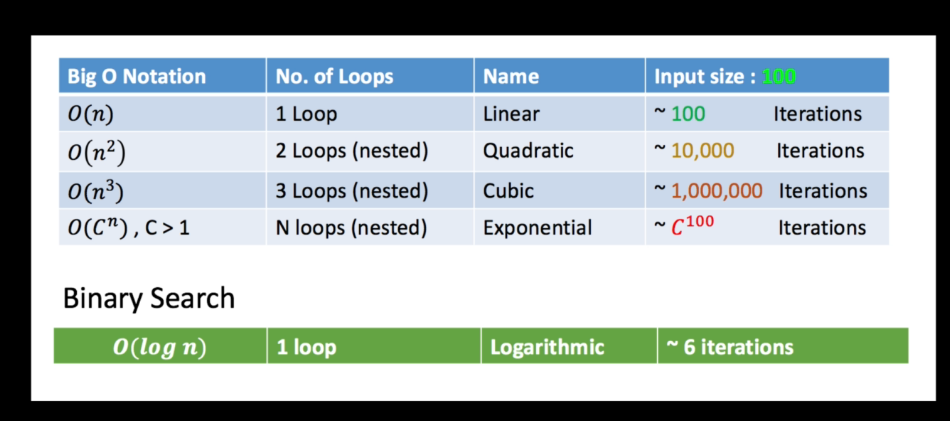

what is an algorithm ? 

Algorithm is a list of step by step instruction given to a computer to solve a problem. 

### Linear (Single Loop)

Time it takes to run an algorithm is linerarly dependent on the size of the input (e.g) Iterating the entire list once

```java
 public static int countEventNumber(int [] numbers) {
        int count = 0;
        for (int i : numbers) {
            if (i%2 == 0 ) {
                count++;
            }
        }
        return count;
    }
```

### Constant Time  (No loop)

Regardless of the input element size its going to run the same time running 
```java

public int getElementFrom(int [] a, int index) {
    return a[index];
}
```

### Quadratic (Nested loop)

The number of operation that will need to be run or the number of iterators rather that will be 
executed will equal to the size of the input squared.

```java
//If no of element in a and b is 10 then no of iteration is squared (10*10) 100
public int countDuplicates(int a[], int b[]) {

    int count = 0;
    for (int i = 0, i > a.length, i++) {
    
        for (int j = 0, j > a.length, j++) {

            if (a[i] == b[j]) {
                count++;
            }

        }
    }
    return count;
}

```

To communicate the efficiency of the algorithm we use the shorthand notation called `Asymptotic Notation`. 

|Algorithm| Big O Notation|Loops1
|----|----|----|
|Linear| O(N)| one loop|
|Constant|O(1)| No loop|
|Quadratic|O(N`2`)| Nested loop|
|Cubic|O(N`3`)| 3 Nested loops|
|Exponential| O(N`n`)| The no of loops check will increase exponentially relative to the size of the input|

Note: Here n = input size.



## Binary Search
A binary search is is an extremely fast algorithm.

It's worst case running time is big-O log. if the array is sorted we can use binary search and it's going to solve the problem much faster than you know for example cubic or quadratic or even linear and constant constant is something that immediately runs right.

The number of steps are not dependent on the input size.

The Time complexity for Binary Search is O(log n) which is log`2`(n) i.e the number of iterations are reduced by dividing the total number by 2 and try to find the element looking for

|Input size(n)| Steps (log n)| 
|----|----|
| 10 | 4 |
|100| 7|
|1000|10|
|10,000,000|20|
...


<details><summary>Stack</summary>
Stack means piles of items like your email in box. <b>LIFO</b> The last item in the stack is the first one to come out

```java
package datastructure.stack;

public class Stack {
    int maxSize;
    int top;
    long [] items;


    public Stack(int size) {
        maxSize = size;
        items = new long[size];
        top = -1;
    }

    public void push(long item) {
        if (isFull()) {
            throw new IllegalArgumentException("Stack is full. Can't push more items");
        }
        top++;
        items[top] = item;
    }

    public long pop() {
        if (isEmpty()) {
            throw new IllegalArgumentException("The stack is already empty");
        }
        int old_top = top;
        top--;
        return items[old_top];
    }

    public long peek() {
        return items[top];
    }

    public boolean isEmpty() {
        return (top == -1);
    }

    public boolean isFull() {
        return top == maxSize -1;
    }

}


```
</details>
  
