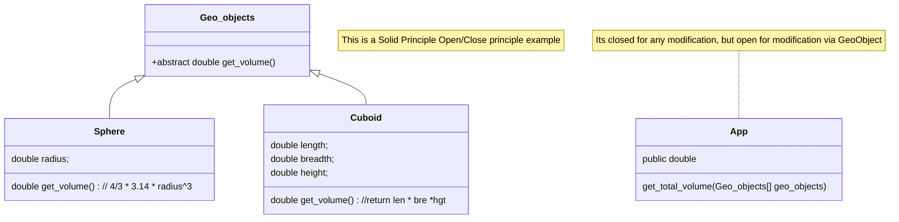

# Solid Principle

- _Single-responsibility principle:_ "There should never be more than one reason for a class to change."[2] In other words, every class should have only one responsibility.
- _Open–closed principle:_ "Software entities(class, modules, functions) ... should be open for extension, but closed for modification."
- _Liskov substitution principle:_ "Functions that use pointers or references to base classes must be able to use objects of derived classes without knowing it.
- _Interface segregation principle:_ "Clients should not be forced to depend upon interfaces that they do not use."
- _Dependency inversion principle:_ "Depend upon abstractions, [not] concretes."

1. Single Responsibility principle(SRP)

- A class should have one, and only one reason to change.
- E.g: Spring DATA JPA CRUD Repository
- Delivery Application
  - 1. Order -> PrepareOrder
  - 2. BillingCalculation-> calculateBill
  - 3. DeliverApp -> delivery
  
  <p>Each of the above class's have a single responsibility. Order is responsible for preparingOrder, BiilingCalcuation is for calcuating the bill for that order, and DeliveryApp has to delivery the order.</p>

```java
    Customer customer1 = new Customer();
        customer1.setName("John");
        customer1.setAddress("Pune");
        Order order1 = new Order();
        order1.setItemName("Pizza");
        order1.setQuantity(2);
        order1.setCustomer(customer1);
 
        order1.prepareOrder();
 
        BillCalculation billCalculation
            = new BillCalculation(order1);
        billCalculation.calculateBill();
 
        DeliveryApp deliveryApp = new DeliveryApp(order1);
        deliveryApp.delivery();
```  

2. Open Closed Principle

- “Software entities (classes, modules, functions, etc.) should be open for extension, but closed for modification”
  


3. Liskov’s Substitution Principle
   
 “Derived or child classes must be substitutable for their base or parent classes“. This principle ensures that any class that is the child of a parent class should be usable in place of its parent without any unexpected behavior.

Example: - Suppose we are creating a service for processing payments. We have a PaymentService interface with two implementations: CreditCardPaymentService and PayPalPaymentService.
 
 - Substitutability: The PaymentController depends on the PaymentService interface, not on specific implementations. This allows any PaymentService implementation (CreditCardPaymentService or PayPalPaymentService) to be injected without affecting the functionality.
 - You can configure which implementation to use in your Spring configuration file or using annotations. Here's how you can prioritize the CreditCardPaymentService using the @Primary annotation:

 ```mermaid

classDiagram

class PaymentService {
<<interface>>
void processPayment(double amount);
}

PaymentService <|-- CreditCardPaymentService
CreditCardPaymentService : +void processPayment(double amount)
PaypalPaymentService : +void processPayment(double amount)
PaymentService <|-- PaypalPaymentService
PaymentController --> PaymentService
class PaymentController {
    PaymentService paymentservice;
 public String makePayment(@RequestParam double amount)
}
 ```

4. Interface Segregation Principle

 “do not force any client to implement an interface which is irrelevant to them“. Here your main goal is to focus on avoiding fat interface and give preference to many small client-specific interfaces. 

 Example:
 <p>
 we are designing a system for different types of printers: basic printers and multi-function printers (which can print, scan, and fax). Instead of creating one large interface that all printer types must implement, we'll create several smaller, more specific interfaces.
 </p>

 ```mermaid
  
 classDiagram
class MultipurposePrinter {
    <interface>
}
MultipurposePrinter: +void print(Document doc)
MultipurposePrinter: +void scan(Document document)
MultipurposePrinter: +void fax(Document document)

class Printer {
<<interface>>
+ void print(Document doc)
}


class Scanner {
<<interface>>    
+void scan(Document document)
}

class Fax {
<<interface>>
+void fax(Document document)
}
 ```
 5. The Dependency Inversion Principle (DIP) 
   
   It states that high-level modules should not depend on low-level modules. Both should depend on abstractions (e.g., interfaces or abstract classes). Additionally, abstractions should not depend on details. Details should depend on abstractions.

   ```mermaid
   
 classDiagram
class MessageSender {
    <interface>
     + void sendMessage(String message)
}
MessageSender <|-- EmailMessageSender
EmailMessageSender : + void sendMessage(String message)
MessageSender <|-- SMSMessageSender
SMSMessageSender : + void sendMessage(String message)
class NotificationService {
    private final MessageSender messageSender;
    public NotificationService(@Qualifier("emailSender") MessageSender msgSender);
    public void notify(String message) //   msgSender.sendMessage(message) 
}

NotificationService --> MessageSender
```
Benefits:

1. **Decoupling:** High-level modules (NotificationService) are decoupled from the low-level modules (EmailSender, SmsSender). Changes to low-level modules do not affect the high-level modules.
2. **Flexibility:** Easily switch or add new message senders without modifying the high-level module. For example, you can add a PushNotificationSender by simply implementing the MessageSender interface and configuring it in Spring.
3. **Testability:** Easier to test high-level modules using mocks or stubs of the MessageSender interface.

## Microservices pattern 

Microservices architecture is an approach to developing applications where a single application is broken down into a suite of small, autonomous services. Each of these services runs in its own process and communicates with lightweight mechanisms, often through an HTTP resource API1. Here are some key terms related to microservices:

**Data Service:** A data service connects to a data source within the system. It’s not limited to databases alone; any valid source that can be served through a microservice applies. Data services are usually bound by domains defined within the global architecture.

**Business Service** (or Business Process Service): This is a higher level of abstraction that builds on data services. It defines business domains that transcend individual data services, ensuring correctness from a business perspective.

**Translation Service:** An abstraction on a third-party operation that you want to encapsulate under your own facade. It allows you to interact with external services seamlessly.
**Edge Service:** Responsible for serving data to users and external systems. These services can provide web views, deliver content, and serve mobile devices.

**Platform:** The all-encompassing arena for all service operations across multiple data centers. It includes infrastructure, runtime, ancillary services, networking, storage, and more.

### Circuit breaker
- To allow the client service to operate normally when the upstream service is not healthy.
- Used with Retry with timeout
- Using Resilence4j-springboot
- [springboot3-resilence4j Getting started](https://resilience4j.readme.io/docs/getting-started-3)
```code
# build.gradle
 implementation group: 'io.github.resilience4j', name: 'resilience4j-spring-boot2', version: '1.7.1'

import io.github.resilience4j.core.IntervalFunction;
import io.github.resilience4j.retry.RetryConfig;

@Configuration
class Resilence4jConfig { 
   @Value("${services.configuration.max-retry}")
    private int maxAttempts;

    @Value("${services.configuration.initial-interval}")
    private int initialInterval;

  @Bean(name = "retryConfig")
    public RetryConfig getRetryConfig() {
        return RetryConfig.custom()
                .maxAttempts(maxAttempts)
                .intervalFunction(IntervalFunction.ofExponentialBackoff(initialInterval, 2))
                .retryExceptions(CosmosAccessException.class) // Want to retry for CosmosAccessException
                .build();
    }
}

import org.springframework.beans.factory.annotation.Qualifier;
import org.springframework.stereotype.Service;
import io.vavr.CheckedRunnable;
import io.vavr.control.Try;
import io.github.resilience4j.retry.Retry;
import io.github.resilience4j.retry.RetryConfig;
import io.github.resilience4j.retry.RetryRegistry;
@Service
class Resilence4jCaller {

  private final Retry retry;

 @Autowired
public Resilence4jCaller(@Qualifier("retryConfig") RetryConfig retryConfig){
 RetryRegistry retryRegistry = RetryRegistry.of(retryConfig);
        retry = retryRegistry.retry("consEventService", retryConfig);
        retry.getEventPublisher().onRetry(e -> LOG.info("Retry-operation for {}, attempt# {}", documentType, e.getNumberOfRetryAttempts()));
        retry.getEventPublisher().onSuccess(e -> LOG.info("Retry-operation successful, for {}", documentType));
        retry.getEventPublisher().onError(e -> LOG.error("Retry-operation failed, for {}", documentType));
}

  public void saveWithRetry(OpsConsignment opsConsignment) {
        CheckedRunnable saveRunnable = () -> repo.saveConsignment(consignment);
        CheckedRunnable save = Retry.decorateCheckedRunnable(retry, saveRunnable);
        Try.run(save::run);
        LOG.debug("{} details for {} saved", documentType, opsConsignment);
    }
```
### What Is Cloud Native?

**Architectural Style:** Cloud native is an architectural style, not a specific problem-solving pattern.
**Facilitating End Goals:** It focuses on processes and system building to achieve specific goals.
**Operating in the Cloud:** Cloud native is primarily designed for operating in cloud environments.
**Key Aspects:**
    - Externalizing configuration
    - Scalability
    - Fast application startup and graceful shutdowns
    - Portability and Scalability
**Portability:**
   - Cloud native applications are designed to be portable.
   - Deploy them globally without additional code changes.
  
**Scalability:**
   - Applications can run as single units or multiple units (scaling up or down).
   - Autoscaling dynamically adjusts resources based on system load.
