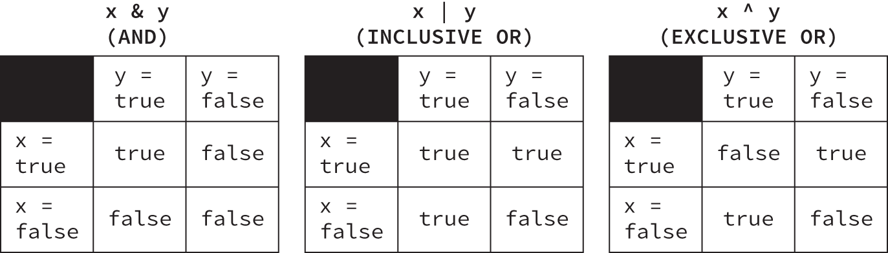

- [Chapter-3 Operators](#chapter-3-operators)
  - [Types Of Operators](#types-of-operators)
  - [Operator Precedence](#operator-precedence)
      - [Unary increment, decrement operators](#unary-increment-decrement-operators)
      - [Order of precedence in arithmetic operations](#order-of-precedence-in-arithmetic-operations)
    - [Numeric Promotion Rules(\*)](#numeric-promotion-rules)
    - [Assignment Operator](#assignment-operator)
      - [Compund Assignment Operators](#compund-assignment-operators)
      - [Assignment Operator Return value](#assignment-operator-return-value)
      - [Equality Operators](#equality-operators)
      - [Relational Operators](#relational-operators)
      - [Numeric Comparision](#numeric-comparision)
      - [instanceof operator](#instanceof-operator)
      - [Logical Operators](#logical-operators)
      - [Short-Circuit Operators](#short-circuit-operators)
      - [Checking for Unperformed Side Effects](#checking-for-unperformed-side-effects)
      - [Ternary operator](#ternary-operator)

# Chapter-3 Operators

## Types Of Operators
In Java: unary, binary, and ternary. These types of operators can be applied to one, two, or three operands, respectively.   

Java operators are not necessarily evaluated from left-to-right order. For example, the second expression of the following Java code is actually evaluated from right to left given the specific operators involved:

```java
int cookies = 4;
double reward = 3 + 2 * --cookies;
System.out.print("Zoo animal receives: "+reward+" reward points");
// output Zoo animal receives: 9.0 reward points
```
## Operator Precedence
- Determining which operators are evaluated in what order is referred to as operator precedence
Java operators follow order of operation, listed in the below table by descreasing order of operator precence(High to low).
- If two operators have the same level of precedence, then Java guarantees left-to-right evaluation.
- For the example remember only the bold one operators

1. post and pre-unary operators: ++,--
2. Other unary operator: -,!(type)
3. Multiplication/division/modulus	*, /, %
4. Addition/Subtraction: +,-
5. Relational Operators: <=, >=, instanceof
6. Equal to/not equal to: ==, !=
7. Logical operators: &,  |
8. Short-circuit logical operators: &&, ||
9. Ternary operator: booleab exp ? exp1 : exp2
10. AssignmentOperators: =, +=, -=, *=, /=
    
#### Unary increment, decrement operators
```java
  double zooTemperature = 1.21;
  zooTemperature = -(-zooTemperature);
  System.out.println(zooTemperature);  // -1.21


    int lion = 3;
    int tiger = ++lion * 5 / lion--;
    System.out.println("lion is " + lion);
    System.out.println("tiger is " + tiger);
    //output
        lion is 3
        tiger is 5
```
#### Order of precedence in arithmetic operations
  - (), *, /,  %, +, -
  ```java
  int price = 2 * ((5 + 3) * 4 - 8);
  int price = 2 * (8 * 4 - 8);
  int price = 2 * (32 - 8);
  int price = 2 * 24;
  price = 48

  short robin = 3 + [(4 * 2) + 4];      // DOES NOT COMPILE [] aren't allowed.
  ```
### Numeric Promotion Rules(*)

1. If two values have different data types, Java will automatically promote one of the values to the larger of the two data types.
2. If one of the values is integral and the other is floating-point, Java will automatically promote the integral value to the floating-point value’s data type.
3. Smaller data types, namely, `byte, short, and char`, are first promoted to `int` any time they’re used with a Java binary arithmetic operator, even if neither of the operands is int.
4. After all promotion has occurred and the operands have the same data type, the resulting value will have the same data type as its promoted operands. 

- A floating-point literal is of type float if it ends with the letter F or f. The type is considered double otherwise. Casting is required any time when assigning a larger numeric data type to a smaller numerical data type, or converting from a floating-point number to an integral value. Hence a double type has to be cast to a smaller type before assigning to a float variable.
 double d = 3.35;
 float f = (float)(d*2); //valid
 float f = d*2F //Its still double assigned to float

[Conversions and Promotions](https://docs.oracle.com/javase/specs/jls/se6/html/conversions.html)
what is the data type ? 
```java
int x = 1;
long y = 33;
var z = x * y; // Z = long

----
double x = 39.21;
float y = 2.1;
var z = x + y;
//compile error floating point literals are assumed to be double, unless postfixed with an f 2.1f
----
short x = 10;
short y = 3;
var z = x * y; // z is int
----
short w = 14;
float x = 13;
double y = 30;
var z = w * x / y; // z is double.
------
short mouse = 10;
short hamster = 3;
short capybara = mouse * hamster;  // DOES NOT COMPILE
short gerbil = 1 + (short)(mouse * hamster);  // DOES NOT COMPILE used binary arithmetic operator(+) without casting.
why it fail? Because short values are automatically promoted to int when applying any arithmetic operator, with the resulting value being of type int
```
### Assignment Operator
**Casting is a unary operation where one data type is explicitly interpreted as another data type. Casting is optional and unnecessary when converting to a larger or widening data type, but it is required when converting to a smaller or narrowing data type**

```java
float egg = 2.0 / 9;        // DOES NOT COMPILE
int tadpole = (int)5 * 2L;  // DOES NOT COMPILE
short frog = 3 - 2.0;       // DOES NOT COMPILE

//Applying casting to fit larger data type values to smaller one
int trainer = (int)1.0;
short ticketTaker = (short)1921222;  // Stored as 20678 as value is large to hold in short
int usher = (int)9f;
long manager = 192301398193810323L;
```
#### Compund Assignment Operators

Operator| Description|
----|-----|
+=, -=, *= | Add, sub, multiply the value on the right to the variable on the left and assigns the product to the variable|
/=| Divides the variable on the left by the value of the right and assigns the quotient to the variable.

```java
long goat = 10;
int sheep = 5;
sheep = sheep * goat;   // DOES NOT COMPILE can be fixed with (int), but better way is using the compound operation

long goat = 10;
int sheep = 5;
sheep *= goat;
```
#### Assignment Operator Return value
The key here is that (wolf=3) does two things. First, it sets the value of the variable wolf to be 3. Second, it returns a value of the assignment, which is also 3.   
```java
long wolf = 5;
long coyote = (wolf=3);
System.out.println(wolf);   // 3
System.out.println(coyote); // 3
```

#### Equality Operators

|Operator	|Apply to primitives|	Apply to objects|
|----|----|----|
|==	|Returns true if the two values represent the same value	|Returns true if the two values reference the same object|
|!=	|Returns true if the two values represent different values	|Returns true if the two values do not reference the same object|


The equality operators are used in one of three scenarios:
- comparing the two primitive types or numeric equals. 5 == 5.00 returns true, since left side is promoted to `double`.
- Comparing two boolean values
- Comparing two objects, including null and String values
  
  ```java
  File monday = new File("schedule.txt");
  File tuesday = new File("schedule.txt");
  File wednesday = tuesday;
  System.out.println(monday == tuesday);    // false
  System.out.println(tuesday == wednesday); // true
  ----
  System.out.print(null == null);  // true
  ```
#### Relational Operators
|Operator|	Description|
|----|----|
| <	| Returns true if the value on the left is strictly less than the value on the right |
| <=	| Returns true if the value on the left is less than or equal to the value on the right |
| >	| Returns true if the value on the left is strictly greater than the value on the right |
| >=	| Returns true if the value on the left is greater than or equal to the value on the right |
| a instanceof b	| Returns true if the reference that a points to is an instance of a class, subclass, or class that implements a particular interface, as named in b|

#### Numeric Comparision

```java
int gibbonNumFeet = 2, wolfNumFeet = 4, ostrichNumFeet = 2;
System.out.println(gibbonNumFeet < wolfNumFeet);      // true
System.out.println(gibbonNumFeet <= wolfNumFeet);     // true
System.out.println(gibbonNumFeet >= ostrichNumFeet);  // true
System.out.println(gibbonNumFeet > ostrichNumFeet);   // false
```

#### instanceof operator
- It is useful for determining whether an arbitrary object is a member of a particular class or interface at runtime.

```java
//valid instanceof
public static void openZoo(Number time) {
   if(time instanceof Integer)
      System.out.print((Integer)time + " O'clock");
   else
      System.out.print(time);
}
//invalid instanceof
public static void openZoo(Number time) {
   if(time instanceof String) // DOES NOT COMPILE
   ...

```
- null and the instanceof operator
  * calling instanceof on the null literal or a null reference always returns false
`System.out.print(null instanceof Object); // false`

#### Logical Operators

The logical operators, (&), (|), and (^), may be applied to both numeric and boolean data types; they are listed in Table 3.8. When they’re applied to boolean data types, they’re referred to as logical operators. Alternatively, when they’re applied to numeric data types, they’re referred to as bitwise operators, as they perform bitwise comparisons of the bits that compose the number


Here are some tips to help you remember this table:

- AND is only true if both operands are true.   
- Inclusive OR is only false if both operands are false.   
- Exclusive OR is only true if the operands are different.   
  `System.out.println(" " + true ^ true);    // false`

#### Short-Circuit Operators
-  the conditional operators, && and ||, which are often referred to as short-circuit operators 

| Operator	| Description|
|----|----|
| &&	|Short-circuit `AND` is true only if `both values are true`. If the left side is false, then the right side will not be evaluated.|
|\|\|| Short-circuit `OR` is true if `at least one of the values is true`. If the left side is true, then the right side will not be evaluated.|    

#### Checking for Unperformed Side Effects
```java
int rabbit = 6;
boolean bunny = (rabbit >= 6) || (++rabbit <= 7);
System.out.println(rabbit); // output is 6 since the second condition is unreached.
```
#### Ternary operator

```java
int stripes = 7;
 
System.out.print((stripes > 5) ? 21 : "Zebra");
 
int animal = (stripes < 9) ? 3 : "Horse";  // DOES NOT COMPILE
```