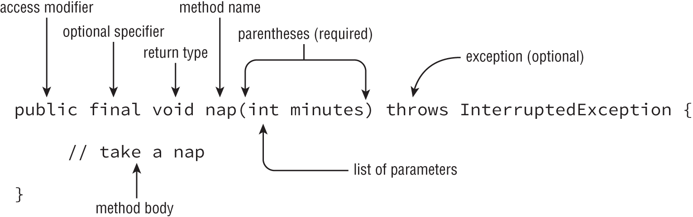

- [Chapter 07 Methods and Encapsulation.](#chapter-07-methods-and-encapsulation)
    - [Designing Methods](#designing-methods)
    - [Applying Access Modifiers](#applying-access-modifiers)
    - [Applying the static Keyword](#applying-the-static-keyword)
    - [Static Initialzation](#static-initialzation)
    - [Passing Data among methods (Java pass by value)](#passing-data-among-methods-java-pass-by-value)
  - [Overloading.](#overloading)
# Chapter 07 Methods and Encapsulation.
- Access modifiers type: private, default(Package-Private),protected,public.
### Designing Methods
  
- optional specifiers: static, abstract, final, synchronized, native, strictfp.
-  String walk7(int a) { if (a == 4) return ""; } //Doesn't compile.
>Note: The walk7() method is a little tricky. There is a return statement, but it doesn’t always get run. If a is 6, the return statement doesn’t get executed. Since the String always needs to be returned, the compiler complains.
- int longMethod() {
   return 9L; // DOES NOT COMPILE
}
- Method name: an identifier may only contain letters, numbers, $, or _. Also, the first character is not allowed to be a number, and reserved words are not allowed. Finally, the single underscore character is not allowed. 
- Working with Varargs
  - Only one Varargs is allowed in a method, and it must be the last element in a method's parameter.
### Applying Access Modifiers
    
* private: Only accessible within the same class
* Default (package-private) access: private plus other classes in the same package
* protected: Default access plus child classes.<br>
 i) **Subclass can access the protected members from their super class eventhough it is in a diff package.**<br>
 ii) The definition of protected allows access to subclasses and classes in the same package. 
* Public: protected plus classes in the other packages

- Class Bird     
  
```java
package pond.shore;
public class Bird {
   protected String text = "floating";           // protected access
   protected void floatInWater() {               // protected access
      System.out.println(text);
   }
}
```     
- protected also gives us access to everything that default access does. This means that a class in the same package as Bird can access its protected members.
  
```java
package pond.shore;                      // same package as Bird
public class BirdWatcher {
   public void watchBird() {
      Bird bird = new Bird();
      bird.floatInWater();               // calling protected member
      System.out.println(bird.text);     // accessing protected member
   }
}
```
- Bird object can't access its own protected members outside of the package, but Goose through inheritance.
```java
package pond.goose;
import pond.shore.Bird;
public class Goose extends Bird {
   public void helpGooseSwim() {
      Goose other = new Goose();
      other.floatInWater();
      System.out.println(other.text);
   }
   public void helpOtherGooseSwim() {
      Bird other = new Goose();
      other.floatInWater();           // DOES NOT COMPILE
      System.out.println(other.text); // DOES NOT COMPILE
   }
}
```
### Applying the static Keyword
- static can be define for member/class variable, method, nested class
- All instance of the class shares the static variable, (e.g) counter.
   
```java
Koala k = new Koala();
System.out.println(k.count);          // k is a Koala
k = null;
System.out.println(k.count);          // k is still a Koala
```
* Only a instance method can call another instance method on the same class without using a ref variable.
* An instance method can access static variable and static method, but below is not possible.
* A static method can't access a non static method without instance variable.

### Static Initialzation
All static initializers run when the class is first used in the order they are defined. The statements in them run and assign any static variables as needed.<br>

```java
private static int one;
private static final int two;
private static final int three = 3;
private static final int four;    // DOES NOT COMPILE
static {
   one = 1;
   two = 2;
   three = 3;                     // DOES NOT COMPILE
   two = 4;                       // DOES NOT COMPILE
}
```
- Change from one object affected the common static field. 
  - Following code prints 08, with the static initalizer, and without it 8.
```java

class Rope
{
  public static int length = 0;
}

public class Main
{
  private static Rope rope1 = new Rope ();
  private static Rope rope2 = new Rope ();
  static
  {
    System.out.print (rope1.length);
  }
  public static void main (String[]args)
  {
    rope1.length = 2;
    rope2.length = 8;
    System.out.print (rope1.length);
  }
}

```
- import static
    `import static java.util.Arrays;       // DOES NOT COMPILE`
    `import static java.util.Arrays.asList;`
### Passing Data among methods (Java pass by value)
      
Java uses pass-by-value to get data into a method. Assigning a new primitive or reference to a parameter doesn’t change the caller. Calling methods on a reference to an object can affect the caller.<br>

```java
 String name = "Webby";
public static void speak(String name) {
   name = "Sparky";
}
 speak(name); 
 System.out.println(name); //Webby
```

- Copying a reference with pass-by-value. 
  
```java
  StringBuilder name = new StringBuilder();
    
   public static void speak(StringBuilder s) {
   s.append("Webby");
  }
  speak(name); 
  System.out.println(name); //Webby
```

```java
  public static StringBuilder work (StringBuilder a, StringBuilder b) {
    a = new StringBuilder ("a");
    b.append ("b");
    return a;
  }
  public static void main (String[]args) {
    var s1 = new StringBuilder ("s1");
    var s2 = new StringBuilder ("s2");
    var s3 = work (s1, s2);
    System.out.println ("s1 = " + s1);
    System.out.println ("s2 = " + s2);
    System.out.println ("s3 = " + s3);
  }
/*
outputs
s1 = s1
s2 = s2b
s3 = a*/
```
## Overloading. 
- Method with different parameter type or parameter length, but with same name and return type.
- Invalid overloading
```java
  public void fly(int numMiles) {}
  public int fly(int numMiles) {}     // DOES NOT COMPILE
  public void fly(int[] lengths) {}
  public void fly(int... lengths) {}     // DOES NOT COMPILE
  public void woof(List<Set> strings) {}
  public void woof(List<Integer> integers) {}  
  public void walk(List<String> strings) {}
  public void walk(List<Integer> integers) {}    // DOES NOT    COMPILE the methods are identical once the Generics is removed.

   public void baa(String c) {}
  	public void baa(String[] c) {}
   public void baa(String... c) {} // DOES NOT COMPILE
	public void baa(CharSequence c) {}

   public void woof(char... chars) {}
  public void woof(Character c) {}

  //Arrays
  public static void walk(int[] ints) {}
  public static void walk(Integer[] integers) {} // compiles not like previous
```
The order java uses  to choose the right overloaded method.

|Rule	                    |Example of what will be chosen for glide(1,2)|
|---|---|
|Exact match by type	 |        String glide(int i, int j)|
|Larger primitive type	 |   String glide(long i, long j)|
|Autoboxed type	         |   String glide(Integer i, Integer j)|
|Varargs	             |       String glide(int... nums)|

- Double conversion is not possible int -> long int -> Integer is ok but not int -> long -> Long
```java
public class TooManyConversions {
   public static void play(Long l) {}
   public static void play(Long... l) {}
   public static void main(String[] args) {
      play(4);      // DOES NOT COMPILE
      play(4L);     // calls the Long version
   }
}
```
Here we have a problem. Java is happy to convert the int 4 to a long 4 or an Integer 4. It cannot handle converting to a long and then to a Long <br>

Review Questions:

1. B, C, D /n(D) Public case sensitivity
2. C, D, /n A D  //final static void method() -- valid statement
3. A, C,D,E/n(E) 	public int methodE() { return 9.0;} // Possible loss conversion from double to int // solution cast (int)
4.  ABF, n(D,E)
5. D, F
6. B, /n(D) // 
   i) Package-private access is more lenient than protected access
   ii) (Tricky) A public class that has private fields and package-private methods is not visible to classes outside the package. Note: The public class is still visible to other classes, but the members are not accessible.
7. D, F/n(B,C,D,F) // Missed to see which part of the code cause compile error main block. private, default access modifier memebers aren't allowed outside the package.
8. A, B, E
9.  C, D, E / BDF //C. public var meow(String s) {} var is not allowed here, read the syntax. Generics overloading is not accepted.
10. A/B // static initializer are executed in the sequence.
11. B, F/B,E. // Rope r2 = null; r2.play() // play is static method compiler treat it as such.
12. A/D
13. E
14. B
15. E
16. A/B (carless mistake)
17. A, D, E/BDE
18. C, E/BCE (careless) B is same as E
19. A/AE (careless. Didn't see other options)
20. C/ACF Char.. character
21. A, C/ABC