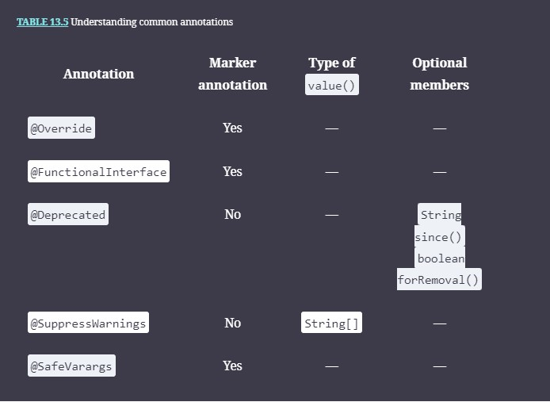

- [Chapter 13: Annotations](#chapter-13-annotations)
  - [Annotation Overview:](#annotation-overview)
  - [Creating Customer Annotations](#creating-customer-annotations)
      - [Rules of Declaring Annotation](#rules-of-declaring-annotation)
      - [Rules of Declaring elements with annotations.](#rules-of-declaring-elements-with-annotations)
    - [Creating a _value()_ Element](#creating-a-value-element)
    - [Predefined JDK Annotations](#predefined-jdk-annotations)
      - [`@Override`](#override)
      - [` @Deprecated`](#-deprecated)
      - [`@SuppressWarnings`](#suppresswarnings)
      - [`@SafeVarargs`](#safevarargs)
      - [@Target limitation and usage](#target-limitation-and-usage)
      - [Storing Annotation with _@Retention_](#storing-annotation-with-retention)
      - [@Documented annotations](#documented-annotations)
      - [@Deprecated \& @deprecated in javadoc](#deprecated--deprecated-in-javadoc)
      - [@SuppressWarnings("deprecation")](#suppresswarningsdeprecation)
      - [@Inherited Annotation](#inherited-annotation)
    - [@Repeatable Annotations](#repeatable-annotations)
  - [Review Questions](#review-questions)

# Chapter 13: Annotations
## Annotation Overview: 
  <p>The Java specification describes an annotation as a marker that associates information with a program constuct but has no effect at run time
  
  Unlike Javadoc tags, annotations can be configured(using a Retention Policy) to be retained and visible to the JVM, allowing them to be accessible at runtime.

  Annotations are used in the frameworks like Spring or JPA as a way to apply behaviours to user-defined classes and methods which would otherwise be declared in an external source(such as an XML conf) 
  
  Simple annotation can be @MyFirstAnnotation 
  other options: 
  @MyFirstAnnotation // Marker type
  @MyFirstAnnotation("THIS") // Single element type (value is the unnamed element here for "THIS")
  @MyFirstAnnotation(name="THIS", value="MORE") // NORMAL element type 0..* many element values, default values.
  </p> 

- Understanding Metadata
  - Metadata is data that provides information about other data.
  - , the metadata includes the rules, properties, or relationships surrounding the actual data.
  - Purpose of the Annotations
     * The purpose of an annotation is to assign metadata attributes to classes, methods, variables, and other Java types. 
     *  first rule about annotations: annotations function a lot like interfaces. In this example, annotations allow us to mark a class as a ZooAnimal without changing its inheritance structure. We could this using interfaces but it can be applied only to classes, annotations can be applied to any dcl incl classes, methods, expressions and even other annotations.
        ```java
                @ZooAnimal public class Lion extends Mammal {}
                
                @ZooAnimal public class Peacock extends Bird {}
        ```
     *  second rule about annotations: annotations establish relationships that make it easier to manage data about our application.
     *  third rule about annotations: an annotation describes custom information on the declaration where it is defined. This turns out to be a powerful tool, as the same annotation can often be applied to completely unrelated classes or variables.
     * 
        ```java
                    @ZooSchedule(hours={"9am","5pm","10pm"}) void feedLions() {
                    System.out.print("Time to feed the lions!");
                }
        ```

     *  final rule about annotations you should be familiar with: annotations are optional metadata and by themselves do not do anything. This means you can take a project filled with thousands of annotations and remove all of them, and it will still compile and run, albeit with potentially different behavior at runtime.
## Creating Customer Annotations
//

```java
   @Documented
   @interface ClassPreamble {
      String author();
      String date();
      int currentRevision() default 1;
      String lastModified() default "N/A";
      String lastModifiedBy() default "N/A";
      // Note use of array
      String[] reviewers();
   }

//using the annotation at class level
After the annotation type is defined, you can use annotations of that type, with the values filled in, like this:

@ClassPreamble (
   author = "John Doe",
   date = "3/17/2002",
   currentRevision = 6,
   lastModified = "4/12/2004",
   lastModifiedBy = "Jane Doe",
   // Note array notation
   reviewers = {"Alice", "Bob", "Cindy"}
)
public class Generation3List extends Generation2List {
}
```
#### Rules of Declaring Annotation
  - We use the @interface annotation (all lowercase) to declare an annotation. Like classes and interfaces, they are commonly defined in their own file as a top‐level type, although they can be defined inside a class declaration like an inner class.
  - The body of the previous annotation definition contains annotation type element declarations, which look a lot like methods. Note that they can define optional default values. elements without default are required when using this annotations.
  -  Annotation names are case sensitive.some annotations, like @Food, can be applied more than once.
  -  As with other declarations in Java, spaces and tabs between elements are ignored. 
  -  To make the information in @ClassPreamble appear in Javadoc-generated documentation, in the Definition mention @Documented.
  
#### Rules of Declaring elements with in annotations.
 - public String title() default null; - fails. The default value of an element must be a non-null constant expression.
 - Element type can be only be one of these predefined types; a primitive  

    `public @interface Exercise {}`   

  - Applying the annotation to some classes 
     ```java
     @Exercise() public class Cheetah {} // paranthesis are optional
        @Exercise public class Sloth {}
        @Exercise
        public class ZooEmployee {}

   @Scaley       @Flexible
   @Food("insect") @Food("rodent")      @FriendlyPet
   @Limbless public class Snake {}

    ```
  

  - 
    ```java
        public @interface Exercise {
        public static final int DEFAULT_WEEKLY_LEAVES = 1;  
        int hoursPerDay(); //Required
        int startHour() default 6;
        }

        //using 
          @Exercise(startHour=5, hoursPerDay=3) public class Cheetah {}
    
         @Exercise(hoursPerDay=0) public class Sloth {}
         
         @Exercise(hoursPerDay=7, startHour="8")  // DOES NOT COMPILE
    public class ZooEmployee {}
   ```
  -  Annotation variables are implicitly public, static, and final
  - Defining a default element value
    * The default value of an annotation should be a _non-null constant_ expression
```java
 public @interface BadAnnotation {
       String name() default new String("");  // DOES NOT COMPILE
       String address() default "";
       String title() default null;           // DOES NOT COMPILE
    }
```
In this example, name() does not compile because it is not a constant expression, while title() does not compile because it is null. Only address() compiles. Notice that while null is not permitted as a default value, the empty String "" is.

- Selecting an Element Type
  *  It must be a primitive type, a String, a Class, an enum, another annotation, or an array of any of these types.
 
  * ```java
        public class Bear {}
        
        public enum Size {SMALL, MEDIUM, LARGE}
        
        public @interface Panda {
        Integer height();   // No
        String[][] generalInfo(); // No
        Size size() default Size.SMALL; // Ok
        Bear friendlyBear(); // No
        Exercise exercise() default @Exercise(hoursPerDay=2); // Ok
        }
  ```
- Applying Element Modifiers
  - annotation elements are implicitly abstract and public

   ```java
      public @interface Material {}

         public @interface Fluffy {
         int cuteness();
         public abstract int softness() default 11;
         protected Material material();  // DOES NOT COMPILE
         private String friendly();      // DOES NOT COMPILE
         final boolean isBunny();        // DOES NOT COMPILE
         //Constants
         public int voltage();
         int MIN_VOLTAGE = 2;
         public static final int MAX_VOLTAGE = 18;
      }
        ```


### Applying Annotations
- Appled to any of the java dcl including the following
    * Classes, interfaces, enums, and modules
    * Variables ( static, instance, local)
    * Methods and constructors
    * Method, constructor, and lambda parameters
    * Cast expressions
    * Other annotations
### Mixing Required and Optional Elements

```java
public @interface Swimmer {
   int armLength = 10; //Constant
   String stroke();
   String name();
   String favoriteStroke() default "Backstroke";
}

//Does not compile since constant.
@Swimmer(stroke="Butterfly", name="Kip", armLength=1) class Reptile {}
@Swimmer(favoriteStroke="Breaststroke", name="Sally") class Tadpole {} // missing stroke
```
### Creating a _value()_ Element
<p> 
In your development experience, you may have seen an annotation with a value, written without the elementName. For example, the following is valid syntax under the right condition:

@Injured("Broken Tail") public class Monkey {}
This is considered a shorthand or abbreviated annotation notation. What qualifies as the right condition? An annotation must adhere to the following rules to be used without a name:

The annotation declaration must contain an element named value(), which may be optional or required.
The annotation declaration must not contain any other elements that are required.
The annotation usage must not provide values for any other elements.

Let's create an annotation that meets this requirements.
</p>
 

```java
public @interface Injured {
   String veterinarian() default "unassigned";
    String value() default "foot";
   int age() default 1;
}

//Applying the annotation
public abstract class Elephant {
   @Injured("Legs") public void fallDown() {}
   @Injured(value="Legs") public abstract int trip();
   @Injured String injuries[];
}

@Injured("Fur",age=2) public class Bear {}  // DOES NOT COMPILE as it provides more than one value.
```
- Passing an Array ofValues
```java
  public @interface Music {
   String[] genres();
}

public class Reindeer {
   @Music(genres="Blues","Jazz") String favorite;  // DOES NOT COMPILE
   @Music(genres=) String mostDisliked;            // DOES NOT COMPILE
   @Music(genres=null) String other;               // DOES NOT COMPILE
   @Music(genres={}) String alternate;
   @Music(genres={"Blues","Jazz"}) String favorite;  
   @Music(genres="Blues") String favorite;  
   @Music({"Blues"}) String favorite;  
   @Music("Blues") String favorite;  
}
```
### Predefined JDK Annotations
      
[Predefined Annotations](https://docs.oracle.com/javase/tutorial/java/annotations/predefined.html)

Predefined Java Annotations | Target | Retention
---------|----------|---------
@Deprecated(forRemoval = true, since = "2020") | PACKAGE, MODULE, TYPE, CONS, METHOD, PARAM, FIELD, LOCAL VAR | RUNTIME
@FunctionalInterface | TYPE | RUNTIME
@Override | METHOD | SOURCE
@SafeVarargs | CONS, METHOD | RUNTIME (Compiler Suppress unchecked warnings relating to varargs usage)
@Suppress Warnings | PACKAGE, MODULE, TYPE, CONS, METHOD, PARAM, FIELD, LOCAL VAR  | SOURCE (Cetains compiler warings are suppressed like deprecated, removal, unchecked, varargs)
||
- _**Note**_ @FunctionaInterface is applicable only to interfaces and not to class
```java
@FunctionalInterface
interface Functionable {
    void performSomeFunction();
}
```
#### `@Override`

 The Override annotations is a marker annotations. It indicates that the method is overriding a method inherited from its super type. The super type could be java.lang.Object also. 
  The overriding method has the same name, number and type of parameters, and return type as the method that it overrides. Also, it should not reduce the visibility of the overridden method. (i.e) default -> public -> protected -> private not from public to default.
```java

  class Flower1 extends Object {
private String name;
public boolean equals(Flower1 flower) { return this.name.equals(flower.name);
}
A. class Flower2 extends Flower1 { @Override boolean equals(Flowerl flower) { return false; } }
B. class Flower3 extends Flowerl { @Override public boolean equals(Flower3 flower) { return super.equals(flower); } }
X wrong
C. class Flower4 extends Object { @Override public boolean equals(Flower4 flower) { return super.equals(flower); } }
D. class Flower5 { @Override public boolean equals(Object object) { return super.equals(object); } }
E.
✓ right
class Flower6 extends Flower1 { @Override public boolean equals(Flowerl flower) { return false;
}} right
```
#### ` @Deprecated` 
  - forRemoval tells caution this method is not just recemmondation, but it will be removed.
  - since() and forRemoval() are optional values available in the @Deprecated annotation
 ```java
   /**
     * Using javadoc tag @deprecated
     *
     * @deprecated As of release 1.2, replaced by {@link #doThat()}
     */
    // Using annotation @Deprecated
    @Deprecated(
            since = "1.3",
            forRemoval = true
    )
    public void doThis() {
        System.out.println("Doing this");
    }
 ```
####  `@SuppressWarnings`
 - To suppress some warnings (e.g)  @SuppressWarnings({"deprecated", "removal"}), following are the common @SuppressWarnings values used often:
   * "deprecation" - Ignore warnings related to types or methods marked with the @Deprecated annotation. I, 
   * "unchecked" - Ignore warnings related to the use of raw types, such as List instead of List<String>.
 - Protecting Arguments with @`SafeVarargs` annotation when you can safely assert that the implemenation of the method will not throw a ClassCastException or other similar exception due to improper handling of the varargs formal parameter.
 -  It **can be applied** _only to constructors or methods that cannot be overridden (aka methods marked private, static, or final)_.
####  `@SafeVarargs` 

when applied to a method or constructor, assert that the code does not perform potentially unsafe operation on its varargs param. 

suppresses the warnings at `Line2: Possible heap pollution from parameterized vararg type`,<br> `Line 1: Unchecked generics array creation for varargs parameter`
 
  ```java
   // Create a simple generic class
      class MyClass<T> {
         T name;

         MyClass(T name) {
            this.name = name;
         }
      }
      // Generic Array creation is not allowed
        MyClass[] myArray = {
                new MyClass<>("jane"),
                new MyClass<>("joe")
        };

        // Yet you can do this...
        doSomething(new MyClass<>("jane"), new MyClass<>("joe")); //1

    @SafeVarargs
    public static void doSomething(MyClass<String>... myStuff) { // 2
        Arrays.stream(myStuff)
                .forEach(System.out::println);
    }
  //Sample 2 
    import java.util.*;
    public class NeverDoThis {
        @SafeVarargs final int thisIsUnsafe(List<Integer>… carrot) { // Line 4
          Object[] stick = carrot;
          stick[0] = Arrays.asList("nope!");
          return carrot[0].get(0);  // ClassCastException at runtime 
       }
       public static void main(String[] a) {
          var carrot = new ArrayList<Integer>();
          new NeverDoThis().thisIsUnsafe(carrot); // Line 11
       }
    }
   
  ```
  <p>
     Having @SafeVarargs suppress this warnings.
      [Line 4]  Type safety: Potential heap pollution via varargs
         parameter carrot
      [Line 11] Type safety: A generic array of List<Integer> is created
         for a varargs parameter
   </p>
   * This annotation is considered more desriable than @SuppressWarnings({"unchecked", "varargs"}).
  
  

#### @Target limitation and usage
- @Target tells where this annotations can be applied like whether the annotation is allowed to be used in METHOD, CONSTRUCTOR, TYPE_PARAM...
- The Target types are:PACKAGE, MODULE, ANNOTATION_TYPE,CONSTRUCTOR,FIELD,LOCAL_VARIABLE,METHOD,PARAMETER,TYPE,TYPE_PARAMETER, TYPE_USE.
- Annotations created without the @Target can be used any where in java target types like METHOD, CONSTRUCTOR, except when used in the parameter places you must mention the @Target type. 
  To detail this here the TypeParameterAnnotation,TypeUseAnnotation is used in the parameter place.Here Line 1, 2, and 3 will show compile error without the   `@Target(ElementType.TYPE_USE),   @Target(ElementType.TYPE_PARAMETER)`
```java
   //Custom Annotations created for 


      // Intended for Type Parameter
      @Target(ElementType.TYPE_PARAMETER)
      @Retention(RetentionPolicy.RUNTIME)
      @interface TypeParameterAnnotation {

      }

      // Intended for Type Use
      @Target(ElementType.TYPE_USE)
      @Retention(RetentionPolicy.RUNTIME)
      @interface TypeUseAnnotation {


     // Annotating a type parameter
  1.  <@TypeParameterAnnotation T> T getSomething(T t) {
        return t;
    }

    public static void main(String[] args) {

        // Annotating a use of a type (TYPE_USE) in a new object
   2.     AnnotateEverythingExample e = new @TypeUseAnnotation AnnotateEverythingExample();
        Object o = e;

        // Annotating a use of a type (TYPE_USE) while casting
    3.    AnnotateEverythingExample e2 = (@TypeUseAnnotation AnnotateEverythingExample) o;
        e.doSomething("Hello");

    }
```
```java
import java.lang.annotation.ElementType;
import java.lang.annotation.Target;
 
@Target({ElementType.METHOD,ElementType.CONSTRUCTOR})
public @interface ZooAttraction {}

```
- ElementType.TYPE_USE 
- <p>
  The TYPE_USE parameter can be used anywhere there is a Java type. By including it in @Target, it actually includes nearly all the values in Table 13.1 including classes, interfaces, constructors, parameters, and more. There are a few exceptions; for example, it can be used only on a method that returns a value. Methods that return void would still need the METHOD value defined in the annotation.
  </p>
```java
@Target(ElementType.TYPE_USE)
@interface Technical {}
 
// NetworkRepair.java
import java.util.function.Predicate;
public class NetworkRepair {
   class OutSrc extends @Technical NetworkRepair {}
   public void repair() {
      var repairSubclass = new @Technical NetworkRepair() {};
       var o = new @Technical NetworkRepair().new @Technical OutSrc();
 
      int remaining = (@Technical int)10.0;
   }
}
```
#### Storing Annotation with _@Retention_
 * Types: SOURCE, CLASS, RUNTIME
 * RetentionPolicy.SOURCE – The marked annotation is retained only in the source level and is ignored by the compiler.
 * RetentionPolicy.CLASS – The marked annotation is retained by the compiler at compile time, but is ignored by the Java Virtual Machine (JVM).
 * RetentionPolicy.RUNTIME – The marked annotation is retained by the JVM so it can be used by the runtime environment.
 * Samples: 
  ```java
   @Retention(RetentionPolicy.CLASS) @interface Flier {}
   @Retention(RetentionPolicy.RUNTIME) @interface Swimmer {}
  ```
#### @Documented annotations
 `@Documented` annotation indicates that whenever the specified annotation is used those elements should be documented using the Javadoc tool. (By default, annotations are not included in Javadoc.). Its a marker interface so doesn't carry any value. 
   `@Documented public @interface Hunter {}`<br>

#### @Deprecated & @deprecated in javadoc

 ```java
  public interface ZooLightShow {
 
       /**
        * Performs a light show at the zoo.
        * 
        * @param      distance   length the light needs to travel.
        * @return     the result of the light show operation.
        * @author     Grace Hopper
        * @since      1.5
        * @deprecated Use lightPerform() instead.
        */
       @Deprecated(since="1.5") public default String perform(int distance) {
          return "Beginning light show!";
       }

       String lightPerform(int distance);
    }
 ```
#### @SuppressWarnings("deprecation")
```java
 
 public class NewYorkZoo implements ZooLightShow {
  @SuppressWarnings("deprecation")
   public String perform() {}

 }
```

#### @Inherited Annotation
* `@Inherited` when its applied to a class, subclass will inherit the annotations information found in the parent class.
```java
// Vertebrate.java
import java.lang.annotation.Inherited;

@Inherited public @interface Vertebrate {} 
 
// Mammal.java
@Vertebrate public class Mammal {}
 
// Dolphin.java
public class Dolphin extends Mammal {}
```
<p>In this example, the @Vertebrate annotation will be applied to both Mammal and Dolphin objects. Without the @Inherited annotation, @Vertebrate would apply only to Mammal instances.</p>
- This meta-annotation type has no effect if the annotated type is used to annotate anything other than a class. It has no effect on interface, methods and fields.
### @Repeatable Annotations
- @Repeatable annotation when you want an annotation to be repeated remember you have to create two 
@Repeatable interface once with the element and another the container for that element

```java
public class AnnotationTest {

    public @interface MealContainer {
        Meal[] value();
    }

    @java.lang.annotation.Repeatable(MealContainer.class)
    public @interface Meal {
        String value();
        String mainDish();
    }

    @Meal(value="breakfast", mainDish="cereal")
    @Meal(value="lunch", mainDish="pizza")
    @Meal(value="dinner", mainDish="salad")
    public void evaluateDiet() { }
}
```


## Review Questions
1. E
2. D, F
which of the following show compile error ? 
```java
      1: import java.lang.annotation.Documented;
      2: enum Color {GREY, BROWN}
      3: @Documented public @interface Dirt {
      4:    boolean wet();
      5:    String type() = "unknown"; // default instead of =
      6:    public Color color();
      7:    private static final int slippery = 5; // Should be public
      8: }
```
3. C, D, E
   Which built‐in annotations can be applied to an annotation declaration?
   @Target, @Repeatable and @Deprecated can be applied to almost any declarations. <br>
4. ~~C~~, D
5. B which of the following line of code doesn't compile ? 
```java
   1: import java.lang.annotation.*;
   2: class Food {} // even final will not work
   3: @Inherited public @interface Unexpected {
   4:    public String rsvp() default null; //Default value of an element must be non-null value.
   5:    Food food(); //an element type must be one of the** predefined immutable types**: a primitive, String, Class, enum, another annotation, or an array of these types
   6:    public String[] dessert();
   7:    final int numberOfGuests = 5;
   8:    long startTime() default 0L;
   9: }
```
6. ~~ D~~ Which line of code placing here compiles ?
```java
    import java.lang.annotation.*;
        @Documented @Deprecated
        public @interface Driver {
           int[] directions();
           String name() default "";
        }
        _________________ class Taxi {}

        @Driver(directions=7)
        @Driver(directions={0,1})
```
7. ~~B, C, D, F~~ All
<p>Annotations can be applied to which of the following? (Choose all that apply.)
A. Class declarations
B. Constructor parameters
C. Local variable declarations
D. Cast operations
E. Lambda expression parameters
F. Interface declarations
</p>

8. B, ~~E~~
<p>
   Fill in the blanks with the correct answers that allow the entire program to compile. (Choose all that apply.)
        @interface FerociousPack {
           _________________;           // m1
        }             
 
        @Repeatable(________________)  // m2
        public @interface Ferocious {}
 
        @Ferocious @Ferocious class Lion {}
Answers: 
Ferocious[] value() on line m1. //The containing type annotation should contain a single value() element that is an array of the repeatable annotation type.
FerociousPack.class on line m2. //The repeatable annotation needs to specify the class name of its containing type annotation
</p>

9.  A, C, D, E
10.  G
11.  A, F
   The @SafeVarargs annotation can be applied on the **declaration** of a `constructor or private, static, or final method` that includes a varargs parameter. Not applicable for abstract method, not on the constructor, or method parameter
 The compiler cannot actually enforce that the operations are safe. It is up to the developer writing the method to verify that
12.  C which of the code does not compile ?
        1: import java.lang.annotation.*;
        2: enum UnitOfTemp { C, F }
        3: @interface Snow { boolean value(); }
        4: @Target(ElementType.METHOD) public @interface Cold {
        5:    private Cold() {} // Constructors are not allowed in annotations.
        6:    int temperature; // Not allowed
        7:    UnitOfTemp unit default UnitOfTemp.C; // missing () after unit
        8:    Snow snow() default @Snow(true);
        9: }
13.  A // careless ness
    Which statements about an optional annotation are correct? (Choose all that apply.)
     a) The annotation declaration always includes a default value.
     b) The annotation may include a value.
14.  D
15. ~~ A~~ A marker annotation does not contain any elements but may contain constant variables.
16. ~~ A~~
  <p>  Which options, when inserted into the blank in the code, allow the code to compile without any warnings? (Choose all that apply.)
        import java.util.*;
        import java.lang.annotation.*;
        public class Donkey {
           _______________________
           public String kick(List… t) {
              t[0] = new ArrayList();
              t[0].add(1);
              return (String)t[0].get(0);
           }
        }
@SafeVarargs
@SafeVarargs("unchecked")
@Inherited
@SuppressWarnings
@SuppressWarnings("ignore")
@SuppressWarnings("unchecked")
None of the above
F. The @SafeVarargs annotation does not take a value and can be applied only to methods that cannot be overridden (marked private, static, or final). For these reasons, options A and B produce compilation errors. Option C also does not compile, as this annotation can be applied only to other annotations. Even if you didn't remember that, it's clear it has nothing to do with hiding a compiler warning. Option D does not compile as @SuppressWarnings requires a value. Both options E and F allow the code to compile without error, although only option F will cause a compile without warnings. The unchecked value is required when performing unchecked generic operations. </p>
17.  A, C
  <p>  What motivations would a developer have for applying the @FunctionalInterface annotation to an interface?
    To provide documentation to other developers
    To trigger a compiler error if the annotation is used incorrectly </p>
18.  D which of the following line of code doesn't compile ?
        1: @interface Strong {
        2:    int force(); }
        3: @interface Wind {
        4:    public static final int temperature = 20; 
        5:    Boolean storm() default true; // Boolean not allowed.
        6:    public void kiteFlying(); // void are not supported annotation element types. It must be a primitive, String, Class, enum, another annotation, or an array of these types.
        7:    protected String gusts(); // annotation elements are implict public
        8:    Strong power() default @Strong(10); // the Strong annotation does not contain a value() element, so the shorthand notation cannot be used
        9: }
19. A
 Which annotations can be added to an existing method declaration but could cause a compiler error depending on the method signature? (Choose all that apply.)
    @Override
    @SafeVarargs can be applied to a method but will trigger a compiler error if the method does not contain a varargs parameter or is able to be overridden (not marked private, static, or final).

20. F
```java
 // Floats.java
        import java.lang.annotation.*;
        @Target(ElementType.TYPE_USE)
        public @interface Floats {
           int buoyancy() default 2;
        }
 
        // Birch.java
        1: import java.util.function.Predicate;
        2: interface Wood {}
        3: @Floats class Duck {}
        4: @Floats
        5: public class Birch implements @Floats Wood {
        6:    @Floats(10) boolean mill() { // There is no value() element in @Floats to use the shorthand.
        7:       Predicate<Integer> t = (@Floats Integer a) -> a> 10;
        8:       return (@Floats) t.test(12); // Missing the boolean casting (@Floats boolean) is required to be compile free.
        9:    } }

```
21.  A
    The _____@Inherited____ annotation determines what annotations from a superclass or interface are applied, while the __@Target_______ annotation determines what declarations an annotation can be applied to.

22.  F
23.  A
24.  A, E
   public @interface Dance {
           long rhythm() default 66;
           int[] value();
           String track() default "";
           final boolean fast = true;
        }
        class Sing {
           ______________ String album;
        }

@Dance(value=5, rhythm=2, track="Samba")
@Dance(77)    
25. C    