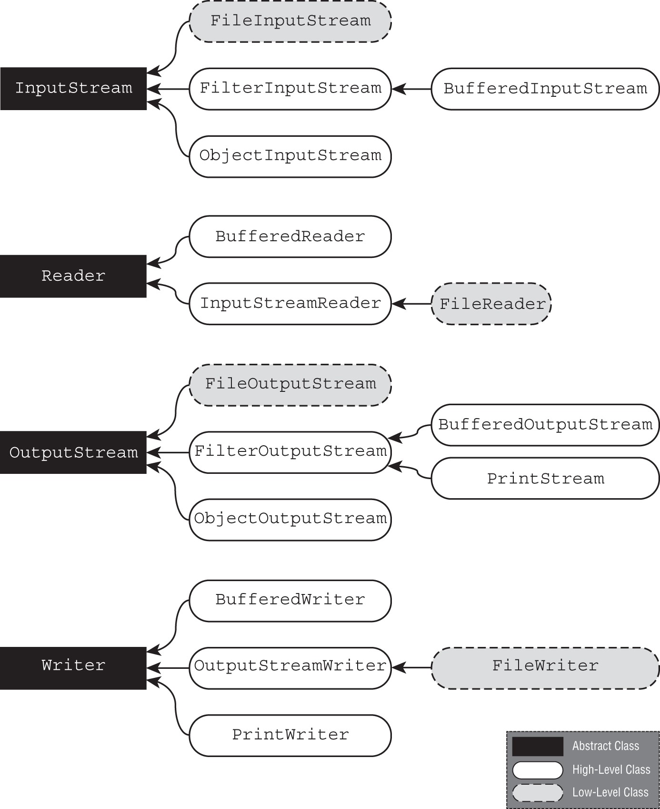

# Chapter 19 I/O
- [Chapter 19 I/O](#chapter-19-io)
    - [Introducing the File class](#introducing-the-file-class)
    - [Introducing I/O Streams](#introducing-io-streams)
    - [Byte Streams vs. Character Streams](#byte-streams-vs-character-streams)
    - [Character Encoding in Java](#character-encoding-in-java)
    - [Input vs. Output Streams](#input-vs-output-streams)
    - [Low-Level vs. High-Level Streams](#low-level-vs-high-level-streams)
      - [Stream Base Classes](#stream-base-classes)
      - [\* I/O Class  and its purpose](#-io-class--and-its-purpose)
    - [Reading and Writing files with I/O Stream](#reading-and-writing-files-with-io-stream)
      - [\*InputStream, Reader and OutputStream and Writer](#inputstream-reader-and-outputstream-and-writer)
      - [Byte Stream](#byte-stream)
      - [CharacterStream](#characterstream)
      - [Closing Wrapped Streams](#closing-wrapped-streams)
    - [Manipulating Input Streams](#manipulating-input-streams)
    - [Flushing Buffered Streams](#flushing-buffered-streams)
    - [Working with I/O Stream Classes](#working-with-io-stream-classes)
      - [**Reading and Writing byte stream using FileInput and FileOutputStream**](#reading-and-writing-byte-stream-using-fileinput-and-fileoutputstream)
      - [**Buffering Binary Data**](#buffering-binary-data)
      - [**Reading and Writing using Character Streams**](#reading-and-writing-using-character-streams)
      - [BufferedReader and BufferedWriter](#bufferedreader-and-bufferedwriter)
    - [Serializing Data](#serializing-data)
    - [Externalizable](#externalizable)
      - [(\*) Storing Data with _ObjectOutStream_ and _ObjectInputStream_](#-storing-data-with-objectoutstream-and-objectinputstream)
    - [Deserialization](#deserialization)
  - [Printing Data](#printing-data)
    - [Interacting with Users](#interacting-with-users)
      - [Printing Data to the User System.out and System.err](#printing-data-to-the-user-systemout-and-systemerr)
      - [Reading Input as a Stream](#reading-input-as-a-stream)
      - [Closing System Streams](#closing-system-streams)
      - [Acquiring Input with Console](#acquiring-input-with-console)
      - [\* Console: _reader() and writer()_](#-console-reader-and-writer)
      - [USING CONSOLE WITH A LOCALE](#using-console-with-a-locale)
      - [Complete sample pgm on Console Methods](#complete-sample-pgm-on-console-methods)
    - [Summary](#summary)
    - [Review Questions](#review-questions)

### Introducing the File class
- `java.io.File` class. The File class is used to read information about existing files and directories, list the contents of a directory, and create/delete files and directories.
- An instance of a File class represents the path to a particular file or directory on the file system. It is used along with the Stream to read or write data.
- Creating a File Object
  - The absolute path of a file or directory is the full path from the root directory to the file or directory
   (e.g) /home/tiger/data/stripes.txt
  - Following is the relative path to the same file, assuming current directory is /home/tiger: data/stripes.txt
- Finding the separator character for the current environment
```java
 Option-1:  System.out.println(System.getProperty("file.separator"));
 Option-2:  System.out.println(java.io.File.separator);
```
- Creating a File instance
```java
    File zooFile2 = new File("/home/tiger", "data/stripes.txt");
    File parent = new File("/home/tiger");
    File zooFile3 = new File(parent, "data/stripes.txt");
```
- Working with a File Object
  * Most commonly used _File_ object methods
    ```java
    var file = new File("c:\\data\\zoo.txt");
    System.out.println("File Exists: " + file.exists());
    if (file.exists()) {
    System.out.println("Absolute Path: " + file.getAbsolutePath());
    System.out.println("Is Directory: " + file.isDirectory());
    System.out.println("Parent Path: " + file.getParent());
    if (file.isFile()) {
        System.out.println("Size: " + file.length());
        System.out.println("Last Modified: " + file.lastModified());
    } else {
        for (File subfile : file.listFiles()) {
            System.out.println("   " + subfile.getName());
        }
    }
    }

    //output
        File Exists: true
        Absolute Path: c:\data\zoo.txt
        Is Directory: false
        Parent Path: c:\data
        Size: 12382
        Last Modified: 1606860000000
    ```

    - _Note:_ On the exam, you might get paths that look like files but are directories, or vice versa. For example, /data/zoo.txt could be a file or a directory, even though it has a file extension. Don't assume it is either unless the question tells you it is!
### Introducing I/O Streams
- The “I/O” refers to the nature of how data is accessed, either by reading the data from a resource (input) or by writing the data to a resource (output).
- java.io API is full of streams that handle characters, strings, groups of bytes, and so on, nearly all are built on top of reading or writing an individual byte or an array of bytes at a time.
- A BufferedOutputStream, can write a large chunk of bytes at a time, reducing the round‐trips and drastically improving performance.
- I/O Streams can be big, A 1 terabyte file could be read and written by a program with very little memory, since the stream allows the application to focus on only a small portion of the overall stream at any given time.

### Byte Streams vs. Character Streams
- `Byte streams` read/write binary data ( 0s and 1s) and have class names that end in InputStream or OutputStream.
- `Character streams` read/write text data and have class names that end in Reader or Writer.
- Even though character streams do not contain the word Stream in their class name, they are still I/O streams. The use of Reader/ Writer in the name is just to distinguish them from byte streams
- the byte stream classes can write all types of binary data, including strings, it follows that the character stream classes aren't strictly necessary. There are advantages, though, to using the character stream classes,  For example, **you can use a Writer class to output a String value to a file without necessarily having to worry about the underlying character encoding of the file.**
- The character encoding determines how characters are encoded and stored in bytes in a stream and later read back or decoded as characters
- Java supports a wide variety of character encodings, ranging from ones that may use one byte for Latin characters, UTF‐8 and ASCII for example, to using two or more bytes per character, such as UTF‐16

### Character Encoding in Java
- The character encoding can be specified using the Charset 
   ```java
    Charset usAsciiCharset = Charset.forName("US-ASCII");
    Charset utf8Charset = Charset.forName("UTF-8");
    Charset utf16Charset = Charset.forName("UTF-16");
   ```
### Input vs. Output Streams
|        |         |
------  | ----------
| InputStream     | OutputStream
| FileInputStream | FileOutputStream 
| FileReader      | FileWriter 
| `NA` | PrintWriter 
| `NA` | PrintStream 

> Note There is not PrintReader to read the user input instead the following way is used. complete sample [Console Reader and Writer](#console-reader-and-writer)
```java
Console c = System.console();
String line =  c.readLine();
var reader = new BufferedReader(new InputStreamReader(System.in)); 
String line = reader.readLine();
```  
### Low-Level vs. High-Level Streams
A `low‐level stream` connects directly with the source of the data, such as a file, an array, or a String.For example, a `FileInputStream` is a class that reads file data one byte at a time.

Alternatively, a `high‐level stream` is built on top of another stream using wrapping.For example, take a look at the FileReader and BufferedReader objects in the following sample code: Here FileReader is the low-level stream and the BufferedReader is the high level stream.
```java
try (var br = new BufferedReader(new FileReader("zoo-data.txt"))) {
   System.out.println(br.readLine());
}
```
#### Stream Base Classes
- The `java.io` library defines four abstract classes that are the parents of all stream classes defined within the API: `InputStream`, `OutputStream` both are byte streams, `Reader`, and `Writer` both are character streams. 

- A class with Buffered in its name reads or writes data in groups of bytes or characters and often improves performance in sequential file systems.

```java
new BufferedInputStream(new FileReader("z.txt"));  // DOES NOT COMPILE Mixing Reader with InputStream
new BufferedWriter(new FileOutputStream("z.txt")); // DOES NOT COMPILE same as above now it writer.
new ObjectInputStream(
   new FileOutputStream("z.txt"));                 // DOES NOT COMPILE Mixing Input and Output Stream
new BufferedInputStream(new InputStream());        // DOES NOT COMPILE since input stream is abstract
```
#### * I/O Class  and its purpose

Class Name|Low/High Level|Description
--------- | ------------- | --------------
FileInputStream|Low|Reads file data as bytes
FileOutputStream|Low|Writes file data as bytes
FileReader|Low|Reads file data as characters
FileWriter|Low|Writes file data as characters
BufferedInputStream|High|Reads byte data from an existing InputStream in a buffered manner, which improves efficiency and performance
BufferedOutputStream|High|Writes byte data to an existing OutputStream in a buffered manner, which improves efficiency and performance
BufferedReader|High|Reads character data from an existing Reader in a buffered manner, which improves efficiency and performance
BufferedWriter|High|Writes character data to an existing Writer in a buffered manner, which improves efficiency and performance
ObjectInputStream|High|Deserializes primitive Java data types and graphs of Java objects from an existing InputStream
ObjectOutputStream|High|Serializes primitive Java data types and graphs of Java objects to an existing OutputStream
PrintStream|High|Writes formatted representations of Java objects to a binary stream
PrintWriter|High|Writes formatted representations of Java objects to a character stream

### Reading and Writing files with I/O Stream  
- Reading and Writing Data
 * We said we are reading and writing bytes, so why do the methods use int instead of byte? Remember, the byte data type has a range of 256 characters. They needed an extra value to indicate the end of a stream
 * The authors of Java decided to use a larger data type, int, so that special values like ‐1 would indicate the end of a stream.
#### *InputStream, Reader and OutputStream and Writer 

```java
// InputStream and Reader
public int read() throws IOException

// OutputStream and Writer
public void write(int b) throws IOException

void copyStream(InputStream in, OutputStream out) throws IOException {
   int b;
   while ((b = in.read()) != -1) {
      out.write(b);
   }
}
// Same method With Reader and Writer instead of InputStream and OutputStream to read and write character.
```
#### Byte Stream
- The byte stream classes also include overloaded methods for reading and writing multiple bytes at a time.
```java
// InputStream
public int read(byte[] b) throws IOException
public int read(byte[] b, int offset, int length) throws IOException
 
// OutputStream
public void write(byte[] b) throws IOException
public void write(byte[] b, int offset, int length) throws IOException
//The offset and length are applied to the array itself. For example, an offset of 5 and length of 3 indicates that the stream should read up to 3 bytes of data and put them into the array starting with position 5
```

#### CharacterStream
- Equivalent character strean classes include overloaded method for reading and writing multiple character array at a time.
```java
// Reader
public int read(char[] c) throws IOException
public int read(char[] c, int offset, int length) throws IOException
 
// Writer
public void write(char[] c) throws IOException
public void write(char[] c, int offset, int length) throws IOException
```

#### Closing Wrapped Streams
- All I/O streams implement Closeable, the best way to do this is with a try‐with‐resources statement,
```java
  try (var fis = new FileInputStream("zoo-data.txt")) {
   System.out.print(fis.read());
}

//explicit close method which is not recommended 
public void close() throws IOException
```
- we can rely on the ObjectOutputStream to close the BufferedOutputStream and FileOutputStream. The following will call only one close()
- When working with a wrapped stream, you only need to use close() on the topmost objec 
```java
   try (var ois = new ObjectOutputStream(
          new BufferedOutputStream(
             new FileOutputStream("zoo-banner.txt")))) {
       ois.writeObject("Hello");
    }
```
### Manipulating Input Streams
The mark() and reset() methods return a stream to an earlier position. Before calling either of these methods, you should call the markSupported() method, which returns true only if mark() is supported. The skip() method is pretty simple; it basically reads data from the stream and discards the contents.
```java
// InputStream and Reader
public boolean <b>markSupported()</b>
public void void mark(int readLimit)
public void reset() throws IOException
public long skip(long n) throws IOException
//Return value of skip tells how many values we are away from the end of the stream

public void readData(InputStream is) throws IOException {
   System.out.print((char) is.read());     // L
   if (is.markSupported()) {
      is.mark(100);  // Marks up to 100 bytes is the readLimit, If programs call reset after this limit then an exception is thrown.
      System.out.print((char) is.read());  // I
      System.out.print((char) is.read());  // O
      is.reset();    // Resets stream to position before I
   }
   System.out.print((char) is.read());    // I
   System.out.print((char) is.read());    // O
   System.out.print((char) is.read());    // N
}
```
- _skip()_
 * `Reader` reading Tiger  
```java
  System.out.print ((char)is.read()); // T
  is.skip(2);  // Skips I and G
  is.read();   // Reads E but doesn't output it
  System.out.print((char)is.read());  // R
  System.out.print((char)is.read());  // S
  //outputs TRS at runtime
```
### Flushing Buffered Streams
- _flush()_ method to requests that all accumulated data be written immediately to disk.
- The flush() method helps reduce the amount of data lost if the application terminates unexpectedly. It is not without cost, though. Each time it is used, it may cause a noticeable delay in the application, 
  especially for large files
- Calling the flush() method when you have finished writing data is not required, since the close() method will automatically do this.
-  When autoflush is enabled, certain key events cause the buffer to be flushed. For example, an autoflush PrintWriter object flushes the buffer on every invocation of println or format.
```java
// OutputStream and Writer
public void flush() throws IOException
```
### Working with I/O Stream Classes

#### **Reading and Writing byte stream using FileInput and FileOutputStream**
- `FileInputStream` and `FileOutputStream`. They are used to read bytes from a file or write bytes to a file.
- The `FileOutputStream` class includes overloaded constructors that take a boolean append flag. When set to true, the output stream will append to the end of a file
- If the source File does not exists `FileNotFoundException` is thrown
- [Abstract class](#reading-and-writing-files-with-io-stream)
```java
void copyByte(File src, File dest) throws IOException {
   try (var in = new FileInputStream(src);
        var out = new FileOutputStream(dest)) {
      int b;
      while ((b = in.read()) != -1) {
         out.write(b);
      }
   }
}
```
#### **Buffering Binary Data**
- Instead of reading the data one byte at a time, We `read and write up to 1024 bytes at a time`.The return value lengthRead is critical for determining whether we are at the end of the stream and knowing how many bytes we should write into our output stream.
  
```java
void copyFileWithBuffer(File src, File dest) throws IOException {
   try (var in = new BufferedInputStream(
           new FileInputStream(src));
        var out = new BufferedOutputStream(
           new FileOutputStream(dest))) {
      var buffer = new byte[1024];
      int lengthRead;
      while ((lengthRead = in.read(buffer))> 0) {
         out.write(buffer, 0, lengthRead);
         out.flush();
      }
   }
}
```
#### **Reading and Writing using Character Streams**
- The FileReader and FileWriter classes, along with their associated buffer classes, are among the most convenient I/O classes because of their built‐in support for text data. 
- we're copying one character at a time, rather than one byte, like in byte stream.
- All character stream classes are descended from Reader and Writer. As with byte streams, there are character stream classes that specialize in file I/O: FileReader and FileWriter.  
```java
void CopyCharacters(File src, File dest) throws IOException {
   try (var reader = new FileReader(src);
        var writer = new FileWriter(dest)) {
      int b;
      while ((b = reader.read()) != -1) {
         writer.write(b);
      }
   }
}
```
- CopyCharacters is very similar to CopyBytes. The most important difference is that CopyCharacters uses FileReader and FileWriter for input and output in place of FileInputStream and FileOutputStream. Notice that both CopyBytes and CopyCharacters use an int variable to read to and write from. However, in CopyCharacters, the int variable holds a character value in its last 16 bits; in CopyBytes, the int variable holds a byte value in its last 8 bits.

#### BufferedReader and BufferedWriter

```java
BufferedReader br = new BufferedReader(new InputStreamReader(System.in));
String str = br.readLine();
```
An InputStream is a bridge between the byteStream and character stream. It reads bytes and decodes them into characters. System.in is a byte stream and its wrapper with input stream reader to read  it as a character stream. The BufferedReader reads text from a character-input stream, buffering characters for efficiency.

- In this example, each loop iteration corresponds to reading and writing a line of a file. Assuming the length of the lines in the file are reasonably sized, this implementation will perform well.
- They add two new methods, readLine() and newLine(), that are particularly useful when working with String values.
```java
  // BufferedReader
   public String readLine() throws IOException
// BufferedWriter
   public void newLine() throws IOException
```
```java
//Method copying one line at a time
void copyTextFileWithBuffer(File src, File dest) throws IOException {
   try (var reader = new BufferedReader(new FileReader(src));
        var writer = new BufferedWriter(new FileWriter(dest))) {
      String s;
      while ((s = reader.readLine()) != null) {
         writer.write(s);
         writer.newLine();
      }
   }
}
```
### Serializing Data

- _Serialization_ is the process of converting an object to a (byte)stream. Likewise, _deserialization_ is the process of converting from a (byte) stream in to an object.
- Serialization often involves writing an object to a stored or transmittable format, while deserialization is the reciprocal process.
- **Applying the Serializable Interface**
- Serializable is marker interface and class can implement it.But in general only mark data‐oriented classes serializable. 
- private `transient` String favoriteFood; fields marked with `transient` are not serialized meaning there state are not written in the file, when you deserialize the value will be default 0 or null.
- declare static `serialVersionUID` variable in every class that implements Serializable. It helps inform the JVM that the stored data may not match the new class definition. When older version of the class is encountered during deserialization, a `java.io.InvalidClassException` may be thrown.
- **Ensuring a Class Is Serializable**
* How to Make a Class Serializable
* The class must be marked Serializable.
* Every instance member of the class is serializable, marked transient, or has a null value at the time of serialization.
### Externalizable
The `writeExternal` and `readExternal` methods of the `Externalizable` interface need to be implemented by a class ONLY if complete control over the format and contents of the stream is required.  
  
#### (*) Storing Data with _ObjectOutStream_ and _ObjectInputStream_
  
```java
  // ObjectInputStream
public Object readObject() throws IOException, ClassNotFoundException
 
// ObjectOutputStream
public void writeObject(Object obj) throws IOException

//Writing object to a file
void saveToFile(List<Gorilla> gorillas, File dataFile)
      throws IOException {
   try (var out = new ObjectOutputStream(
           new BufferedOutputStream(
              new FileOutputStream(dataFile)))) {
      for (Gorilla gorilla : gorillas)
         out.writeObject(gorilla);
   }
}

//Reading Object from file
List<Gorilla> readFromFile(File dataFile) throws IOException,
      ClassNotFoundException {
   var gorillas = new ArrayList<Gorilla>();
   try (var in = new ObjectInputStream(
           new BufferedInputStream(
              new FileInputStream(dataFile)))) {
      while (true) {
         var object = in.readObject();
         if (object instanceof Gorilla)
            gorillas.add((Gorilla) object);
      }
   } catch (EOFException e) {
      // File end reached
   }
   return gorillas;
}
```
- Unlike our earlier techniques for reading methods from an input stream, we need to use an infinite loop to process the data, which throws an EOFException when the end of the stream is reached.
```java
var gorillas = new ArrayList<Gorilla>();
gorillas.add(new Gorilla("Grodd", 5, false));
gorillas.add(new Gorilla("Ishmael", 8, true));
File dataFile = new File("gorilla.data");
 
saveToFile(gorillas, dataFile);
var gorillasFromDisk = readFromFile(dataFile);
System.out.print(gorillasFromDisk);
//output 
[[name=Grodd, age=5, friendly=false], 
 [name=Ishmael, age=8, friendly=true]]
```
### Deserialization 
Deserialization is the process by which the object previously serialized is reconstructed back into its original form i.e. object instance. The input to the deserialization process is the stream of bytes that comes from the filesystem/database.

When you deserialize an object, the constructor/initializers of the class are not called when the object is created. Java will call the no-arg constructor of the first non-serializable parent class it can find in the class hierarchy

In the deserialization process, it is required that all the parent classes of instance should be Serializable; and if any super-class in the hierarchy is not Serializable then it must have a default constructor.

If any super class of instance to be de-serialized in non-serializable and also does not have a default constructor then the _‘NotSerializableException‘_ is thrown by JVM.

Note that after this no constructor will be called for any class. After executing the superclass constructor, JVM read the byte stream and uses the instance’s metadata to set type information and other meta information of the instance.

After the blank instance is created, JVM first set its static fields and then invokes the default readObject() method [if it’s not overridden, otherwise overridden method will be called] internally which is responsible for setting the values from byte stream to blank instance.

## Printing Data
- `PrintStream` and `PrintWriter` are high‐level output print streams classes that are useful for writing text data to a stream.
- `public PrintStream(OutputStream out)` and `public PrintWriter(Writer out)`
- Apart from inherited `write()` methods, the print stream classes include numerous methods to write data including `print(), println(), and format()`.
- They don't throw checked exception like other print stream classes
- `System.out` and `System.err` are PrintStream objects.
- `System.in`, often useful for reading user input, is an `InputStream`
- **_print()_**  takes primitive, String values as arguments and perform String.valueOf() on the argument and call the underlying streams's `write()` method to add it to the stream.
- **_println()_** virtually identical to the print() methods, except that they also print a line break after the String value is written
- *_printf()_* print with the format.
- **_format()_** 
```java
  // PrintStream
public PrintStream format(String format, Object args…)
public PrintStream format(Locale loc, String format, Object args…)
 
// PrintWriter
public PrintWriter format(String format, Object args…)
public PrintWriter format(Locale loc, String format, Object args…)

System.out.format("Hello %s, order %d is ready", name, orderId);
```
- `%s - String, %d - int and long, %f- float and double, %n inserts a line break`
- Missing data type and value cause exceptions (e.g) `System.out.format("Food: %d tons", 2.0); // IllegalFormatConversionException`
```java
String name = "James";
double score = 90.25;
int total = 100;
System.out.format("%s:%n   Score: %f out of %d", name, score, total);
James:
   Score: 90.250000 out of 100
```
- Using the format() with _FLAGS_
  * `%.1f` used to round of the value` 90.25000` to `90.3` By default, %f displays exactly six digits past the decimal
  * Support to prefix spaces and 0 with brackets, [] (e.g)
```java
  var pi = 3.14159265359;
    System.out.format("[%f]",pi);      // [3.141593]
    System.out.format("[%12.8f]",pi);  // [  3.14159265] 2 spaces prefixed to meet length 12.
    System.out.format("[%012f]",pi);   // [00003.141593]
    System.out.format("[%12.2f]",pi);  // [        3.14]// Total length 12, with 2 decimal character.
    System.out.format("[%.3f]",pi);    // [3.142]
```


### Interacting with Users

The `java.io` API contains class to interact with the user. (e.g) Asking user to log in and prints a success message. Java includes two PrintStream instances for providing information to the user: System.out and System.err.  
#### Printing Data to the User System.out and System.err
- `System.err` is the same as `System.out` but is used to report errors to the user in a separate stream from the regular output information.
#### Reading Input as a Stream

```java
var reader = new BufferedReader(new InputStreamReader(System.in));
String userInput = reader.readLine();
System.out.println("You entered: " + userInput);
```
#### Closing System Streams
- `System.out, System.err, and System.in` these are I/O Streams used without try-with-resources block on! because these are static objects, the System streams are shared by the entire application.
- Using in try-with-resource is not recommended as this will close the stream and it will not be available to any thread in the application
```java
try (var out = System.out) {}
System.out.println("Hello"); 
try (var err = System.err) {}
System.err.println("Hello");  
```
- Above doesn't print nothing as the  stream is closed, note PrintStream do not throw any checked exceptions and rely on the checkError() to report errors. so they fail silently.
- Following code prints an exception at runtime. Unlike the PrintStream class, most InputStream implementations will throw an exception if you try to operate on a closed stream.
```java
 var reader = new BufferedReader(new InputStreamReader(System.in));
try (reader) {}
String data = reader.readLine();  // IOException, since InputStream is already closed.
```
#### Acquiring Input with Console
- `java.io.Console` is specifically designed to handle user interactions. Its a singleton class instance is create from a factory method and only one instance is available all time.
  
```java
Console console = System.console();
if (console != null) {
   String userInput = console.readLine();
   console.writer().println("You entered: " + userInput);
} else {
   System.err.println("Console not available");
}
```
#### * Console: _reader() and writer()_
- The Console class includes access to two streams for reading and writing data.
```java
public Reader reader()
public PrintWriter writer()

Console console = System.console();
if (console == null) {
   throw new RuntimeException("Console not available");
} else {
   console.writer().println("Welcome to Our Zoo!");
   console.format("It has %d animals and employs %d people", 391, 25);
   console.writer().println();
   console.printf("The zoo spans %5.1f acres", 128.91);
}
//outputs
Welcome to Our Zoo!
It has 391 animals and employs 25 people
The zoo spans 128.9 acres.
```
#### USING CONSOLE WITH A LOCALE

Console console = System.console();
console.writer().format(new Locale("fr", "CA"), "Hello World");

#### Complete sample pgm on Console Methods
```java
Console console = System.console();
if (console == null) {
   throw new RuntimeException("Console not available");
} else {
   String name = console.readLine("Please enter your name: ");
   console.writer().format("Hi %s", name);
   console.writer().println();
 
   console.format("What is your address? ");
   String address = console.readLine();
 
   char[] password = console.readPassword("Enter a password " 
      + "between %d and %d characters: ", 5, 10);
   char[] verify = console.readPassword("Enter the password again: ");
   console.printf("Passwords "
      + (Arrays.equals(password, verify) ? "match" : "do not match"));
   console.printf("User: %s Register successful!", name);   
}
```
### Summary 
- Code comparision of byte and character streams
```java
InputStream      Reader         Buffered byte and Character Stream
  ^                ^
  |                |
FileInputStream  FileReader      BufferedInputStream in = new BufferedInputStream(new FileInputStream(new File(fileName))
                                  var buffer = new byte[1024];
                                  int lengthRead;
 while ((b = in.read()) != -1)    while ((lengthRead = in.read(buffer))> 0) 
                                    out.write(buffer, 0, lengthRead);

OutputStream     Writer         BufferedReader reader =new BufferedReader(new FileWriter("characterinput.txt"));    
  ^                ^              new BufferedWriter(new FileWriter("characteroutput.txt")); 
  |                |                while ((s = reader.readLine()) != null) {
FileOutputStream FileWriter              writer.write(s); writer.newLine(); 

        out.write(b)          
```
### Review Questions
1. F - ObjectInputStream is best to use a read a binary file into a Java object. Note ObjectReader is not an I/O stream class rather its a IO class.
2. C, ~~F~~, G, E Methods in java.io.File class mkdirs(), mkdir(), renameTo(). No method like mv, copy()
3. ~~E~~ What is the value of name after the instance of Eagle created in the main() method is serialized and then deserialized?
    During deserialization, **Java calls the constructor of the first nonserializable parent. In this case, the Bird constructor is called, with name being set to Matt. Note that none of the constructors or instance initializers in Eagle is executed as part of deserialization**.   

   ```java
    import java.io.Serializable;
         class Bird {
            protected transient String name;
            public void setName(String name) { this.name = name; }
            public String getName() { return name; }
            public Bird() {
               this.name = "Matt";
            }
         }
         public class Eagle extends Bird implements Serializable {
            { this.name = "Olivia"; }
            public Eagle() {
               this.name = "Bridget";
            }
            public static void main(String[] args) {
               var e = new Eagle();
               e.name = "Adeline";
            }
         }
   ```
4. D  Which classes will allow the following to compile? `BufferedInputStream there's no rule that it can't be wrapped multiple times by a high level stream, ObjectInputStream`
 ```java
    var is = new BufferedInputStream(new FileInputStream("z.txt"));
         InputStream wrapper = new __________(is);
         try (wrapper) {}
 ```
5. B
   - System.console() will return null if a Console is not available. It won't throw any exception. `Console` includes a `format()` method to write data to the console's output.
6. C, E
7. D (XYZY) provided the stream supports mark() operation by calling markSupported() on the stream. As there is no check the result can't be determined    
   Assume that in is a valid stream whose next bytes are XYZABC. What is the result of calling the following method on the stream, using a count value of 3?  
  ```java
   public static String pullBytes(InputStream in, int count)
               throws IOException {
            in.mark(count);
            var sb = new StringBuilder();
            for(int i=0; i<count; i++)
               sb.append((char)in.read());
            in.reset();
            in.skip(1);
            sb.append((char)in.read());
            return sb.toString();
         }
  ```

8. A, F - The `readObject`() method of `ObjectInputStream` may throw a `ClassNotFoundException` even if the return object is not cast to a specific type. 
9. A, /home/parrot is an absolute path,  /home/parrot path could be a file or directory.new File("/home") will not throw an exception if /home does not exist. Its possible to create a `File` reference to files and directories that do not exists. new File("/home").delete() return false if the file or directory can't be deleted.
10.  E, F Requirement for a class to be serializable ? Class must implement Serializable. All instance members of the class must be serializable or marked transient.
11.  C. It will delete all files within the directory tree
      ```java
      public static void deleteTree(File file) {
            if(!file.isFile())                    // f1
               for(File entry: file.listFiles())  // f2
                  deleteTree(entry);
            else file.delete();
         }
      ```
12. B What are possible results of executing the following code? (Choose all that apply.)
- The code does not compile, as the Writer methods append() and flush() both throw an IOException.  If the method dcl IOException, c.writer() could return null if no console available, if console available then prints what ever the name you have entered.
 ```java
   public static void main(String[] args) {
      String line;
      var c = System.console();
      Writer w = c.writer();
      try (w) {
         if ((line = c.readLine("Enter your name: ")) != null)
            w.append(line);
         w.flush();
      }
   }
 ```
13.    B, ~~ D~~, E new File("weather", "/winter/snow.dat") this is wrong since weather is not starting with /
14.    A, C, E
15.    E (No PrintReader, Instead Console c = System.console(); c.readLine() or var reader = new BufferedReader(new InputStreamReader(System.in)); reader.readLine() used)
16.   What happens to the code when its run ? D
 1. When run, the method creates a new file with one line of text in it.
 2. The method compiles but will produce an exception at runtime.
```java
private void echo() throws IOException {
         var o = new FileWriter("new-zoo.txt");
         try (var f = new FileReader("zoo-data.txt");
            var b = new BufferedReader(f); o) {
            o.write(b.readLine());
         }
         o.write("");
      }
```
17. Assume reader is a valid stream that supports mark() and whose next characters are PEACOCKS. What is the expected output of the following code snippet? C
- prints `PEOE`
```java
var sb = new StringBuilder();
      sb.append((char)reader.read());
      reader.mark(10);
      for(int i=0; i<2; i++) {
         sb.append((char)reader.read());
         reader.skip(2);
      }
      reader.reset();
      reader.skip(0);
      sb.append((char)reader.read());
      System.out.println(sb.toString());
```
18. Suppose that you need to write data that consists of int, double, boolean, and String values to a file that maintains the data types of the original data. You also want the data to be performant on large files. Which three java.io stream classes can be chained together to best achieve this result? (Choose three.)
 * FileOutputStream, BufferedOutputStream, ObjectOutputStream
19.  D, G which statement are correct ? 
    * If we check file2 on line n1 within the file system after five iterations of the while loop, it may be empty.
    * The code compiles and correctly copies the data between some files. since read/write byte[] missing instead char[] is used. so It will only correctly copy files whose character count is a multiple of 10
    * This method contains a resource leak.
 ```java
 public void copyFile(File file1, File file2) throws Exception {
            var reader = new InputStreamReader(
               new FileInputStream(file1));
            try (var writer = new FileWriter(file2)) {
               char[] buffer = new char[10];
               while(reader.read(buffer) != -1) {
                  writer.write(buffer);
                  // n1
               }
            }
         }
 ```
20.   C console.format("You fav color is %s", color), writer().printl, writer().println
21.   Reason to use a character stream such as Reader/Writer over a byte stream, such as InputStream/OutputStream. 
    - More convenient code syntax when working with String data
    - Automatic character encoding
22.  A, C (Java Object implements Serializable) would be correct 
    - To be serializable, a class must implement the Serializable interface, which Zebra does. It must also contain instance members that either are marked transient or are serializable. The instance member stripes is of type Object, which is not serializable Therefore, the Zebra class is not serializable, with the program throwing an exception at runtime if serialized
    - Removing Stripes line makes Zebra serializable with name and age default to NULL.
         ```java
         1:  import java.io.Serializable;
         2:  import java.util.List;
         3:  public class Zebra implements Serializable {
         4:     private transient String name = "George";
         5:     private static String birthPlace = "Africa";
         6:     private transient Integer age;
         7:     List<Zebra> friends = new java.util.ArrayList<>();
         8:     private Object stripes = new Object();
         9:     { age = 10;}
         10:    public Zebra() {
         11:       this.name = "Sophia";
         12:    }
         13:    static Zebra writeAndRead(Zebra z) {
         14:       // Implementation omitted
         15:    }
         16:    public static void main(String[] args) {
         17:       var zebra = new Zebra();
         18:       zebra = writeAndRead(zebra);
         19:    } }
         ```
 

