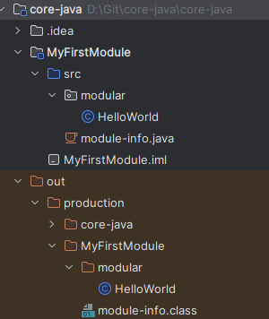
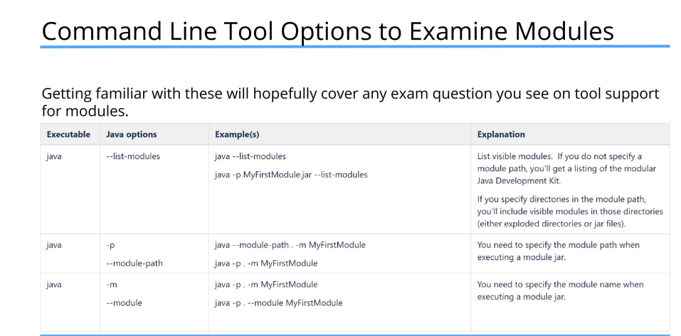
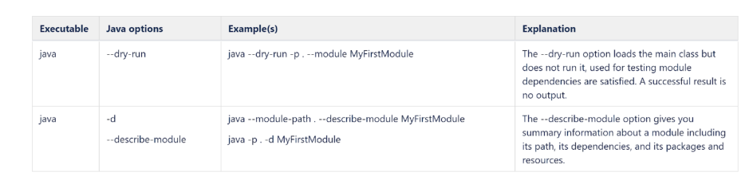
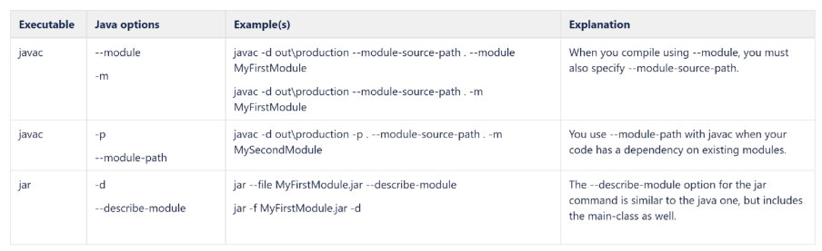
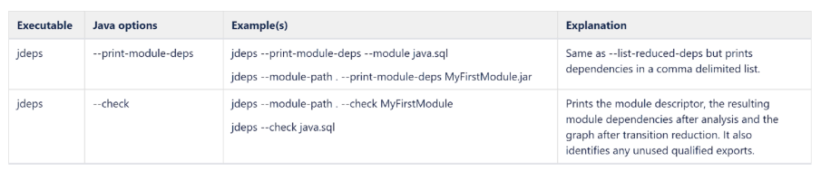
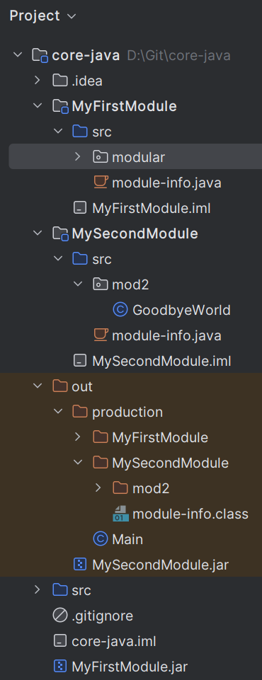
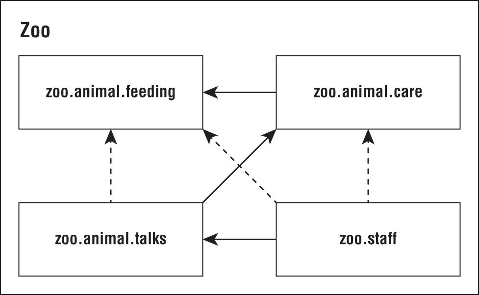

# Chapter 11 Modules

- A Java Platform Module System was (JPMS) was introduced in Java 9
- A module is a group of one or more packages plus a specific file called module-info.java
- It includes the following
  - A format for module JAR files
    - Partitioning of the JDK into modules
    - Additional command-line options for Java tools
- What it solved ?
  - Modules solve this problem by acting as a fifth level of access control. They can expose packages within the modular JAR to specific other packages. This stronger form of encapsulation really does create internal packages.
- -p D:\Git\core-java\core-java\out\production\MyFirstModule -m MyFirstModule/modular.HelloWorld

## Creating and Running a Modular Program

1. create a new module from root folder MyFirstModule
2. create src\module-info.java in the source folder
  

```shell

## compiling a Module
 javac --module-path MyFirstModule -d out\production .\MyFirstModule\src\modular\HelloWorld.java .\MyFirstModule\src\module-info.java

## Executing -p is like class path containing the exploded classes
 java --module-path .\out\production\ --module MyFirstModule/modular.HelloWorld
 java -p .\out\production\ -m MyFirstModule/modular.HelloWorld

## Creating a jar file in the root folder -C contains the exploded class file and module-info
 jar --create --file MyFirstModule.jar --main-class modular.HelloWorld -C .\out\production\ . 

## Examining a module 
 jar -f MyFirstModule.jar --list

 jar -f MyFirstModule.jar -d # describe the module

## Executing from jar
 java --module-path . --module MyFirstModule
 
 java -p . -m MyFirstModule #shorter version
```







## Working with Multi module


Changes:
  
  1. Do changes in the module-info.java of (MyFirstModule, MySecondModule)

  ```json
      module MyFirstModule {
        requires MySecondModule;
      }

       module MySecondModule {
        export mod2;
      }
  ```

  2. Compile, build jar and execute 
  
  ```bash
    D:\Git\core-java>jar --create --file MyFirstModule.jar --main-class modular.HelloWorld -C out\production\MyFirstModule\ .

    D:\Git\core-java>jar --create --file out\MySecondModule.jar -C out\production\MySecondModule\ .  

    D:\Git\core-java>java --dry-run -p .;out -m MyFirstModule

    D:\Git\core-java>java -p .;out -m MyFirstModule 

    #Examine the dependent modules
    jdeps --module-path .;out  MyFirstModule.jar
     #or 
    jdeps --module-path .;out  -m MyFirstModule 

  ```
## module-info

- The`module-info` file must be in the root directory of your module. Regular Java classes should be in packages.
- The `module-info` file must use the keyword module instead of class, interface, or enum.
- The module name follows the naming rules for package names. It often includes periods (.) in its name. Regular class and package names are not allowed to have dashes (-). Module names follow the same rule.
- _module-info_ file
  - Keywords used in the module-info files are: exports, requires, provides, uses, and opens.
  - requires Examples
    - requires org.module.a;
    - `requires transitive` java.xml; 
      In this case, any module that reads java.desktop also implicitly reads java.xml. For example, if a method from the java.desktop module returns a type from the java.xml module, code in modules that read java.desktop becomes dependent on java.xml. Without the `requires transitive` directive in java.desktop’s module declaration, such dependent modules will not compile unless they explicitly read java.xml.
    - requires static org.module.e (means required on the compile time, but its optional in runtime)
  - exports Example
    - `export org.pkg.base` its a unqualified type meaning available to any module adds requires in their module-info.java
    - `export org.pkg.util to module.a, module.b` its a qualified type here module a and module b are considered as friends and (only) these modules have access to the public and protected type of the exported module.
- Transitive dependency version of modules.
  Here with the help of _requires transitive_ you can get ride of the dashed lines, by declaring transtive dependencies in care, talks
- uses. A uses module directive specifies a service used by this module—making the module a service consumer. A service is an object of a class that implements the interface or extends the abstract class specified in the uses directive.
- `provides…with`. A provides…with module directive specifies that a module provides a service implementation—making the module a service provider. The provides part of the directive specifies an interface or abstract class listed in a module’s uses directive and the with part of the directive specifies the name of the service provider class that implements the interface or extends the abstract class.
- `open, opens, and opens…to`. Before Java 9, reflection could be used to learn about all types in a package and all members of a type—even its private members—whether you wanted to allow this capability or not. Thus, nothing was truly encapsulated.


```java
module zoo.animal.care {
   exports zoo.animal.care.medical;
   requires transitive zoo.animal.feeding;
}

module zoo.animal.talks {
   exports zoo.animal.talks.content to zoo.staff;
   exports zoo.animal.talks.media;
   exports zoo.animal.talks.schedule;

   // no longer needed requires zoo.animal.feeding;
   // no longer needed requires zoo.animal.care;
   requires transitive zoo.animal.care;
}

module zoo.staff {
   // no longer needed requires zoo.animal.feeding;
   // no longer needed requires zoo.animal.care;
   requires zoo.animal.talks;
}
```

- _**Duplicate requires Statements**_

- Java doesn't allow you to repeat the same module in a requires clause.

```java
module bad.module {
   requires zoo.animal.talks;
   requires transitive zoo.animal.talks;
}
```

- **provides, uses, and opens**

 <p> The provides keyword specifies that a class provides an implementation of a service. </p>

  `provides zoo.staff.ZooApi with zoo.staff.ZooImpl`<br>

 <p> The uses keyword specifies that a module is relying on a service. To code it, you supply the API you want to call:</p>

  `uses zoo.staff.ZooApi`

<p>The `uses` keyword specifies that a module is relying on a service. To code it, you supply the API you want to call:

Java allows callers to inspect and call code at runtime with a technique called reflection. This is a powerful approach that allows calling code that might not be available at compile time.

Since reflection can be dangerous, the module system requires developers to explicitly allow reflection in the module-info if they want calling modules to be allowed to use it. Here are two examples:
</p>

```java
opens zoo.animal.talks.schedule; // Allows any module using this one to use reflection.
opens zoo.animal.talks.media to zoo.staff; //Gives privilege to the zoo.staff package.
```

- Discovering Modules
  - **The java Command**
    The java command has three module-related options. 1) One describes a module, 2) another lists the available modules, and 3) the third shows the module resolution logic.<br>

  - Describing a Module
  Each prints information about the module.<br>

  option-1:  `java -p mods -d zoo.animal.feeding`  <br>

  option-2:  `java -p mods --describe-module zoo.animal.feeding` <br>

  It might print something like these
  
```java
  zoo.animal.feeding file:///absolutePath/mods/zoo.animal.feeding.jar
  exports zoo.animal.feeding
  requires java.base mandated
```  

- _Note:_ The java.base module is special. It is automatically added as a dependency to all modules. This module has frequently used packages like java.util. That’s what the mandated is about.

- More about describing modules

- The contents of module-info in zoo.animal.care  

 ```java
  module zoo.animal.care {
   exports zoo.animal.care.medical to zoo.staff;
   requires transitive zoo.animal.feeding;
}
//output
java -p mods -d zoo.animal.care
 
1. zoo.animal.care file:///absolutePath/mods/zoo.animal.care.jar
2. requires zoo.animal.feeding transitive
3. requires java.base mandated
4. qualified exports zoo.animal.care.medical to zoo.staff
contains zoo.animal.care.details

1. absolute path of the module file.
2, 3: requires lines as care is dependened on feeding module as its declared transitive, any module requires care, by default they inherit the feeding
1. The contains means that there is a package in the module that is not exported at all.
 ```

- **Listing Available**
  - `java -p mods --list-modules` list the build-in modules plus + four in our zoo system.
- **Showing Module Resolution**

```java
  java --show-module-resolution
   -p feeding
   -m zoo.animal.feeding/zoo.animal.feeding.Task
```

- The jar Command
  Like java command jar command can describe a module.

```java
  jar -f mods/zoo.animal.feeding.jar -d
  jar --file mods/zoo.animal.feeding.jar --describe-module
```

### The jdeps Command

  <p>The jdeps gives information about dependencies within a module. Unlike describing a module, it looks at the code in addition to the module-info file. This tells you what dependencies are actually used rather than simply declared.</p>

```java
jdeps -s mods/zoo.animal.feeding.jar
 
jdeps -summary mods/zoo.animal.feeding.jar
//Both outputs zoo.animal.feeding -> java.base
jdeps --jdk-internals  mods/zoo.animal.feeding.jar
```

- Note: Without -s/-summary you get the detailed dependencies
- --jdk-internals option lists any classes your using that call an internal API along with which API.
[Jdeps](https://docs.oracle.com/en/java/javase/11/tools/jdeps.html#GUID-A543FEBE-908A-49BF-996C-39499367ADB4)
- **The jmod Command**
   JMOD files are recommended only when you have native libraries or something that can’t go inside a JAR file. This is unlikely to affect you in the real world.<br>
