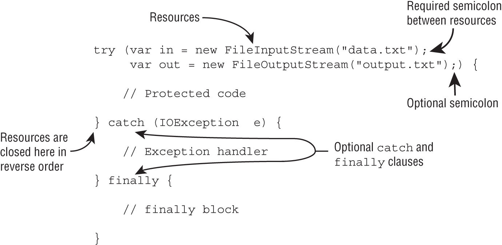

# Chapter-16: Exceptions, Assertions, and Localization

- [Chapter-16: Exceptions, Assertions, and Localization](#chapter-16-exceptions-assertions-and-localization)
  - [Handling Exception](#handling-exception)
  - [Examining Exception Categories](#examining-exception-categories)
    - [Uncheck Exceptions](#uncheck-exceptions)
    - [Checked Exceptions](#checked-exceptions)
    - [Inheriting Exception Classes](#inheriting-exception-classes)
    - [Custom Exceptions](#custom-exceptions)
    - [Rethrowing Exceptions with More Inclusive Type Checking](#rethrowing-exceptions-with-more-inclusive-type-checking)
    - [Traditional try](#traditional-try)
  - [try with resources](#try-with-resources)
    - [Understanding Suppressed Exceptions](#understanding-suppressed-exceptions)
    - [Declaring Assertions](#declaring-assertions)
      - [Writing Assertions Correctly](#writing-assertions-correctly)
  - [Working with Dates and Times](#working-with-dates-and-times)
    - [Creating Dates and Times](#creating-dates-and-times)
    - [Formatting Dates and Times](#formatting-dates-and-times)
    - [Standard DateTimeFormatter](#standard-datetimeformatter)
    - [Custom java.time.format.DateTimeFormatter (Java 11)](#custom-javatimeformatdatetimeformatter-java-11)
    - [THE DATE AND java.text.SimpleDateFormat CLASSES (java 8)](#the-date-and-javatextsimpledateformat-classes-java-8)
    - [Adding Customer Text values](#adding-customer-text-values)
  - [Supporting Internalization and Localization](#supporting-internalization-and-localization)
    - [Creating a Locale instance](#creating-a-locale-instance)
      - [Setting default `Locale`](#setting-default-locale)
    - [Localizing Numbers](#localizing-numbers)
    - [Formatting Numbers NumberFormat.getInstance(locale)](#formatting-numbers-numberformatgetinstancelocale)
    - [Parsing Numbers](#parsing-numbers)
    - [Parsing currency](#parsing-currency)
    - [Writing a Customer Number Formatter](#writing-a-customer-number-formatter)
  - [Localizing Dates](#localizing-dates)
  - [Specifying a Locale Category](#specifying-a-locale-category)
    - [Loading Properties with Resource Bundles](#loading-properties-with-resource-bundles)
      - [Creating a Resource Bundle](#creating-a-resource-bundle)
      - [Picking a Resource Bundle(\*)](#picking-a-resource-bundle)
    - [Selecting Resource Bundle Values](#selecting-resource-bundle-values)
    - [Formatting Messages (java.text.MessageFormat)](#formatting-messages-javatextmessageformat)
    - [Using the Properties Class](#using-the-properties-class)
    - [Review Questions](#review-questions)
  - [References](#references)

## Handling Exception

## Examining Exception Categories

Package: java.lang

```html
             Throwable
             /       \
   Exception          Error (Unchecked)   
       |
   RuntimeException (Unchecked)             

```

- Unchecked exception does not need to be handled or declared.
- Error is fatal, and it is considered a poor practice to catch it.

### Uncheck Exceptions

|                               |                                |
| ----------------------------- | ------------------------------ |
| ArithmeticException           | ArrayIndexOutOfBoundsException |
| ArrayStoreException           | ClassCastException             |
| UnsupportedOperationException | IllegalStateException          |
| MissingResourceException      | NullPointerException           |
| NumberFormatException         | IllegalArgumentException       |

### Checked Exceptions

|                          |                |
| ------------------------ | -------------- |
| FileNotFoundException    | IOException    |
| NotSerializableException | ParseException |
| SQLException             |

### Inheriting Exception Classes

- Knowing the Inheritance exception types are important (e.g) NumberFormatException extends IllegalFormatException
- FileNotFoundException and NotSerializableException extends IOException

```java
  try {
   throw new IOException();
} catch (IOException | FileNotFoundException e) {} // DOES NOT COMPILE
```

### Custom Exceptions

You can create custom exceptions by extending Exception, RunTimeException and Error, having said mostly CheckException are only created by extending the Exception.

  ```java
    public class CannotSwimException extends Exception {
      public CannotSwimException() {
          super();  // Optional, compiler will insert automatically
      }
      public CannotSwimException(Exception e) {
          super(e);
      }
      public CannotSwimException(String message) {
          super(message);
      }
    }

    15: public static void main(String[] unused) throws Exception {
    16:    throw new CannotSwimException("broken fin");
    17: }

    Exception in thread "main" CannotSwimException: broken fin
   at CannotSwimException.main(CannotSwimException.java:16)
  ```

  We can even pass another exception like 

```java
  15: public static void main(String[] unused) throws Exception {
  16:    throw new CannotSwimException(
  17:       new FileNotFoundException("Cannot find shark file"));
  18: }

  Exception in thread "main" CannotSwimException: 
   java.io.FileNotFoundException: Cannot find shark file
   at CannotSwimException.main(CannotSwimException.java:16)
Caused by: java.io.FileNotFoundException: Cannot find shark file
   … 1 more
```

### Rethrowing Exceptions with More Inclusive Type Checking

- Following specific exception throwing is possible only from Java SE 7

```java
public void rethrowException(String exceptionName)
  throws FirstException, SecondException {
    try {
      // ...
    }
    catch (Exception e) {
      throw e;
    }
  }
```

- Note: If a catch block handles more than one exception type, then the catch parameter is implicitly final. In this example, the catch parameter ex is final and therefore you cannot assign any values to it within the catch block.
  
### Traditional try

A tradition try statement must 1..* catch block incl multi-catch block, but at most (1) finally block.

```java
 try {
  //protected code
 } catch (IOException ex) {

 } catch (ArithmeticException | IllegalArgumentException ex) {

 } finally {

 }

```

## try with resources



- using a try‐with‐resources statement to open all your resources, this happens automatically.
- **Rule 1:** try‐with‐resources statements require resources that implement the AutoCloseable interface.

```java
    interface java.lang.AutoCloseable  {
    public void close() throws Exception;
    }

  public class MyFileReader implements AutoCloseable {
    private String tag;
    public MyFileReader(String tag) { this.tag = tag;}

      @Override public void close() {
        System.out.println("Closed: "+tag);
      }
  }
```

- **Rule 2** In a try‐with‐resources statement, you need to remember that the `resource will be closed at the completion of the try block`, before any declared catch or finally blocks execute.
- **Rule 3** _**A try‐with‐resources statement can include multiple resources, which are closed in the reverse order**_ in which they are declared. Resources are terminated by a semicolon (;). **semicolon(;) at the end is optional.**

```java
  final var bookReader = new MyFileReader("1"); //From Java 9
  var tvReader = new MyFileReader("3");// Effective final
    try (bookReader;
        var movieReader = new MyFileReader("2");
        tvReader) { //tvReader is effective final, but last statement assign null Results Compile error.
    System.out.println("Try Block");
    
    } finally {
    System.out.println("Finally Block");
    }
    tvReader = null;
 //Prints 
    Try Block
    Closed: 3
    Closed: 2
    Closed: 1
    Finally Block   
```

- File copy using try with resource

```java
 public void copyData(Path path1, Path path2) throws Exception {
    try (var in = Files.newBufferedReader(path1);
         var out = Files.newBufferedWriter(path2)) {
       out.write(in.readLine());
    }
 } 
```

- **Rule 4** resources declared within a try‐with‐resources statement are in scope only within the try block.
  
```java
3: try (Scanner s = new Scanner(System.in)) {
4:    s.nextLine();
5: } catch(Exception e) {
6:    s.nextInt(); // DOES NOT COMPILE
7: } finally {
8:    s.nextInt(); // DOES NOT COMPILE
9: }
```

- **Rule 5**  Exceptions thrown from the try-with-resource block (close) are suppressed, if the try block throws an exception.
  If an exception is thrown from the try block and `one or more exceptions are thrown from the try-with-resources statement, then those exceptions thrown from the try-with-resources statement are suppressed`, and the exception thrown by the block is the one that is thrown
- [try-with-resources](https://docs.oracle.com/javase/tutorial/essential/exceptions/tryResourceClose.html)


### Understanding Suppressed Exceptions

```java
1:  public class JammedTurkeyCage implements AutoCloseable {
2:     public void close() throws IllegalStateException {
3:        throw new IllegalStateException("Cage door does not close");
4:     }
5:     public static void main(String[] args) {
6:        try (JammedTurkeyCage t = new JammedTurkeyCage()) {
7:           System.out.println("Put turkeys in");
8:        } catch (IllegalStateException e) {
9:           System.out.println("Caught: " + e.getMessage());
10:       }
11:    }
12: }
```

<p>The close() method is automatically called by try‐with‐resources. It throws an exception, which is caught by our catch block and prints the following:Caught: Cage door does not close</p>

- try block itself is throwing

```java
5:     public static void main(String[] args) {
6:        try (JammedTurkeyCage t = new JammedTurkeyCage()) {
7:           throw new IllegalStateException("Turkeys ran off");
8:        } catch (IllegalStateException e) {
9:           System.out.println("Caught: " + e.getMessage());
10:          for (Throwable t: e.getSuppressed())
11:             System.out.println("Suppressed: "+t.getMessage());
12:       }
13:    }
//output
Caught: Turkeys ran off
Suppressed: Cage door does not close

`catch` block looks for matches on the primary exception. Since RuntimeException is not the primary exception the exception is handled by the caller main() 

5:     public static void main(String[] args) {
6:        try (JammedTurkeyCage t = new JammedTurkeyCage()) {
7:           throw new RuntimeException("Turkeys ran off");
8:        } catch (IllegalStateException e) {
9:           System.out.println("caught: " + e.getMessage());
10:       }
11:    }
```

- If line no 7: has  `throw new RuntimeException("Turkeys ran off");` the main method will output like. Java remembers the suppressed exceptions that go with a primary exception even if we don't handle them in the code.

```java
Exception in thread "main" java.lang.RuntimeException: Turkeys ran off
   at JammedTurkeyCage.main(JammedTurkeyCage.java:7)
   Suppressed: java.lang.IllegalStateException: 
         Cage door does not close
      at JammedTurkeyCage.close(JammedTurkeyCage.java:3)
      at JammedTurkeyCage.main(JammedTurkeyCage.java:8)
```

 <p>we have a problem in the below code. The finally block runs after all this. Since line 9 also throws an exception, the previous exception from line 7 is lost, with the code printing the following:</p>

```java
5:     public static void main(String[] args) {
6:        try (JammedTurkeyCage t = new JammedTurkeyCage()) {
7:           throw new IllegalStateException("Turkeys ran off");
8:        } finally {
9:           throw new RuntimeException("and we couldn't find them");
10:       }
11:    }
//output 
Exception in thread "main" java.lang.RuntimeException:
   and we couldn't find them
   at JammedTurkeyCage.main(JammedTurkeyCage.java:9)
```

### Declaring Assertions

- Assertions are basically used to validate the data.
- AssertionError will be thrown at runtime, since programs aren't supposed to catch an `Error`, assertion failures are fatal and end the program!
  
- Syntax

```java
  assert test_value;
  assert test_value: message;
```

- test_value must be a expression returning <true/false> 
- message is Optional message

```java
assert 1 == age;
assert(2 == height);
assert 100.0 == length : "Problem with length";
assert ("Cecelia".equals(name)): "Failed to verify user data";
```

When provided, the error message will be sent to the AssertionError constructor. It is commonly a String, although it can be any value.

- Assertion Syntax error

```java
  assert(1);
  assert x -> true;
  assert 1 == 2 ? "Accept" : "Error";
  assert.test(5> age); //syntax invalid other expecting an expression returin boolean
```

- When assertion is enabled, and Assertions returns the boolean  true nothing happens, incase false the AssertionError is thrown with the error message if any provded.
- Lets try a sample with and without assertion enables, disabled

```java
1: public class Party {
2:    public static void main(String[] args) {
3:       int numGuests = -5;
4:       assert numGuests> 0;
5:       System.out.println(numGuests);
6:    }
7: }
```

- java –ea Party.java. Executing the class with assertion enable throws assertion error.

- -ea is the short cut for `-enableassertions`

 ```java
  Exception in thread "main" java.lang.AssertionError 
   at asserts.Assertions.main(Assertions.java:4)
 ```

- you can enable assertions specific to a package or class (e.g)

- `java -ea:com.demos… my.programs.Main` Here enable assertions in com.demos and its subpackages and specific class Main.
- `java -ea:com.demos… -da:com.demos.TestColors my.programs.Main` enabling assertions for the entire application class, but disabling for the specific class.
- The ellipsis ( …) means any class in the specified package or subpackages. You can also enable assertions for a specific class.
- By default, all assertions are disabled.Then, those items marked with ‐ea are enabled

#### Writing Assertions Correctly

- One of the most important rules you should remember from this section is: assertions should never alter outcomes. when assertion is turned on x will be 11, when off x will be 10.
`int x = 10; assert ++x> 10; // Not a good design!`

## Working with Dates and Times

Packages: ` java.time.*`, `java.time.format.DateTimeFormatter`;

### Creating Dates and Times  

- Understanding the Date and Time types
  
```java
  System.out.println(java.time.LocalDate.now());
  System.out.println(java.time.LocalTime.now());
  System.out.println(java.time.LocalDateTime.now());
  System.out.println(java.time.ZonedDateTime.now());

  2020-10-14
  12:45:20.854
  2020-10-14T12:45:20.854
  2020-10-14T12:45:20.854-04:00[America/New_York]
```

- Using the of() Methods

  ```java
  //Create Locale Date
  LocalDate date1 = LocalDate.of(2020, Month.OCTOBER, 20);
  LocalDate date2 = LocalDate.of(2020, 10, 20);

  LocalTime time1 = LocalTime.of(6, 15);           // hour and minute
  LocalTime time2 = LocalTime.of(6, 15, 30);       // + seconds
  LocalTime time3 = LocalTime.of(6, 15, 30, 200);  // + nanoseconds

  var dt1 = LocalDateTime.of(2020, Month.OCTOBER, 20, 6, 15, 30);
  
  LocalDate date = LocalDate.of(2020, Month.OCTOBER, 20);
  LocalTime time = LocalTime.of(6, 15);
  var dt2 = LocalDateTime.of(date, time);
  ```

  - We used the factory pattern or factory method pattern to construct LocateDate, bcos you cannot call new LocalDate() since all of the constructors in this class are private.

### Formatting Dates and Times

```java
  LocalDate date = LocalDate.of(2020, Month.OCTOBER, 20);
  System.out.println(date.getDayOfWeek());  // TUESDAY
  System.out.println(date.getMonth());      // OCTOBER
  System.out.println(date.getYear());       // 2020
  System.out.println(date.getDayOfYear());  // 294
```

### Standard DateTimeFormatter

- Java provides a class called DateTimeFormatter to display standard formats.

```java
LocalDate date = LocalDate.of(2020, Month.OCTOBER, 20);
LocalTime time = LocalTime.of(11, 12, 34);
LocalDateTime dt = LocalDateTime.of(date, time);
 
System.out.println(date.format(DateTimeFormatter.ISO_LOCAL_DATE));
System.out.println(time.format(DateTimeFormatter.ISO_LOCAL_TIME));
System.out.println(dt.format(DateTimeFormatter.ISO_LOCAL_DATE_TIME));

2020-10-20
11:12:34
2020-10-20T11:12:34
```

More on [DateTimeFormatter](https://docs.oracle.com/en/java/javase/11/docs/api/java.base/java/time/format/DateTimeFormatter.html)

- `java.text.SimpleDateFormat` class is a class used prior to Java 8.

### Custom java.time.format.DateTimeFormatter (Java 11)

```java
var f = DateTimeFormatter.ofPattern("MMMM dd, yyyy 'at' hh:mm");
System.out.println(dt.format(f));  // January 20, 2020 at 11:12
```

- Java assigns each letter or symbol for a specific date/time part for example:
  - y Year
  - M  1(month)
  - MM 01(month)
  - MMM Jan
  - MMMM January
  - d (day)
  - m Minute
  - s Second
  - a (a.m/p.m) AM, PM
  - case matters m is for minute and M for month
  - `z` Time Zone Name Eastern Standard Time, EST
  - `Z` Time Zone Offset ‐0400

### THE DATE AND java.text.SimpleDateFormat CLASSES (java 8)

- SimpleDateFormat (old api)

```java
  DateFormat s = new SimpleDateFormat("MMMM dd, yyyy 'at' hh:mm");
  System.out.println(s.format(new Date()));  // October 20, 2020 at 06:15
```

- try Some examples

```java
var dt = LocalDateTime.of(2020, Month.OCTOBER, 20, 6, 15, 30);
 
var formatter1 = DateTimeFormatter.ofPattern("MM/dd/yyyy hh:mm:ss");
System.out.println(dt.format(formatter1));
 
var formatter2 = DateTimeFormatter.ofPattern("MM_yyyy_-_dd");
System.out.println(dt.format(formatter2));
 
var formatter3 = DateTimeFormatter.ofPattern("h:mm z");
System.out.println(dt.format(formatter3));

//output as follows
10/20/2020 06:15:30
10_2020_-_20
Exception in thread "main" java.time.DateTimeException:
   Unable to extract ZoneId from temporal 2020-10-20T06:15:30
```

- **Selecting a _format()_ Method**
- The date/time LocalDate, LocalDateTime contains a format() method that will take a formatter `localDateTime.format(dateTimeFormatter)`
- DateTimeFormatter contains a format method that takes a dateTime.
- These statements print the same value at runtime. Which syntax you use is up to you.

```java
  var dateTime = LocalDateTime.of(2020, Month.OCTOBER, 20, 6, 15, 30);
  var formatter = DateTimeFormatter.ofPattern("MM/dd/yyyy hh:mm:ss");

  System.out.println(dateTime.format(formatter)); // 10/20/2020 06:15:30
  System.out.println(formatter.format(dateTime)); // 10/20/2020 06:15:30
```

### Adding Customer Text values

```java
var dt = LocalDateTime.of(2020, Month.OCTOBER, 20, 6, 15, 30);
var f1 = DateTimeFormatter.ofPattern("MMMM dd, yyyy ");
var f2 = DateTimeFormatter.ofPattern(" hh:mm");

System.out.println(dt.format(f1) + "at" + dt.format(f2));  

//Using escaping character ' to add custom text in the message.
This prints October 20, 2020 at 06:15 at runtime.
var f = DateTimeFormatter.ofPattern("MMMM dd, yyyy 'at' hh:mm");
System.out.println(dt.format(f));  // October 20, 2020 at 06:15

//what if we want to print ' as well. without ' it will throw exception.
var g1 = DateTimeFormatter.ofPattern("MMMM dd', Party''s at' hh:mm");
System.out.println(dt.format(g1)); // October 20, Party's at 06:15

```

## Supporting Internalization and Localization

- The Locale class is in the `java.util.Locale` package. The first useful Locale to find is the user's current locale.

### Creating a Locale instance

The Locale class has several constructors:

Locale(String language)
Locale(String language, String country)
Locale(String language, String country, String variant)

```java
Locale II = new Locale("en"); //#1 Allowed
Locale 12 = new Locale("en", "in"); //#2 Allowed
Locale 13 = new Locale("en", "in", "");  //#3 Allowed
Locale 14 = new Locale(13); //#4 //wrong no constr
Locale 15 = new Locale(): //#5 //wrong no constr
Locale 16 = new Locale(null); //#6 Allowed
Locale 17 = new Locale(true); //#7 //wrong no constr
Locale l8 = new Locale("ti", "XX");//Invalid language and country allows, but you won't get the expected result in runtime.
```

```java
  Locale locale = Locale.getDefault();
  System.out.println(locale);
```

- The correct versions are en and en_US. Country code is optional.

- `Locale` class, available for some common locales.

```java
  System.out.println(Locale.GERMAN);  // de
  System.out.println(Locale.GERMANY); // de_DE

  //Option-2: 
  System.out.println(new Locale("fr"));       // fr
  System.out.println(new Locale("hi", "IN")); // hi_IN

  //Option-3: 
  Locale l1 = new Locale.Builder()
   .setLanguage("en")
   .setRegion("US")
   .build();

  //
1.  Locale 11 = Locale.US;
2.  Locale 12 = new Locale("en", "US");
3.  Locale 13 = new Locale.Builder().setRegion("US").build();
  System.out.printin(11.equals (12));
  System.out.println(12.equals(13)); 
//Line 1 and Line 2 create Locale with default language en, so the output is true, false.
```

- Java will let you create a Locale with an invalid language or country, such as xx_XX. However, it will not match the Locale that you want to use, and your program will not behave as expected.

#### Setting default `Locale`

```java
  System.out.println(Locale.getDefault()); // en_US
  Locale locale = new Locale("fr");
  Locale.setDefault(locale);               // change the default
  System.out.println(Locale.getDefault()); // fr
```

### Localizing Numbers

 In the United States, the dollar sign is prepended before the value along with a decimal point for values less than one dollar, such as $2.15. In Germany, though, the euro symbol is appended to the value along with a comma for values less than one euro, such as 2,15 €.

the `java.text` package includes classes to format numbers, currency, and dates based on the default locale and specified Locale.

- Factorymethods to get a NumberFormat
  - **`General`**: NumberFormat.getInstance() NumberFormat.getInstance(locale)
  - **`NumberInstance`**: NumberFormat.getNumberInstance() NumberFormat.getNumberInstance(locale)
  - **`CurrencyInstance`**: NumberFormat.getCurrencyInstance() NumberFormat.getCurrencyInstance(locale)
  - **`PercentInstance`**: NumberFormat.getPercentInstance() NumberFormat.getPercentInstance(locale)
  - **`IntegerInstance`**: NumberFormat.getIntegerInstance() NumberFormat.getIntegerInstance(locale)

> Having `NumberFormat` instance, you can call `format()` to turn a number into a `String`, or you can use `parse()` to turn a String into a number.

### Formatting Numbers NumberFormat.getInstance(locale)

- This shows how our U.S., German guests can all see the same information in the number format

```java
int attendeesPerYear = 3_200_000;
int attendeesPerMonth = attendeesPerYear / 12;
 
var us = NumberFormat.getInstance(Locale.US);
System.out.println(us.format(attendeesPerMonth));
 
var gr = NumberFormat.getInstance(Locale.GERMANY);
System.out.println(gr.format(attendeesPerMonth));

var ca = NumberFormat.getInstance(Locajshelle.CANADA_FRENCH);
System.out.println(ca.format(attendeesPerMonth));

266,666
266.666
266 666
```

- Formatting currency works the same way using NumberFormat.getPercentInstance(locale)

### Parsing Numbers
  - `NumberFormat.parse()` convert String to a structured object or primitive value. <br>

   ```java
    var en = NumberFormat.getInstance(Locale.US);
    System.out.println(en.parse("40.45"));  // 40.45
   ```

### Parsing currency

  ```java
    String income = "$92,807.99";
    var cf = NumberFormat.getCurrencyInstance(Locale.US); //pass US locale any other or default compile error parseException
    double value = (Double) cf.parse(income);
    System.out.println(value); // 92807.99
  ```

### Writing a Customer Number Formatter

- `java.text.DecimalFormat` extends NumberFormat to format decimal numbers in the your requested format

| Symbol | Meaning Examples                                           |
| ------ | ---------------------------------------------------------- |
| `#`    | Omit the position if no digit exists for it. $2.2          |
| `0`    | Put a 0 in the position if no digit exists for it. $002.20 |

```java
12: double d = 1234567.467;
13: NumberFormat f1 = new DecimalFormat("###,###,###.0");
14: System.out.println(f1.format(d));  // 1,234,567.5
15:
16: NumberFormat f2 = new DecimalFormat("000,000,000.00000");
17: System.out.println(f2.format(d));  // 001,234,567.46700
```

## Localizing Dates

- Factory methods to get a `DateTimeFormatter`

| Description                    | Using default Locale                                        |
| ------------------------------ | ----------------------------------------------------------- |
| For formatting dates           | DateTimeFormatter.ofLocalizedDate(dateStyle)                |
| For formatting times           | DateTimeFormatter.ofLocalizedTime(timeStyle)                |
| For formatting dates and times | DateTimeFormatter.ofLocalizedDateTime(dateStyle, timeStyle) |
DateTimeFormatter.ofLocalizedDateTime(dateTimeStyle)

- Each method in the table takes a `java.time.format.FormatStyle.SHORT` parameter, with possible values SHORT, MEDIUM, LONG, and FULL no need to remember this style for exam.
- Following code demonstrate the difference in the date, time, and dateTime formats when used withLocal formatter (e.g)
- dtf.format(localDateTime); //prints 10/20/20
- dtf.format.withLocale(new Locale("it","IT")).format(localDateTime); //prints 20/10/20
- Here dtf = DateTimeFormatter.ofLocalizedDate(SHORT); // to format the passed dateTime to SHORT

```java
 import static java.time.format.FormatStyle.SHORT;

import java.text.NumberFormat;
import java.time.LocalDateTime;
import java.time.Month;
import java.time.format.DateTimeFormatter;
import java.util.Locale;
 
 //Print LocaleDateTime w.r.t to supplies Locale reference
 public static void print(DateTimeFormatter dtf,
      LocalDateTime dateTime, Locale locale) {
   System.out.println(dtf.format(dateTime) + ", " 
      + dtf.withLocale(locale).format(dateTime));
}

//Print the currenct w.r.t to the Locale reference supplied
  public static void printCurrency(Locale locale, double money) {
      System.out.println(
              NumberFormat.getCurrencyInstance().format(money)
                      + ", " + locale.getDisplayLanguage());
  }

public static void main(String[] args) {
   Locale.setDefault(new Locale("en", "US"));
   var italy = new Locale("it", "IT");
   var dt = LocalDateTime.of(2020, Month.OCTOBER, 20, 15, 12, 34);
 
   // 10/20/20, 20/10/20
   print(DateTimeFormatter.ofLocalizedDate(SHORT),dt,italy);
   
   // 3:12 PM, 15:12
   print(DateTimeFormatter.ofLocalizedTime(SHORT),dt,italy);
 
   // 10/20/20, 3:12 PM, 20/10/20, 15:12
   print(DateTimeFormatter.ofLocalizedDateTime(SHORT,SHORT),dt,italy);  

     System.out.println("------- Format Local current using Locale.Category------");
        var spain = new Locale("es", "ES");
        var money = 1.23;
        // Print with default locale
        Locale.setDefault(new Locale("en", "US"));
        printCurrency(spain, money);  // $1.23, Spanish

        // Print with default locale and selected locale display
        Locale.setDefault(Locale.Category.DISPLAY, spain);
        printCurrency(spain, money);  // $1.23, espaÑol
        
        // Print with default locale and selected locale format
        Locale.setDefault(Locale.Category.FORMAT, spain);
        printCurrency(spain, money);  // 1,23 €, espaÑol
}
```

## Specifying a Locale Category

- `Locale.setDefault()` with a locale, several display and formatting options are internally selected, to customise the selection use Locale.Category enum. Its a nested element in `Locale`
- Locale.Category values are DISPLAY, FORMAT sample above.

```java
import static java.util.Locale.Category.*;
public static void printCurrency(Locale locale, double money) {
    System.out.println(
      NumberFormat.getCurrencyInstance().format(money) 
      + ", " + locale.getDisplayLanguage());
}
var money = 1.23;
Locale.setDefault(usl); //Default US
var spain = new Locale("es", "ES");
// Print with default locale
printCurrency(spain, money); //prints $1.23, Spanish Uses the default country en_US

// Print with default locale and selected locale display
Locale.setDefault(Category.DISPLAY, spain); 
printCurrency(spain, money); //$1.23, espa±ol

// Print with default locale and selected locale format
    Locale.setDefault(Category.FORMAT, spain);
    printCurrency(spain, money);  // 1,23 €, espaÑol
//Locale.setDefault(us) after the previous code snippet will change both locale categories to en_US
```

### Loading Properties with Resource Bundles

 A resource bundle contains the locale‐specific objects to be used by a program. It is like a map with keys and values. The resource bundle is commonly stored in a properties file. 

 The key and value are separated by an equal sign ("=") or colon (":")

```java
Locale us            = new Locale("en", "US");
Locale france        = new Locale("fr", "FR");
```

#### Creating a Resource Bundle

- Following are the properties file for our resource bundle

```java
Zoo_en.properties
hello=Hello
open=The zoo is open
 
Zoo_fr.properties
hello:Bonjour
open:Le zoo est ouvert
```

- Creating our first resource bundle.

```java
import java.util.ResourceBundle;
var rb = ResourceBundle.getBundle("Zoo", new Locale("fr", "FR"));
    System.out.println(rb.getString("hello") 
       + ", " + rb.getString("open")); // Prints Bonjour, Le zoo est ouvert
```

Since a resource bundle contains key/value pairs, you can even loop through them to list all of the pairs. The ResourceBundle class provides a keySet() method to get a set of all keys.

```java
var us = new Locale("en", "US");
ResourceBundle rb = ResourceBundle.getBundle("Zoo", us);
rb.keySet().stream()
   .map(k -> k + ": " + rb.getString(k))
   .forEach(System.out::println);
//output prints 
hello: Hello
open: The zoo is open   
```

#### Picking a Resource Bundle(*)

- `ResourceBundle.getBundle("Zoo", new Locale("fr", "FR"));`
- Picking a resource bundle for French/France with default locale English/US. Java handles the logic of picking the best available resource bundle for a given key in the following order in the table.
When defining a Locale, the first argument is the lowercase language code. The language is always required. The second argument is the uppercase country code. The country is optional. Here, the language is "fr" (for French) and the country is "FR" (for France).
To select the appropriate ResourceBundle, Java will follow this order.

1. ResourceBundle class for the specified Locale (`fr_FR` match both language and country)
2. ResourceBundle class for the specified Locale (`fr` match only language)
3. ResourceBundle class for the default Locale (`en_US` match both language and country)
4. ResourceBundle class for the default Locale (`en` match only language)
5. Use the default resource bundle if no matching locale can be found.

| Step | Looks for file                                      | Reason                                            |
| ---- | --------------------------------------------------- | ------------------------------------------------- |
| 1    | Zoo_fr_FR.properties                                | The requested locale (fr_FR)                      |
| 2    | Zoo_fr.properties                                   | The language we requested with no country(fr)     |
| 3    | Zoo_en_US.properties                                | The default locale (en_US)                        |
| 4    | Zoo_en.properties                                   | The default locale's language(en) with no country |
| 5    | Zoo.properties                                      | No locale at all—the default bundle               |
| 6    | If still not found, throw MissingResourceException. | No locale or default bundle available             |

<hr>

1. Look for the resource bundle for the requested locale, followed by the one for the default locale.
2. For each locale, check language/country, followed by just the language.
3. Use the default resource bundle if no matching locale can be found.

- (e.g) Sample

```java
Locale.setDefault(new Locale("hi"));
ResourceBundle rb = ResourceBundle.getBundle("Zoo", new Locale("en"));
```

<p> The answer is three. They are listed here:

1. Zoo_en.properties
2. Zoo_hi.properties
3. Zoo.properties
The requested locale is en, so we start with that. Since the `en` locale does not contain a country, we move on to the default locale, `hi`. Again, there's no country, so we end with the default bundle.</p>

### Selecting Resource Bundle Values

<p> What does this mean exactly? Assume the requested locale is fr_FR and the default is en_US. The JVM will provide data from an en_US only if there is no matching fr_FR or fr resource bundles. If it finds a fr_FR or fr resource bundle, then only those bundles, along with the default bundle, will be used.</p>
For an example <br>

```java
Zoo.properties //3
name=Vancouver Zoo
 
Zoo_en.properties //2
hello=Hello
open=is open
 
Zoo_en_US.properties //4
name=The Zoo
 
Zoo_en_CA.properties //1
visitors=Canada visitors

11: Locale.setDefault(new Locale("en", "US"));
12: Locale locale = new Locale("en", "CA");
13: ResourceBundle rb = ResourceBundle.getBundle("Zoo", locale);
14: System.out.print(rb.getString("hello")); //2  
15: System.out.print(". ");
16: System.out.print(rb.getString("name"));//Default resource bundle
17: System.out.print(" ");
18: System.out.print(rb.getString("open"));
19: System.out.print(" ");
20: System.out.print(rb.getString("visitors"));
Order: 1. en_CA, 2. en, 3. Default Resource bundle, 4. en_US (Default Locale) 
//Output: Hello.Vancouver Zoo is open Canada Visitors
```

### Formatting Messages (java.text.MessageFormat)

```java
helloByName=Hello, {0} and {1}

String format = rb.getString("helloByName");
System.out.print(MessageFormat.format(format, "Tammy", "Henry"));
```

### Using the Properties Class

```java
import java.util.Properties;
public class ZooOptions {
   public static void main(String[] args) {
      var props = new Properties();
      props.setProperty("name", "Our zoo");
      props.setProperty("open", "10am");
   }
}
//The Properties class is commonly used in handling values that may not exist.
System.out.println(props.getProperty("camel"));         // null
System.out.println(props.getProperty("camel", "Bob"));  // Bob (default)

props.get("open");                               // 10am
 
props.get("open", "The zoo will be open soon");  // DOES NOT COMPILE default applicable onl y in getProperty
```

### Review Questions

1. D
2. A, D,  E
3. G
4. F
5. E

    ```java
    LocalDate date = LocalDate.parse("2020–04–30", 
       DateTimeFormatter.ISO_LOCAL_DATE_TIME);
    System.out.println(date.getYear() + " " 
       + date.getMonth() + " "+ date.getDayOfMonth());
    ```

6. C
7. B you can mix 0# after the decimal place, but not before it.

```java
  var message = DoubleStream.of(5.21, 8.49, 1234)
       .mapToObj(v -> new DecimalFormat("0000.0#").format(v))
       .collect(Collectors.joining("> <"));
    System.out.println("<"+message+">");
    //<005.21> <008.49> <1,234.0>
```

8. A,D
9. B, E
10. B, C
11. B
12. 12 A, B, C ,D, E, F
13. G
14. F
15. D, C, A which if the them can be inserted in blanks ZonedDateTime, LocalDateTime, LocalTime ?
     var f = DateTimeFormatter.ofPattern("hh o'clock");
    System.out.println(f.format(____________.now()));
16. B
17. C, F
18. C
19. D
20. B
21. C, D
22. E

    ```java
      LocalDateTime ldt = LocalDateTime.of(2020, 5, 10, 11, 22, 33);
      var f = DateTimeFormatter.ofLocalizedTime(FormatStyle.SHORT);
      System.out.println(ldt.format(f)); // 11:22 AM
    ```

23. A, E, G
24. A
25. C

```java
    what is the output ?
     public class SnowStorm {
       static class WalkToSchool implements AutoCloseable {
          public void close() {
             throw new RuntimeException("flurry");
          }
       }
       public static void main(String[] args) {
          WalkToSchool walk1 = new WalkToSchool();
          try (walk1; WalkToSchool walk2 = new WalkToSchool()) {
             throw new RuntimeException("blizzard");
          } catch(Exception e) {
             System.out.println(e.getMessage()
                + " " + e.getSuppressed().length);
          }
          walk1 = null;
       }
    }
```

26. A assert is a keyword, so compilation error `boolean assert = false;`

## References

- [Java Locale - Complete Tutorial](https://www.oracle.com/technical-resources/articles/javase/locale.html)
- [Resource bundle concept](https://docs.oracle.com/javase/tutorial/i18n/resbundle/concept.html)
- [DateTimeFormatter](https://docs.oracle.com/en/java/javase/11/docs/api/java.base/java/time/format/DateTimeFormatter.html#ofPattern(java.lang.String))
