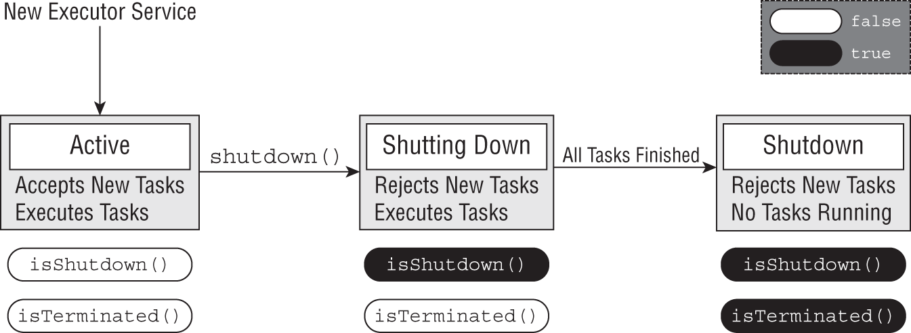

# Chapter 18 Concurrency
- [Chapter 18 Concurrency](#chapter-18-concurrency)
  - [Introducing Threads](#introducing-threads)
  - [Thread Types](#thread-types)
  - [Understanding Thread Concurrency.](#understanding-thread-concurrency)
  - [Defining a Task with Runnable.](#defining-a-task-with-runnable)
  - [Creating a Thread](#creating-a-thread)
  - [Polling with Sleep](#polling-with-sleep)
  - [Creating Threads with the Concurrency API](#creating-threads-with-the-concurrency-api)
  - [Shutting Down a Thread Executor](#shutting-down-a-thread-executor)
  - [Submitting Tasks](#submitting-tasks)
    - [Waiting for Result](#waiting-for-result)
    - [Introducing Callable.](#introducing-callable)
    - [Submitting Task Collections](#submitting-task-collections)
    - [Scheduling Tasks](#scheduling-tasks)
    - [Increasing Concurrency with Pools.](#increasing-concurrency-with-pools)
  - [Writing Thread-Safe Code](#writing-thread-safe-code)
    - [Protecting Data with Atomic Clases.](#protecting-data-with-atomic-clases)
      - [Atomic classes](#atomic-classes)
      - [Improving Access with Synchronized Blocks](#improving-access-with-synchronized-blocks)
      - [Synchronized methods](#synchronized-methods)
    - [Understanding the Lock Framework](#understanding-the-lock-framework)
      - [Applying a ReentrantLock Interface](#applying-a-reentrantlock-interface)
      - [tryLock()](#trylock)
    - [Orchestrating Tasks with a CyclicBarrier](#orchestrating-tasks-with-a-cyclicbarrier)
    - [Using Concurrent Collections](#using-concurrent-collections)
      - [Concurrent Collection Class](#concurrent-collection-class)
    - [Understanding Blocking Queues](#understanding-blocking-queues)
    - [Obtaining Synchronized Collections](#obtaining-synchronized-collections)
    - [Identifying Threading Problems](#identifying-threading-problems)
    - [Working with Parallel Streams](#working-with-parallel-streams)
      - [Creating Parallel Streams](#creating-parallel-streams)
      - [Performing a Parallel Decomposition](#performing-a-parallel-decomposition)
      - [ORDERING FOREACH RESULTS](#ordering-foreach-results)
    - [Processing Parallel Reductions](#processing-parallel-reductions)
    - [Combining Results with collect()](#combining-results-with-collect)
    - [Performing a Parallel Reduction on a Collector](#performing-a-parallel-reduction-on-a-collector)
  - [Avoiding Stateful Operations](#avoiding-stateful-operations)

## Introducing Threads
A thread is the smallest unit of execution that can be scheduled by the operating system.
A process is a group of associated threads that execute in the same, shared environment.
A multithreaded process is one that contains one or more threads.
A task is a single unit of work performed by a thread.  A thread can complete multiple independent tasks but only one task at a time.

## Thread Types

- A `system thread` is created by the JVM and runs in the background of the application (e.g) Garbage Collection 
When a system‐defined thread encounters a problem and cannot recover, such as running out of memory, it generates a Java Error, as opposed to an Exception
- A `user-defined` thread is one created by application developer to accomplish a specific task.


## Understanding Thread Concurrency.
The property of executing multiple threads and processes at the same time is referred to as concurrency.<Need to read>

## Defining a Task with Runnable.
- `java.lang.Runnable` is a functional interface that takes no arguments and returns no data


```java
@FunctionalInterface public interface Runnable {
   void run();
}
//The following lambda expressions each implement the Runnable interface:
Runnable sloth = () -> System.out.println("Hello World");
Runnable snake = () -> {int i=10; i++;};
Runnable beaver = () -> {return;};
Runnable coyote = () -> {};

Runnable capybara = () -> "";                 // DOES NOT COMPILE
```

## Creating a Thread
The simplest way to execute a thread is by using the `java.lang.Thread` class. Executing a task with Thread is a two‐step process. </p>
1. First, you define the Thread with the corresponding task to be done. 
2. Then, you start the task by using the `Thread.start()` method.

```java
public class ReadInventoryThread extends Thread {
   @Override public void run() { // Overrides method in Thread
      System.out.println("Printing zoo inventory");
   }
   public static void main(String[] args) {
      (new ReadInventoryThread()).start();
   }
}
//Invoking the thread
 (new ReadInventoryThread()).start();
 Incase the same ReadInventoryThread implements Runnable instead of extends Thread then 
 (new Thread(new ReadInventoryThread())).start(); // pass the Runnable instance to the Thread object.
```
- Calling run() instead of start() doesn't execute the task in a separate thread.
- Use `Thread` class only under specific circumstances, such as when you are creating your own priority‐based thread. In most situations, you should implement the Runnable interface rather than extend the Thread class.
- Apart from extending Thread and Implementing Runnable. you can also create and manage threads indirectly using an `ExecutorService`.

## Polling with Sleep
<p>one thread often needs to wait for the results of another thread to proceed. One solution is to use polling. Polling is the process of intermittently checking data at some fixed interval. For example, let's say you have a thread that modifies a shared static counter value and your main() thread is waiting for the thread to increase the value to greater than 100

 Using a while() loop to check for data without some kind of delay is considered a bad coding practice as it ties up CPU resources for no reason.

The Thread.sleep() method requests the current thread of execution rest for a specified number of milliseconds. When used inside the body of the main() method, the thread associated with the main() method will pause, while the separate thread will continue to run. 

While polling does prevent the CPU from being overwhelmed with a potentially infinite loop, it does not guarantee when the loop will terminate

</p>

```java
 public class CheckResults {
   private static int counter = 0;
   public static void main(String[] a) throws InterruptedException {
      new Thread(() -> {
         for(int i = 0; i < 500; i++) CheckResults.counter++;
      }).start();
      while(CheckResults.counter < 100) {
         System.out.println("Not reached yet");
         Thread.sleep(1000); // 1 SECOND
      }
      System.out.println("Reached!");
   }
}
```

## Creating Threads with the Concurrency API
 The Concurrency API includes the `ExecutorService` interface, which defines services that create and manage threads for you. Its an interface and an instance can be created with the a factory pattern.

```java
import java.util.concurrent.*;
public class ZooInfo {
   public static void main(String[] args) {
      ExecutorService service = null;
      Runnable task1 = () ->
         System.out.println("Printing zoo inventory");
      Runnable task2 = () -> {for(int i = 0; i < 3; i++)
            System.out.println("Printing record: "+i);};
      try {
         service = Executors.newSingleThreadExecutor();
         System.out.println("begin");
         service.execute(task1);
         service.execute(task2);
         service.execute(task1);
         System.out.println("end");
      } finally {
         if(service != null) service.shutdown();
      }
   }
}
```
<p>With a single‐thread executor, results are guaranteed to be executed sequentially. Notice that the end text is output while our thread executor tasks are still running. This is because the main() method is still an independent thread from the ExecutorService.</p>

## Shutting Down a Thread Executor
A thread executor creates a non‐daemon thread on the first task that is executed, so failing to call shutdown() will result in your application never terminating.
- Life cycle of an ExecutorService object.
  
- What if you want to cancel all running and upcoming tasks? The ExecutorService provides a method called `shutdownNow()`
- If a new task is submitted to an ExecutorService while it is shutting down, an exception is thrown.
- The `isShutdown()` method returns true once the shutdown() method is called.
- 

## Submitting Tasks
Method name	| Description
----------- | ------------
void execute(Runnable command)	|Executes a Runnable task at some point in the future
Future<?> submit(Runnable task)	|Executes a Runnable task at some point in the future and returns a Future representing the task
<T> Future<T> submit(Callable<T> task)	| Executes a Callable task at some point in the future and returns a Future representing the pending results of the task
<T> List<Future<T>> invokeAll(Collection<? extends Callable<T>> tasks) throws InterruptedException	| Executes the given tasks and waits for all tasks to complete. Returns a List of Future instances, in the same order they were in the original collection
<T> T invokeAny(Collection<? extends Callable<T>> tasks) throws InterruptedException, ExecutionException	| Executes the given tasks and waits for at least one to complete. Returns a Future instance for a complete task and cancels any unfinished tasks

### Waiting for Result 
  * `Future<?> future = service.submit(() -> System.out.println("Hello"));` 
  * `Future` includes useful methods for determining the state of a task.
  * boolean isDone(), boolean isCancelled(), boolean cancel(boolean mayInterruptedIfRunning), V get() RRetrieves the result of a task, waiting endlessly if it is not yet available, V get(long timeout, TimeUnit unit)	Retrieves the result of a task, waiting the specified amount of time. If the result is not ready by the time the timeout is reached, a checked TimeoutException will be thrown.
  * Other supported Enums TimeUnit.NANOSECONDS, TimeUnit.MICROSECONDS, TimeUnit.MILLISECONDS similary for minutes, hours and Days.
  * Sample program
    ```java
    import java.util.concurrent.*;
     
    public class Main
    {
        private static int counter = 0;
        public static void main(String[] args) throws InterruptedException, Exception {
        ExecutorService service = null;
        try {
            service = Executors.newSingleThreadExecutor();
            Future<?> result = service.submit(() -> {
                for(int i = 0; i < 500; i++) Main.counter++;
            });
            result.get(10, TimeUnit.SECONDS);
            System.out.println("Reached!"+ counter);
        } catch (TimeoutException e) {
            System.out.println("Not reached in time");
        } finally {
            if(service != null) service.shutdown();
        }
         if(service != null) {
            service.awaitTermination(1, TimeUnit.MINUTES); // Await for all task to complete
            
            // Check whether all tasks are finished
            if(service.isTerminated()) System.out.println("Finished!");
            else System.out.println("At least one task is still running");
         }
        }
    }
    ```
### Introducing Callable.

<p>The java.util.concurrent.Callable functional interface is similar to Runnable except that its call() method returns a value and can throw a checked exception.</p>

```java
    @FunctionalInterface public interface Callable<V> {
    V call() throws Exception;
    }
```

### Submitting Task Collections
- invokeAll(List tasks)
```java
    23: List<Future<String>>  list = service.invokeAll(
    24:    List.of(task, task, task));
    25: for (Future<String> future : list) {
    26:    System.out.println(future.get());
    27: }
```
- invokeAny(List tasks)
invokeAny() method executes a collection of tasks and returns the result of one of the tasks that successfully completes execution, cancelling all unfinished tasks.

- invokeAll() method will wait indefinitely until all tasks are complete, while the invokeAny() method will wait indefinitely until at least one task completes. The ExecutorService interface also includes overloaded versions of invokeAll() and invokeAny() that take a timeout value and TimeUnit parameter.

### Scheduling Tasks
- Creating a ScheduledExecutorService 
```java
ScheduledExecutorService service 
   = Executors.newSingleThreadScheduledExecutor();
```
-  ScheduledExecutorService take a Callable or Runnable, respectively; perform the task after some delay; and return a ScheduledFuture
- The ScheduledFuture interface is identical to the Future interface, except that it includes a getDelay() method that returns the remaining delay
```java
    ScheduledExecutorService service
    = Executors.newSingleThreadScheduledExecutor();
    Runnable task1 = () -> System.out.println("Hello Zoo");
    Callable<String> task2 = () -> "Monkey";
    ScheduledFuture<?> r1 = service.schedule(task1, 10, TimeUnit.SECONDS);
    ScheduledFuture<?> r2 = service.schedule(task2, 8,  TimeUnit.MINUTES);
```
While these tasks are scheduled in the future, the actual execution may be delayed.If there aren't any threads available to perform task.
- `ScheduledAtFixedRate()` method creates a new task and submit it to the executor regardless of whether the previous task finished.(e.g) Here initial 5 mins delayed and at every 1 min the new task is submitted to the executor
`service.scheduleAtFixedRate(command, 5, 1, TimeUnit.MINUTES);`
- `scheduleWithFixedDelay()` creates a new task only after the previous task has finished. For example, if a task runs at 12:00 and takes five minutes to finish, with a period between executions of two minutes, then the next task will start at 12:07.
### Increasing Concurrency with Pools.
- `ExecutorService.newCachedThreadPool()`	Creates a thread pool that creates new threads as needed but will reuse previously constructed threads when they are available. Commonly used for pools that require executing many short-lived async tasks.
- `ExecutorService.newFixedThreadPool(int)`	Creates a thread pool that reuses a fixed number of threads operating off a shared unbounded queue
- `ScheduledExecutorService.newScheduledThreadPool(int)`	Creates a thread pool that can schedule commands to run after a given delay or to execute periodically
- `Choosing a pool size` Oftentimes, the number of CPUs available is used to determine the thread pool size using the command:
  `Runtime.getRuntime().availableProcessors()`

## Writing Thread-Safe Code

- Sheep counting example prints different output when you run multiple times `7 8 2 5 9 3 10 6 1 4`.
   
```java
 private int sheepCount = 0;
   private void incrementAndReport() {
      System.out.print((++sheepCount)+" ");
   }
  	public static void main(String[] args) throws InterruptedException, Exception {
	  ExecutorService service = null;
      try {
         service = Executors.newFixedThreadPool(20);
         Main manager = new Main();
         for(int i = 0; i < 10; i++)
            service.submit(() -> manager.incrementAndReport());
      } finally {
         if(service != null) service.shutdown();
      }
	}  
```
### Protecting Data with Atomic Clases.
One way to improve our sheep counting example is to use the java.util.concurrent.atomic package

As we demonstrated in the previous section, the increment operator ++ is not thread‐safe. Furthermore, the reason that it is not thread‐safe is that the operation is not atomic, carrying out two tasks, read and write, that can be interrupted by other threads.

Any thread trying to access the sheepCount variable while an atomic operation is in process will have to wait until the atomic operation on the variable is complete. Conceptually, this is like setting a rule for our zoo workers that there can be only one employee in the field at a time, although they may not each report their result in order.

#### Atomic classes
1. `AtomicBoolean, AtomicInteger, AtomicLong` values that may be updated atomically. 
2. In the previous example. If you replace with the AtomicInteger then you get varying output from 1..10, but still it prints the numbers 1 through 10.
```java
  private AtomicInteger sheepCount = new AtomicInteger(0);
   private void incrementAndReport() {
      System.out.print(sheepCount.incrementAndGet()+" ");
   }
```
For the overall methods: [Atomic Integer](https://docs.oracle.com/javase/8/docs/api/java/util/concurrent/atomic/AtomicInteger.html)

#### Improving Access with Synchronized Blocks
- Synchronzied Block _(with monitor and lock mechanism)_
 * synchronized blocks allow only one thread to enter
```java
SheepManager manager = new SheepManager();
synchronized(manager) {
   // Work to be completed by one thread at a time
}

//In previous example if we replace 
  private int sheepCount = 0;
   private void incrementAndReport() {
      synchronized(this) {
         System.out.print((++sheepCount)+" "); // It outputs 1 2 3 4 5 6 7 8 9 10
      }
  }
```
- Although all threads are created and executed at the same time each thread wait for its turn to increment and report back
#### Synchronized methods
- We can add the synchronized modifier to any instance method to synchronize automatically on the object itself.

```java
private synchronized void incrementAndReport() {
   System.out.print((++sheepCount)+" ");
}

public static synchronized void printDaysWork() {
   System.out.print("Finished work");
}
```
- Even when the data is protected, though, the performance cost for using it can be high.

### Understanding the Lock Framework
The Concurrency API includes the Lock interface that is conceptually similar to using the synchronized keyword
Instead of synchronizing on any Object, though, we can “lock” only on an object that implements the Lock interface.

#### Applying a ReentrantLock Interface
```java
// Implementation #2 with a Lock
Lock lock = new ReentrantLock();
try {
   lock.lock();
   
// Protected code
} finally {
   lock.unlock(); //possible to throw IllegalMonitorStateException if you don't acquired the lock.
}
```
#### tryLock()
- The tryLock() method will attempt to acquire a lock and immediately return a boolean result indicating whether the lock was obtained.Unlike the lock() method, it does not wait if another thread already holds the lock

```java
Lock lock = new ReentrantLock();
new Thread(() -> printMessage(lock)).start();
if(lock.tryLock()) { //Incase to wait to acquire a lock lock.tryLock(10,TimeUnit.SECONDS)
   try {
      System.out.println("Lock obtained, entering protected code");
   } finally {
      lock.unlock();
   }
} else {
   System.out.println("Unable to acquire lock, doing something else");
}
```

<p>Like lock(), the tryLock() method should be used with a try/ finally block. Fortunately, you need to release the lock only if it was successfully acquired.</p>

- `tryLock(long,TimeUnit)`: , if a lock is available, then it will immediately return with it. If a lock is unavailable, though, it will wait up to the specified time limit for the lock.
- It is critical that you release a lock the same number of times it is acquired. For calls with tryLock(), you need to call unlock() only if the method returned true.

### Orchestrating Tasks with a CyclicBarrier

The CyclicBarrier takes in its constructors a limit value, indicating the number of threads to wait for. As each thread finishes, it calls the await() method on the cyclic barrier. Once the specified number of threads have each called await(), the barrier is released, and all threads can continue.

```java
import java.util.concurrent.*;
public class LionPenManager {
   private void removeLions() {System.out.println("Removing lions");}
   private void cleanPen() {System.out.println("Cleaning the pen");}
   private void addLions() {System.out.println("Adding lions");}
   public void performTask(CyclicBarrier c1, CyclicBarrier c2) {
      try {
         removeLions();
         c1.await();
         cleanPen();
         c2.await();
         addLions();
      } catch (InterruptedException | BrokenBarrierException e) {
         // Handle checked exceptions here
      }
   }
   public static void main(String[] args) {
      ExecutorService service = null;
      try {
         service = Executors.newFixedThreadPool(4);
         var manager = new LionPenManager();
         var c1 = new CyclicBarrier(4);
         var c2 = new CyclicBarrier(4, 
            () -> System.out.println("*** Pen Cleaned!"));
         for (int i = 0; i < 4; i++)
            service.submit(() -> manager.performTask(c1, c2));
      } finally {
         if (service != null) service.shutdown();
      }
   }
}
//Output 
Removing lions
Removing lions
Removing lions
Removing lions
Cleaning the pen
Cleaning the pen
Cleaning the pen
Cleaning the pen
*** Pen Cleaned!
Adding lions
Adding lions
Adding lions
Adding lions
```
-` THREAD POOL SIZE AND CYCLIC BARRIER LIMIT` If you are using a thread pool, make sure that you set the number of available threads to be at least as large as your CyclicBarrier limit value
- CyclicBarrier is reusable it usually releases all the threads once the task are performed, the no of threads waiting on the cyclic barrier goes back to zero. At this point we can reuse the cyclic barrier.

### Using Concurrent Collections
- Code throws `ConcurrentModificationException` at runtime. It can happen with a single thread, and on non concurrent collection.In the place of HashMap if ConcurrentHashMap is used this error will not happen.
- The concurrent classes were created to help avoid common issues in which multiple threads are adding and removing objects from the same collections. At any given instance, all threads should have the same consistent view of the structure of the collection.
```java
var foodData = new HashMap<String, Integer>();
//var foodData = new ConcurrentHashMap<String, Integer>();
foodData.put("penguin", 1);
foodData.put("flamingo", 2);
for(String key: foodData.keySet())
   foodData.remove(key);
```
#### Concurrent Collection Class

Class Name              | Java Collections Interfaces, Ordered ? Sorted? Blockin?
----------------------- | -------------------------------
ConcurrentHashMap	      |ConcurrentMap	No	No	No
ConcurrentLinkedQueue	|Queue	Yes	No	No
ConcurrentSkipListMap	|ConcurrentMap SortedMap NavigableMap	Yes	Yes	No
ConcurrentSkipListSet	|SortedSet NavigableSet	Yes	Yes	No
CopyOnWriteArrayList	   |List	Yes	No	No
CopyOnWriteArraySet	   |Set	No	No	No
LinkedBlockingQueue	   |BlockingQueue Yes	No	Yes

- Understanding _SkipList_ Collections
The SkipList classes, ConcurrentSkipListSet and ConcurrentSkipListMap, are concurrent versions of their sorted counterparts, TreeSet and TreeMap, respectively. They maintain their elements or keys in the natural ordering of their elements. 
- Understanding CopyOnWrite Collections
 * Two classes, CopyOnWriteArrayList and CopyOnWriteArraySet it  copy all of their elements to a new underlying structure anytime an element is added, modified, or removed from the collection. 
  * The `CopyOnWrite` classes are similar to the immutable object pattern  a new underlying structure is created every time the collection is modified. Unlike a true immutable object, though, the reference to the object stays the same even while the underlying data is changed.
 ```java
   List<Integer> favNumbers = 
      new CopyOnWriteArrayList<>(List.of(4,3,42));
   for(var n: favNumbers) {
      System.out.print(n + " ");
      favNumbers.add(9);
   }
   System.out.println();
   System.out.println("Size: " + favNumbers.size());
   //output 
   4 3 42
   Size: 6
 ```
 - CopyOnWrite classes can use a lot of memory as it has to create new Collection object every time the original one is modified. Another approach is to use the ArrayList class with an iterator, as shown here:

  ```java
    var iterator = birds.iterator();
    while(iterator.hasNext()) {
       iterator.next();
       <b>iterator.remove()</b>;
    }
    System.out.print(birds.size());  // 0
  ```

### Understanding Blocking Queues
- `BlockingQueue` waiting methods
Method name	| Description
----------- | ---------------
| offer(E e, long timeout, TimeUnit unit)	| Adds an item to the queue, waiting the specified time and returning false if the time elapses before space is available
| poll(long timeout, TimeUnit unit)	| Retrieves and removes an item from the queue, waiting the specified time and returning null if the time elapses before the item is available

```java
try {
   var blockingQueue = new LinkedBlockingQueue<Integer>();
   blockingQueue.offer(39);
   blockingQueue.offer(3, 4, TimeUnit.SECONDS);
   System.out.println(blockingQueue.poll());
   System.out.println(blockingQueue.poll(10, TimeUnit.MILLISECONDS));
} catch (InterruptedException e) {
   // Handle interruption
}
//output 39 3
```
### Obtaining Synchronized Collections
obtaining synchronized versions of existing nonconcurrent collection objects.
- `synchronizedCollection(Collection<T> c)`
- `synchronizedList(List<T> list)`
- `synchronizedMap(Map<K,V> m)`
- `synchronizedNavigableMap(NavigableMap<K,V> m)`
- `synchronizedNavigableSet(NavigableSet<T> s)`
- `synchronizedSet(Set<T> s)`
- `synchronizedSortedMap(SortedMap<K,V> m)`
- `synchronizedSortedSet(SortedSet<T> s)`

* Following loops throws a `ConcurrentModificationException` 
```java
var foodData = new HashMap<String, Object>();
foodData.put("penguin", 1);
foodData.put("flamingo", 2);
var synFoodData = Collections.synchronizedMap(foodData);
for(String key: synFoodData.keySet())
   synFoodData.remove(key);
```

### Identifying Threading Problems
- There are three types of liveness issues with which you should be familiar: `deadlock, starvation, and livelock`
* Deadlock
  *  <p>Imagine that our zoo has two foxes: Foxy and Tails. Foxy likes to eat first and then drink water, while Tails likes to drink water first and then eat. Furthermore, neither animal likes to share, and they will finish their meal only if they have exclusive access to both food and water.
     What happens if Foxy gets the food first and Tails gets the water first? The following application models this behavior: </p>

```java
import java.util.concurrent.*;
class Food {}
class Water {}
public class Fox {
   public void eatAndDrink(Food food, Water water) {
      synchronized(food) {
         System.out.println("Got Food!");
         move();
         synchronized(water) {
            System.out.println("Got Water!");
         }
      }
   }
   public void drinkAndEat(Food food, Water water) {
      synchronized(water) {
         System.out.println("Got Water!");
         move();
         synchronized(food) {
            System.out.println("Got Food!");
         }
      }
   }
   public void move() {
      try {
         Thread.sleep(100);
      } catch (InterruptedException e) {
         // Handle exception
      }
   }
   public static void main(String[] args) {
      // Create participants and resources
      Fox foxy = new Fox();
      Fox tails = new Fox();
      Food food = new Food();
      Water water = new Water();
      // Process data
      ExecutorService service = null;
      try {
         service = Executors.newScheduledThreadPool(10);
         service.submit(() -> foxy.eatAndDrink(food,water));
         service.submit(() -> tails.drinkAndEat(food,water));
      } finally {
         if(service != null) service.shutdown();
      }
   }
} 
//Output 
Got Food!
Got Water!
```
In this example, Foxy obtains the food and then moves to the other side of the environment to obtain the water. Unfortunately, Tails already drank the water and is waiting for the food to become available. The result is that our program outputs the following, and it hangs indefinitely resulting (deadlock):

- You cannot resolve a dead lock, only limited success in practise.

* `Starvation` Starvation occurs when a single thread is perpetually denied access to a shared resource or lock. The thread is still active, but it is unable to complete its work as a result of other threads constantly taking the resource that they are trying to access.
* `Livelock` Livelock occurs when two or more threads are conceptually blocked forever, although they are each still active and trying to complete their task. Livelock is a special case of resource starvation in which two or more threads actively try to acquire a set of locks, are unable to do so, and restart part of the process.

- Managing Race Conditions
Two users trying to signup with the same username at the same time possible outcome 1. Both are register with same username with diff password 2. Both are denied 3. One user successfully signed up, and other failed.
### Working with Parallel Streams
  - A _parallel stream_ is a stream that is capable of processing results concurrently, using multiple threads. For example, you can use a parallel stream and the map() operation to operate concurrently on the elements in the stream, vastly improving performance over processing a single element at a time.

#### Creating Parallel Streams
- Calling parallel() on an Existing Stream
```java
Stream<Integer> s1 = List.of(1,2).stream();
Stream<Integer> s2 = s1.parallel();
```
 * _Note:_ parallel() is an intermediate operation that operates on the original stream. For example, applying a terminal operation to s2 also makes s1 unavailable for further use.
- Calling parallelStream() on a Collection Object
  
   `Stream<Integer> s3 = List.of(1,2).parallelStream();`
- Checking a stream is paraller using isParallel()
  -    Stream.concat(Stream s1, Stream s2) is parallel if either s1 or s2 is parallel
  -    flatMap() creates a new stream that is not parallel by default,regardless of whether the underlying elements were parallel.

#### Performing a Parallel Decomposition
A parallel decomposition is the process of taking a task, breaking it up into smaller pieces that can be performed concurrently, and then reassembling the results. The more concurrent a decomposition, the greater the performance improvement of using parallel streams.

```java
private static int doWork(int input) {
   try {
      Thread.sleep(5000);
   } catch (InterruptedException e) {}
   return input;
}

long start = System.currentTimeMillis();
List.of(1,2,3,4,5)
   .parallelStream()
   .map(w -> doWork(w))
   .forEach(s -> System.out.print(s + " "));
 
System.out.println();
var timeTaken = (System.currentTimeMillis()-start)/1000;
System.out.println("Time: "+timeTaken+" seconds");

//outputs 
3 2 1 5 4 
Time: 5 seconds
```
When a parallelStream() is used the results are not predictable, but takes less time compare to the serial stream `stream()` which process one element at a time.

#### ORDERING FOREACH RESULTS
-  Forcing a parallel stream to process the results in order at the cost of performance. `forEachOrdered`  operation forces our stream into a single‐threaded process.
```java
 List.of(5,2,1,4,3)
       .parallelStream()
       .map(w -> doWork(w))
       .forEachOrdered(s -> System.out.print(s + " "));
    //output:
    5 2 1 4 3
    Time: 5 seconds  
```

### Processing Parallel Reductions
- Reduction operations on parallel streams are referred to as parallel reductions.
- **Performing Order‐Based Tasks**
  * `findAny()` on parallel streams may result in unexpected behavior it can even print 1, 4
 ```java
  System.out.print(List.of(1,2,3,4,5,6)
   .stream()
   .findAny().get());
 ```
- All termination operations findFirst(),limit() or skip() may actually perform more slowly in a parallel environment. But one plus side is `skip(5).limit(2).findFirst()` will return the same result on ordered serial and paraller streams.

- Creating Unordered Streams
 * `List.of(1,2,3,4,5,6).stream().unordered().parallel();`  For serial streams, using an unordered version has no effect, but on parallel streams, the results can greatly improve performance.
- Combining Results with reduce()
   ```java

   <U> U reduce(U identity, 
   BiFunction<U,? super T,U> accumulator, 
   BinaryOperator<U> combiner)

    System.out.println(List.of('w', 'o', 'l', 'f')
   .parallelStream()                                   
   .reduce("", 
      (s1,c) -> s1 + c, 
      (s2,s3) -> s2 + s3));  // wolf
   ```
  - _ Note_ We used c for char, whereas s1, s2, and s3 are String values. in a serial stream, wolf is built one character at a time. In a parallel stream, the intermediate values wo and lf are created and then combined.
  - **With parallel streams, though, order is no longer guaranteed and produces unpredictable results**
- Lets see some problematic accumulator.
   * Here the combinar is removed since the types are same number, String
```java
  System.out.println(List.of(1,2,3,4,5,6)
   .parallelStream()
   .reduce(0, (a,b) -> (a - b)));  // PROBLEMATIC ACCUMULATOR

   //Unpredicatable results -21, 3,
```
- The same program with serial stream produces Xwolf
```java
System.out.println(List.of("w","o","l","f")
   .parallelStream()
   .reduce("X", String::concat));  // XwXoXlXf
```
- It is recommended to pass the third param, combiner method allows the JVM to paritition the operations in the stream more efficiently.

### Combining Results with collect()
- collect same as reduce takes 3 parameters
```java
<R> R collect(Supplier<R> supplier,
   BiConsumer<R, ? super T> accumulator,
   BiConsumer<R, R> combiner)
```
- `collect()` can be performed as a parallel reduction, as shown in the following example:
  
```java
   Stream<String> stream = Stream.of("w", "o", "l", "f").parallel();
   SortedSet<String> set = stream.collect(ConcurrentSkipListSet::new,
      Set::add,
      Set::addAll);
   System.out.println(set);  // [f, l, o, w]
```
<p> `ConcurrentSkipListSet` are sorted according to their natural ordering. You should use a concurrent collection to combine the results, ensuring that the results of concurrent threads do not cause a ConcurrentModificationException.
</p>

### Performing a Parallel Reduction on a Collector
- The Collectors class includes two sets of static methods for retrieving collectors, toConcurrentMap() and groupingByConcurrent(), that are both UNORDERED and CONCURRENT. These methods produce Collector instances capable of performing parallel reductions efficiently. 
<p>
We use a ConcurrentMap reference, although the actual class returned is likely
ConcurrentHashMap. The particular class is not guaranteed; it will just be a class that implements the interface ConcurrentMap.
</p>

```java
Stream<String> ohMy = Stream.of("lions","tigers","bears").parallel();
ConcurrentMap<Integer, String> map = ohMy
   .collect(Collectors.toConcurrentMap(String::length,
      k -> k,
      (s1, s2) -> s1 + "," + s2));
System.out.println(map); // {5=lions,bears, 6=tigers}
System.out.println(map.getClass());  // java.util.concurrent.ConcurrentHashMap

//same result using grouping by
var ohMy = Stream.of("lions","tigers","bears").parallel();
ConcurrentMap<Integer, List<String>> map = ohMy.collect(
   Collectors.groupingByConcurrent(String::length));
System.out.println(map); // {5=[lions, bears], 6=[tigers]}
```
- _Note_ The key to applying parallel reductions is to encourage the JVM to take advantage of the parallel structures, such as using a groupingByConcurrent() collector on a parallel stream rather than a groupingBy() collector. 

## Avoiding Stateful Operations
- A `stateful lambda expression` is one whose result depends on any state that might change during the execution of a pipeline.
```java
  public List<Integer> addValues(IntStream source) {
   var data = Collections.synchronizedList(new ArrayList<Integer>());
   source.filter(s -> s % 2 == 0)
      .forEach(i -> { data.add(i); });  // STATEFUL: DON'T DO THIS!
   return data;
}
//Call
var list = addValues(IntStream.range(1, 11));
System.out.println(list); //[2, 4, 6, 8, 10]

var list = addValues(IntStream.range(1, 11).parallel());
System.out.println(list); //[6, 8, 10, 2, 4]
```
- As you can see when a parallel stream is passed the order is not maintained, To fix this solution by rewriting our stream operation 

```java
   public static List<Integer> addValues(IntStream source) {
      return source.filter(s -> s % 2 == 0)
         .boxed()
         .collect(Collectors.toList()); //[2, 4, 6, 8, 10]
   }
```

Summary: 
- how to process tasks in parallel using the Concurrency API.
- The work that a thread performs can be expressed as lambda expressions or instances of Runnable or Callable.
- How to concurrently execute task using ExecutorService incl. scheduled and pooled services
- Thread safety mechanism in Java  `synchronized methods/blocks, the Lock framework, and CyclicBarrier`
- `CopyOnWriteArrayList` class, which creates a new underlying structure anytime the list is modified.
- Basic theory behind the concept on Deadlock, starvation, and livelock can result in programs that appear stuck, while race conditions can result in unpredictable data.
- `ParallelStreams` how to use them to perform parallel decompositions and reductions.
- `Parallel streams` can greatly improve the performance of your application. They can also cause unexpected results since the results are no longer ordered
- Avoid stateful lambda expressions, especially when working with parallel streams.

