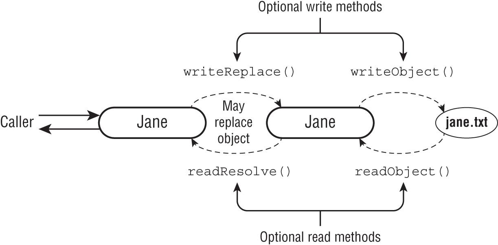

# Chapter22 Security

## Designing a Secure Object
Techniques that can protect your objects from Hacers are access control, extensibility, validation and creating immutable objects.
- Limit Accessibility (Encapsulation)
  - Using the four level of access modifiers private, protected, default and public
  - Using private access modifiers limiting access to the combos object within the class 
  ```java
    package animals.security;
    public class ComboLocks {
    private Map<String, String> combos;
    
    public boolean isComboValid(String animal, String combo) {
        var correctCombo = combos.get(animal);
        return combo.equals(correctCombo);
    }
    }
  ```
  - limit accessibility by making instance variables private or package‐private, whenever possible. If your application is using modules, you can do even better by only exporting the security packages to the specific modules that should have access. Here's an example:

  `exports animals.security to zoo.staff;`

In this example, only the `zoo.staff` module can access the `public` classes in the `animals.security` package.

- Restricting Extensibility
* Marking a sensitive class as `final` prevents any subclasses.
```java
public class GrasshopperCage {
    public static void openLock(ComboLocks comboLocks, String combo) {
        if (comboLocks.isComboValid("grasshopper", combo))
            System.out.println("Open!");
    }
}

public class EvilComboLocks extends ComboLocks {
    public boolean isComboValid(String animal, String combo) {
        var valid = super.isComboValid(animal, combo);
        if (valid) {
            // email the password to Hacker Harry
        }
        return valid;
    }
}
```

```java
public final class ComboLocks {
   private Map<String, String> combos;
 
   // instantiate combos object
 
   public boolean isComboValid(String animal, String combo) {
      var correctCombo = combos.get(animal);
      return combo.equals(correctCombo);
   }
}
```
- Creating Immutable Objects
  * The String class used throughout the book is immutable.“Generics and Collections,” you used List.of(), Set.of(), and Map.of(). All three of these methods return immutable types.
  * Writing an immutable class. Familar with the common strategies
    1. Mark the class as `final`. // Prevents anyone creating mutable subclass
    2. Mark all the instance variables `private`. // encapsulation
    3. Don't define any setter methods and make fields final. // calles and the class itself don't make changes to the instance variables.
    4. Don't allow referenced mutable objects to be modified. (Don't expose a getter method for a mutable object).
    5. Use a constructor to set all properties of the object, making a copy if needed.
   
- Rule 4: Hackers can modify the data by calling `getFavoriteFoods().clear()` or add a food to list
    ```java
        1:  import java.util.*;
        2:
        3:  public final class Animal {
        4:     private final ArrayList<String> favoriteFoods;
        5:
        6:     public Animal() {
        7:        this.favoriteFoods = new ArrayList<String>();
        8:        this.favoriteFoods.add("Apples");
        9:     }
        10:    public List<String> getFavoriteFoods() { 
        11:       return favoriteFoods;
        12:    }
        13: }
    ```
    * How to handle then ? By using delegate methods to read the data. Like 
    ```java
        public int getFavoriteFoodsCount() { 
        return favoriteFoods.size();
        }
        public String getFavoriteFoodsElement(int index) { 
        return favoriteFoods.get(index);
        }
    ```
    * Another options copy of the `favoriteFoods` changes in the copy won't be reflected in the original, but at leat the original is protected from external changes.
        ```java
        10:    public ArrayList<String> getFavoriteFoods() { 
        11:       return new ArrayList<String>(this.favoriteFoods);
        12:    }
        ```
    * Use copy constructor to make a copy of the list object containing the same elements.
        ```java
                6:     public Animal(List<String> favoriteFoods) {
                7:        if(favoriteFoods == null)
                8:           throw new RuntimeException("favoriteFoods is required");
                9:        this.favoriteFoods = new ArrayList<String>(favoriteFoods);
                10:    }
        ```    
### Cloning Objects

By `default`, the clone() method makes a `shallow copy(Default)` of the data, which means only the top‐level object references and primitives are copied. No new objects from within the cloned object are created. For example, if the object contains a reference to an ArrayList, a shallow copy contains a reference to that same ArrayList. Changes to the ArrayList in one object will be visible in the other since it is the same object.   

```java
public class Animal implements Cloneable {
    String name;
    private ArrayList<String> food;

    public Animal(String name, ArrayList<String> food) {
        this.name = name;
        this.food = food;
    }

    public String getName() {
        return name;
    }

    public List<String> getFood() {
        return food;
    }

   /* public Animal clone() {
        ArrayList<String> listClone = (ArrayList) food.clone();
        return new Animal(name, listClone);
    }*/

    public static void main(String[] args) throws CloneNotSupportedException {
        ArrayList<String> list = new ArrayList<>(Arrays.asList("milk", "fish"));
        Animal cat = new Animal("meaow", list);
        Animal clone = (Animal) cat.clone();
        System.out.println("clone object == :" + (cat == clone));
        System.out.println("clone list ==: "+ (clone.getFood() == cat.food)); // prints true without overridden clone method
        System.out.println("clone name ==: "+ (clone.name == cat.name)); //prints true
    }
}
```

### Introducing Injection and Input Validation
- Simple SQL statement like `"SELECT opens FROM hours WHERE day = " + day` will be exploited by the Hacker by passing day value like `"'Monday' and day is not null"` 
- Preventing SQL Injections using PrepareStatement and binding variable

```java
public int getOpening(Connection conn, String day) 
      throws SQLException {
   String sql = "SELECT opens FROM hours WHERE day = ?";
   try (var ps = conn.prepareStatement(sql)) {
      ps.setString(1, day);
      try (var rs = ps.executeQuery()) {
         if (rs.next())
            return rs.getInt("opens");
      }
   }
   return -1;
}
```
//TODO File Injection

### Working with Confidential Information
Category and there examples of confidential information	 
- Login information	
 * Usernames
 * Passwords
 * Hashes of passwords

- Banking	
 * Credit card numbers
 * Account balances
 * Credit score

- PII (Personal identifiable information)	
 * Social Security number (or other government ID)
 * Mother's maiden name
 * Security questions/answers
  
The confidential information shouldn't be logged in to the following senstive contexts   
 * Writing to a log file
 * Printing an exception or stack trace
 * System.out and System.err messages
 * Writing to data files

#### Protecting Data in Memory
When calling the readPassword() on Console, it returns a char[] instead of a String. This is safer for two reasons.

It is not stored as a String, so Java won't place it in the String pool, where it could exist in memory long after the code that used it is run.
You can null out the value of the array element rather than waiting for the garbage collector to do it.

```java
Console console = System.console();
char[] password = console.readPassword();
Arrays.fill(password, 'x');
```

When the sensitive data cannot be overwritten, it is good practice to set confidential data to `null` when you're done using it. If the data can be garbage collected, you don't have to worry about it being exposed later.    

```java
LocalDate dateOfBirth = getDateOfBirth();
// use date of birth
dateOfBirth = null;
```
#### Limiting File Access
use a security policy to control what the program can access.It is good to apply multiple techniques to protect your application. This approach is called defense in depth.   

```json
    grant {
    permission java.io.FilePermission 
        "C:\\water\\fish.txt",
        "read";   
    };
    grant {
      permission java.io.FilePermission "/usr/local/school/referencebook.txt",
      "read,write";
    };

```


#### Serializing and Deserializing Objects
Imagine we want to store employee data in a file, and read this data back into memory, but we want to do so without writing any potentially sensitive data to disk. Suppose age field in employee record is sensitive data which you don't want to write to the file, then prevents it from being seralized using `transient`.    

Alternatively, you can specify fields to be serialized in an array.   
```java
private static final ObjectStreamField[] serialPersistentFields = 
   { new ObjectStreamField("name", String.class) };
```
- _Note_ Remember to use the `private`, `static`, and `final` modifiers. Otherwise, the field will be ignored.

### Customizing the Serialization Process. 
#### writeObject and ReadObject
we got a new requirement to `add the Social Security number(SSN)` to our Employee object. Unlike age we do need to serialize this information safely without storing in plain text format.    

we need to write some custom code and use `_writeObject()_` and `_readObject()_` for serialization and deserialization. using the `_ObjectOutputStream->putFields_` and and `_ObjectInputStream->readFields_`

```java
import java.io.*;
 
public class Employee implements Serializable {
   private String name;
   private String ssn;
   private int age;
   
   // Constructors/getters/setters
 
   private static final ObjectStreamField[] serialPersistentFields = 
      { new ObjectStreamField("name", String.class),
      new ObjectStreamField("ssn", String.class) };
 
   private static String encrypt(String input) {
      // Implementation omitted
   }
   private static String decrypt(String input) {
      // Implementation omitted
   }
   
   private void writeObject(ObjectOutputStream s) throws Exception {
      ObjectOutputStream.PutField fields = s.putFields();
      fields.put("name", name);
      fields.put("ssn", encrypt(ssn));
      s.writeFields();
   }
   private void readObject(ObjectInputStream s) throws Exception {
      ObjectInputStream.GetField fields = s.readFields();
      this.name = (String)fields.get("name", null);
      this.ssn = decrypt((String)fields.get("ssn", null));
   }
}
```
Suppose we were to update our writeObject() method with the age variable.

      `fields.put("age", age);`
When using serialization, the code would result in an exception.

`java.lang.IllegalArgumentException: no such field age with type int` this shows the ObjectStreamField[] is working and only the fields contained in the array are allowed to be write.

### How to store password ? 

When a password is set for a user, it should be converted to a String value using a salt (initial random value) and one‐way hashing algorithm. Then, when a user logs in, convert the value they type in using the same algorithm and compare it with the stored value. This allows you to authenticate a user without having to expose their password.   

### Pre/Post-Serialzation Processing

- Storing unique employee object using the ConcurrentHashMap and private constructor and factory method.

```java
import java.io.*;
import java.util.Map;
import java.util.concurrent.ConcurrentHashMap;
 
public class Employee implements Serializable {
   …
   private Employee() {}
   private static Map<String,Employee> pool = 
      new ConcurrentHashMap<>();
 
   public synchronized static Employee getEmployee(String name) {
      if(pool.get(name) == null) {
         var e = new Employee();
         e.name = name;
         pool.put(name, e);
      }
      return pool.get(name);
   }
}
```

- **Applying _readResolve()_**
   We want to start reading/writing the employee data to disk, but we have a problem. When someone reads the data from the disk, it deserializes it into a new object, not the one in memory pool(Map). This could result in two users holding different versions of the Employee in memory!   

   This is resolved by using the following readResolve() method

```java
import java.io.*;
import java.util.Map;
import java.util.concurrent.ConcurrentHashMap;
 
public class Employee implements Serializable {
   … 
   public synchronized Object readResolve()
         throws ObjectStreamException {
      var existingEmployee = pool.get(name);
      if(pool.get(name) == null) {
         // New employee not in memory
         pool.put(name, this);
         return this;
      } else {
         // Existing user already in memory
         existingEmployee.name = this.name;
         existingEmployee.ssn = this.ssn;
         return existingEmployee;
      }
   }
} 
```

Java allows any method modifiers `(except static)` for the readResolve() method including any access modifier. This rule applies to writeReplace() as well, which is up next   

#### writeReplace()
we want to always write the version of the object in the pool rather than the `this` instance. The `writeReplace()` method ensures we achieve our objective, it runs before the `writeObject()` and allows us to replace the object that gets serialized.

```java
import java.io.*;
import java.util.Map;
import java.util.concurrent.ConcurrentHashMap;
 
public class Employee implements Serializable {
   … 
   public Object writeReplace() throws ObjectStreamException {
      var e = pool.get(name); // If an instance is found in pool its used for serialization; otherwise, the current instance is used.
      return e != null ? e : this;
   }
}
```
* _Note_  The exam is likely to test you on these methods

#### Reviewing Serialization Methods
- Methods for serialization and deserialization

|Returntype	|Method	         |Parameters	         |Description|
|----|----|----|----|
|void	      |writeObject()	   |ObjectInputStream	|Serializes optionally using PutField|
|void	      |readObject()	   |ObjectOutputStream	|Deserializes optionally using GetField|
|Object	   |writeReplace()	|None	               |Allows replacement of object before serialization|
|Object	   |readResolve()	   |None	               |Allows replacement of object after deserialization|

- Remember the usescases like storing and reading SSN(encrpted-decrypted) are done through the Customer Serialization process using writeObject() and readObject().
- We want to write and read the object that is available in the pool rather than creating a new object every time when we serialze and deserlize this is using the concurrentMap and using the writeReplace() and readResolve().
  
A visualization of the process of writing and reading a record in



<p> we show how an employee record for Jane is serialized, written to disk, then read from disk, and returned to the caller. We also show that writeReplace() happens before writeObject(), while readResolve() happens after readObject(). Remember that all four of these methods are optional and must be declared in the Serializable object to be used.</p>

### Constructing Sensitive Objects
When constructing sensitive objects, you need to ensure that subclasses can't change the behavior. Suppose we have a FoodOrder class.   
```java
//Normal Java POJO class 
public class FoodOrder {
   private String item;
   private int count;
    
   public FoodOrder(String item, int count) {
      setItem(item);
      setCount(count);
   }
   public String getItem() { return item; }
   public void setItem(String item) { this.item = item; }
   public int getCount() { return count; }
   public void setCount(int count) { this.count = count; }
}

public static int total(List<FoodOrder> orders) {
   return orders.stream()
      .mapToInt(FoodOrder::getCount)
      .sum();
}
```
The above Object can be exploited by Hacker by extending and implementing there own getCount and setCount this results in the count being always zero, then how to prevent this lets see the following technics.

```java
public class HarryFoodOrder extends FoodOrder {
   public HarryFoodOrder(String item, int count) {
      super(item, count);
   }
   public int getCount() { return 0; }
   public void setCount(int count) { super.setCount(0); }
}
```
1. Making methods _final_ 
   
 ```java
      public class FoodOrder {
      private String item;
      private int count;
      
      public FoodOrder(String item, int count) {
         setItem(item);
         setCount(count);
      }
      public final String getItem() { return item; }
      public final void setItem(String item) { this.item = item; }
      public final int getCount() { return count; }
      public final void setCount(int count) { this.count = count; }
   }
 ```
 2. Making Classes _final_
   ```java
      public final class FoodOrder {
         private String item;
         private int count;

         public FoodOrder(String item, int count) {
         setItem(item);
         setCount(count);
         }
         public final String getItem() { return item; }
         public final void setItem(String item) { this.item = item; }
         public final int getCount() { return count; }
         public final void setCount(int count) { this.count = count; }
      }
   ```
 3.  Making the Constructor _private_
   ```java
         public class FoodOrder {
         private String item;
         private int count;
         
         private FoodOrder(String item, int count) {
            setItem(item);
            setCount(count);
         }
         //creating a factory method for object creation.
         public FoodOrder getOrder(String item, int count) { 
            return new FoodOrder(item, count);
         }
         public String getItem() { return item; }
         public void setItem(String item) { this.item = item; }
         public int getCount() { return count; }
         public void setCount(int count) { this.count = count; }
      }
   ```
### Preventing Denial of Service Attacks(DOS)

Most denial of service attacks require multiple requests to bring down their targets. Some attacks send a very large request that can even bring down the application in one shot.       
- To prevent DOS attacks its recommended to do the following
   * Catch clauses should also include Error, not only exception, bcos if Error is not handled it will lead to DOS. It can be best handled using Throwable in the catch. 
   * Ensure that the code doesn't cause integer overflow.
   * Thread executors has to be shutdown or resource closed explicitily 
   * Possible (infinite loops) Loops can become infinite loops if any exit conditions are not reached.

#### Leaking resources

Hacker Harry likes this method. He can call it in a loop. Since the method opens a file system resource and never closes it, there is a resource leak. After Hacker Harry calls the method enough times, the program crashes because there are no more file handles available.   

```java
public long countLines(Path path) throws IOException  {
   return Files.lines(path).count();
}
//Solution close the open resource with try with resource
public long countLines(Path path) throws IOException  {
   try (var stream = Files.lines(path)) {
      return stream.count();
   }
}
```

#### Reading Very Large Resources

- A simple method that reads a file into memory, does some transformations on it, and writes it to a new file.mall file, this works just fine. However, on an extremely large file, your program could run out of memory and crash

- To prevent this problem, you can check the size of the file before reading it.
```java
   public void transform(Path in, Path out) throws IOException  {
      var list = Files.readAllLines(in);
      list.removeIf(s -> s.trim().isBlank());
      Files.write(out, list);
   }
```
#### Including Potentially Large Resources
An inclusion attack is when multiple files or components are embedded within a single file. Any file that you didn't create is suspect. Some types can appear smaller than they really are. For example, some types of images can have a “zip bomb” where the file is heavily compressed on disk. When you try to read it in, the file uses much more space than you thought.

(e.g) For example, imagine you have a web page that includes a script on another website. You don't control the script, but Hacker Harry does. Including scripts from other websites is dangerous regardless of how big they are.

#### Overflowing Numbers
When checking file size, be careful with an int type and loops. Since an int has a maximum size, exceeding that size results in integer overflow. Incrementing an int at the maximum value results in a negative number, so validation might not work as expected.   

```java
public static void main(String[] args) {
   System.out.println(enoughRoomToAddLine(100)); // output true
   System.out.println(enoughRoomToAddLine(2_000_000)); // false
   System.out.println(enoughRoomToAddLine(Integer.MAX_VALUE)); // true
}
 
public static boolean enoughRoomToAddLine(int requestedSize) {
   if (requestedSize >= Integer.MAX_VALUE) { // If this block is missing then the last output is true, otherwise false.
      return false;
   }
   int maxLength = 1_000_000;
   String newLine = "END OF FILE";
 
   int newLineSize = newLine.length();
   return requestedSize + newLineSize < maxLength;
}
```

#### Wasting Data Structures
- `HashMap` with bad hashCode() implementation leads to slower execution, hacker can hack the hashCode() to return constants like 42
- Codes that attempt to create a very large array or other data strcuture.For example, if you write a method that lets you set the size of an array, Hacker Harry can repeatedly pick a really large array size and quickly exhaust the program's memory. Solution limit the size of an array parameter, or better don't allow size to be set at all.


#### Exam Essentials
Identify ways of preventing a denial of service attack. Using a try‐with‐resources statement for all I/O and JDBC operations prevents resource leaks. Checking the file size when reading a file prevents it from using an unexpected amount of memory. Confirming large data structures are being used effectively can prevent a performance problem.

Protect confidential information in memory. Picking a data structure that minimizes exposure is important. The most common one is using char[] for passwords. Additionally, allowing confidential information to be garbage collected as soon as possible reduces the window of exposure.

Compare injection, inclusion, and input validation. SQL injection and command injection allow an attacker to run expected commands. Inclusion is when one file includes another. Input validation checks for valid or invalid characters from users.

Design secure objects. Secure objects limit the accessibility of instance variables and methods. They are deliberate about when subclasses are allowed. Often secure objects are immutable and validate any input parameters.

Write serialization and deserializaton code securely. The transient modifier signifies that an instance variable should not be serialized. Alternatively, serialPersistenceFields specifies what should be. The readObject(), writeObject(), readResolve(), and writeReplace() methods are optional methods that provide further control of the process.
- [Java Secure code Guidelines](https://www.oracle.com/java/technologies/javase/seccodeguide.html)