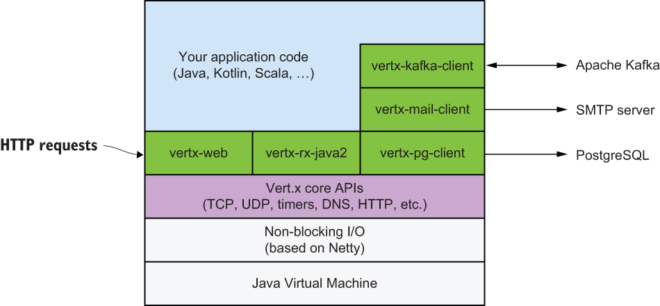
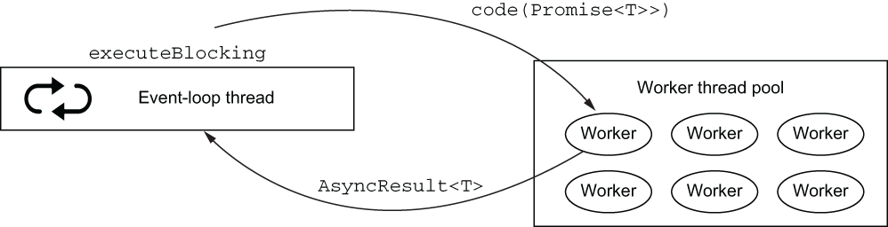
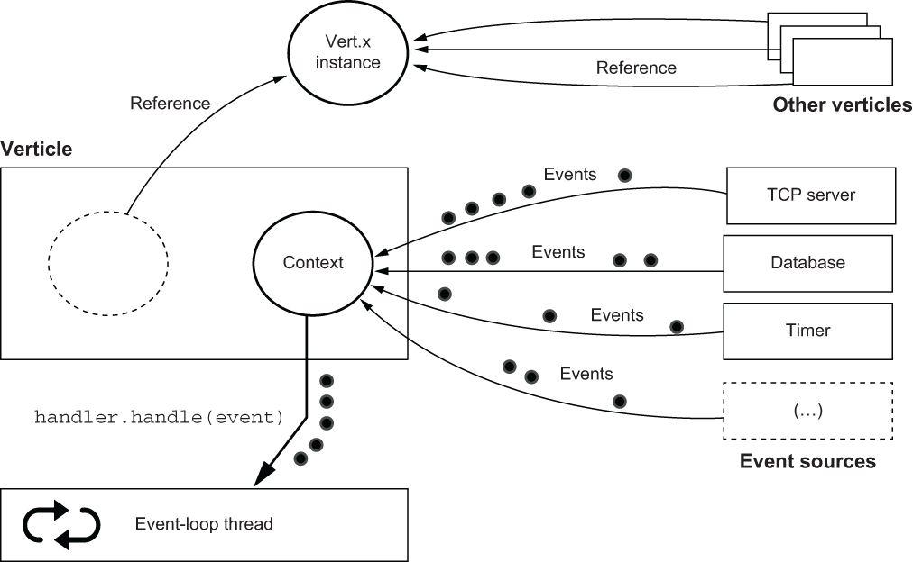

# Eclipse vert.x

## Blocking API's 

The traditional and widespread model for managing concurrent network connections is to allocate a thread for each connection. This is the model in many technologies, such as Servlets in Jakarta EE (before additions in version 3), Spring Framework (before additions in version 5), Ruby on Rails, Python Flask, and many more. This model has the advantage of simplicity, as it is synchronous.

**Drawbacks**

- Allocating a thread for each incoming connection is costly. Threads needs memory and the more threads you have, the more you put pressure on the operating system kernel scheduler, as it needs to give CPU time to the threads. Eventhough we can improve using thread pools, still need n threads for n connections at any given point in time.

## Asynchronous programming with non-blocking I/O

The idea behind non-blocking I/O is to request a (blocking) operation, and move on to doing other tasks until the operation result is ready.

Java has long had the java.nio (Java NIO) package, which offers non-blocking I/O APIs over files and networks.

## Multiplexing event-driven processing: The case of the event loop
events are queued as they arrive. They can be I/O events, such as data being ready for consumption or a buffer having been fully written to a socket. They can also be any other event, such as a timer firing. A single thread is assigned to an event loop, and processing events shouldn’t perform any blocking or long-running operation.

What is a reactive system?

The four properties of reactive systems are exposed in  The Reactive Manifesto: **responsive, resilient, elastic, and message-driven (www.reactivemanifesto.org/).** We are not going to paraphrase the manifesto in this book, so here is a brief take on what these properties are about:

Elastic --Elasticity is the ability for the application to work with a variable number of instances. This is useful, as elasticity allows the app to respond to traffic spikes by starting new instances and load-balancing traffic across instances. 

Resilient --Resiliency is partially the flip side of elasticity. When one instance crashes in a group of elastic instances, resiliency is naturally achieved by redirecting traffic to other instances, and a new instance can be started if necessary. 

Depending on the application domain, it may be possible to respond with older cached values, or even to respond with empty or default data. It may also be possible to forward a request to some other, non-error instance. In the worst case, an instance can respond with an error, 

Responsive -- This is achieved both thanks to the ability to start new instances if need be (to keep response times acceptable), and also because instances still respond quickly when errors arise

Message-driven -- enables messages to be dispatched to more instances (making the system elastic) and controls the flow between message producers and message consumers (this is back-pressure).

## What is Vert.x? 

- Vert.x website (https://vertx.io/), “Eclipse Vert.x is a tool-kit for building reactive applications on the JVM.”
- Vert.x is processing asynchronous events, mostly coming from non-blocking I/O, and the threading model processes events in an event loop.
- Your free to use Vert.x as a library in a large code base
- Structure of vert.x 
  - A core project, called vertx-core, provides the APIs for asynchronous programming, non-blocking I/O, streaming, and convenient access to networked protocols such as TCP, UDP, DNS, HTTP, or WebSockets.

  - A set of modules that are part of the community-supported Vert.x stack, such as a better web API (vertx-web) or data clients (vertx-kafka-client, vertx-redis, vertx-mongo, etc.) provide functionality for building all kinds of applications.

  - A wider ecosystem of projects provides even more functionality, such as connecting with Apache Cassandra, non-blocking I/O to communicate between system processes, and so on.
- Vert.x is polyglot as it supports most of the popular JVM languages: JavaScript, Ruby, Kotlin, Scala, Groovy, and more. Interestingly, these languages are not just supported through their interoperability with Java.
   
  

## Preparing a Vert.x project

   You can also use the Vert.x starter web application at [vertx starter](https://start.vertx.io/) and generate a project skeleton to download.

## What are the alternatives to Vert.x?

- Node.js, Akka, Spring framework Reactive, Quarkus is a new framework for developing Java applications that run exceptionally well in container environments like Kubernetes (https:// quarkus.io). Indeed, in such environments, boot time and memory consumption are critical cost-saving factors. 
-  Vert.x will appeal to developers who prefer a toolkit approach, or developers who have affinities with Node.js. In contrast, Quarkus will appeal to developers who prefer an opinionated stack approach with dependency injection and convention over configuration. In the end, both projects work together, and anything you develop with Vert.x can be reused in Quarkus.
-  Netty --The Netty framework provides non-blocking I/O APIs for the JVM. Vert.x is one of the many technologies built on top of Netty (Spring Reactive and Akka have Netty integration), and you can get all the performance benefits of Netty with the simpler APIs of Vert.x.
-  Scripting languages: Python and Ruby.

## Verticles: The basic processing unit of Vert.x

- What is a Verticle ? 
- A verticle is the fundamental processing unit in Vert.x. 
- The role of a verticle is to encapsulate a technical functional unit for processing events, such as exposing an HTTP API and responding to requests, providing a repository interface on top of a database, or issuing requests to a third-party system. Much like components in technologies like Enterprise JavaBeans, verticles can be deployed, and they have a life cycle.
- verticles have private state that may be updated when receiving events, they can deploy other verticles, and they can communicate via message-passing.

### Writing Verticles

1. create gradle build file build.gradle.kts

```json
  dependencies {
    implementation("io.vertx:vertx-core:4.0.3")
    implementation("ch.qos.logback:logback-classic:1.2.3")
  }

  tasks.create<JavaExec>("run") {
    main = project.properties.getOrDefault("mainClass", "chapter2.hello.HelloVerticle") as String
    classpath = sourceSets["main"].runtimeClasspath
    systemProperties["vertx.logger-delegate-factory-class-name"] = "io.vertx.core.logging.SLF4JLogDelegateFactory"
  }
```

2. Create simple verticles
   
```java
import io.vertx.core.AbstractVerticle;
import io.vertx.core.Vertx;
import org.slf4j.Logger;
import org.slf4j.LoggerFactory;

public class HelloVerticle extends AbstractVerticle {
  private final Logger logger = LoggerFactory.getLogger(HelloVerticle.class);

  private long counter = 1;

  @Override
  public void start() {
    vertx.setPeriodic(5000, id -> {                    ❶
      logger.info("tick");
    });

//Blocking vertx this cause  io.vertx.core.VertxException: Thread blocked
   /*  vertx.setTimer(1000, id -> {
      while(true);
    }) */

    vertx.createHttpServer()
      .requestHandler(req -> {                         ❷
        logger.info("Request #{} from {}", counter++, 
        ➥ req.remoteAddress().host());
        req.response().end("Hello!");
      })
      .listen(8080);
    logger.info("Open http://localhost:8080/");
  }

  public static void main(String[] args) {
    Vertx vertx = Vertx.vertx();                       ❸
    vertx.deployVerticle(new HelloVerticle());         ❹
    //vertix.deployVerticle("HelloVerticle", new DeploymentOptions().setInstances(4));
  }
}
```
❶ This defines a periodic task every five seconds.
❷ The HTTP server calls this handler on every request.
❸ We need a global Vert.x instance.
❹ This is the simplest way to deploy a verticle.

Defining a verticle in Java is typically done by specializing the AbstractVerticle class. There is a Verticle interface that you could in theory implement, but AbstractVerticle provides all the event processing, configuration, and execution plumbing that Vert.x users need.

A verticle instance always executes event processing on the same thread, so there is no need for using thread synchronization primitives. Here the counter is thread safe, unlike in multi thread environment no need of using synchronized blocker or a `java.util.concurrent.AtomicLong
`
The life cycle of a verticle consists of start and stop events. The AbstractVerticle class provides start and stop methods that can be overridden:

- Deploying more the verticle Instance.

```java
vertx.deployVerticle("HelloVerticle", new DeploymentOptions().setInstances(4));

//creating clustered vertx
vertx.clusteredVertx(new VertxOptions())
      .onSuccess(vertx -> {vertx.deployVerticle(new HelloVerticle());})
      .onFailure(exception -> {log.error("oops {}", exception);});
      
```

- Running and observing
  
  ` ./gradlew run -PmainClass=chapter2.hello.HelloVerticle`

- Sample output 
 
 ```log
INFO [vert.x-eventloop-thread-0] HelloVerticle - Open http://localhost:8080/❶
INFO [vert.x-eventloop-thread-0] HelloVerticle - tick                       ❷
INFO [vert.x-eventloop-thread-0] HelloVerticle - 
➥ Request #1 from 0:0:0:0:0:0:0:1                                          ❸  
```
❶ The HTTP server is now ready.

❷ A periodic task event log

❸ An HTTP request event log

### More on Verticles

- What happens when the event loop is being blocked?
  
  In the above example the commented code throws `WARN [vertx-blocked-thread-checker] BlockedThreadChecker - Thread Thread[vert.x-eventloop-thread-0,5,main] has been blocked for 2155 ms, time limit is 2000 ms`.

 The time limit before the blocked thread checker complains is two seconds by default, but it can be configured to a different value. options to configure

```yml
  -Dvertx.options.blockedThreadCheckInterval=5000 changes the interval to five seconds.
  -Dvertx.threadChecks=false disables the thread checker. 
```

- Asynchronous notification of life-cycle events
  
  ```java
    public class SomeVerticle extends AbstractVerticle {

      @Override
      public void start(Promise<Void> promise) {           ❶
        vertx.createHttpServer()
          .requestHandler(req -> req.response().end("Ok"))
          .listen(8080, ar -> {
            if (ar.succeeded()) {                          ❷
              promise.complete();                          ❸
            } else {
              promise.fail(ar.cause());                    ❹
            }
          });

       if (promise.future().succeeded()) {
            LOG.info("HTTP Request was successful");
       } else {
          LOG.info(" " + promise.future().cause());
       }
      }
    }
  ```

  The start and stop methods in AbstractVerticle support variants with an argument of type io.vertx.core.Promise. As the name suggests, a Vert.x Promise is an adaptation of the futures and promises model for processing asynchronous results.2 A promise is used to write an asynchronous result, whereas a future is used to view an asynchronous result. Given a Promise object, you can call the future() method to obtain a future of type io.vertx.core.Future.

  we are deploying 50 verticles from Deployer, yet there are likely fewer threads than verticles appearing in the logs. By default, Vert.x creates twice the number of event-loop threads as CPU cores. If you have 8 cores, then a Vert.x application has 16 event loops. The assignment of verticles to event loops is done in a round-robin fashion.

### Passing configuration data to Verticle

```java
  import io.vertx.core.DeploymentOptions;
  import io.vertx.core.Vertx;
  import io.vertx.core.json.JsonObject;

public void start() {
  // print the passed value from the config, if none then print -1
    logger.info("n = {}", config().getInteger("i", -1); 
}

  Vertx vertex = Vertx.vertex();
  for (int i: 3) {
      JsonObject conf = new JsonObject().put("i", i);
    DeploymentOptions opts = new DeploymentOptions();
    opts.setConfig(conf);
    opts.setInstance(i);
    vertex.deployVerticle("chapter2.opts.SampleVerticle", i);
  }
```

### When code needs block in event loop

The code on an event loop should not be block, but in some case you might come across blocking calls like calling 3rd party library. Vertix provides two options
1. Worker Verticle: Its a special form of verticles that do not execute on an event loop. It process the events just like an event-loop verticle, but it can take an arbitrarily long time.

A worker verticle is not tied to a single worker thread, so unlike event-loop verticle, successive events may not execute on the same thread. 
Worker verticles may only be accessed by a single worker thread at a given time.

```java
 @Override
  public void start() {
    vertx.setPeriodic(10_000, id -> {
      try {
        logger.info("Zzz...");
        Thread.sleep(8000); // Blocking
        logger.info("Up!");
      } catch (InterruptedException e) {
        logger.error("Woops", e);
      }
    });
  }
  // creating a Worker Verticle with the option .setWorker(true); remove this will block the event-loop
    Vertx vertx = Vertx.vertx();
    DeploymentOptions opts = new DeploymentOptions()
      .setInstances(2)
      .setWorker(true);                                  ❷
    vertx.deployVerticle("chapter2.worker.WorkerVerticle", opts);
 //output 
  INFO [vert.x-worker-thread-2] WorkerVerticle - Zzz...
  INFO [vert.x-worker-thread-3] WorkerVerticle - Zzz...
  INFO [vert.x-worker-thread-3] WorkerVerticle - Up!
  INFO [vert.x-worker-thread-2] WorkerVerticle - Up!   
```

2. executeBlocking operations: 

Extracting the blocking code and running in a Worker verticles is not a sensible option all the time, as it can lead to the explosion in the no of worker verticle classes performing small duties, so the second doptions is executeBlocking operation in the Worker thread, and send the result back to the event loop as a new event



```java
public class Offload extends AbstractVerticle {
  private final Logger logger = LoggerFactory.getLogger(Offload.class);

  @Override
  public void start() {
    vertx.setPeriodic(5000, id -> {
      logger.info("Tick");
      vertx.executeBlocking(this::blockingCode, this::resultHandler);   ❶
      //   vertx.executeBlocking(this::blockingCode, false, this::resultHandler); no order maintained
    });
  }

  private void blockingCode(Promise<String> promise) {                  ❷
    logger.info("Blocking code running");
    try {
      Thread.sleep(4000);
      logger.info("Done!");
      promise.complete("Ok!");                                          ❸
    } catch (InterruptedException e) {
      promise.fail(e);
    }
  }

  private void resultHandler(AsyncResult<String> ar) {                  ❹
    if (ar.succeeded()) {
      logger.info("Blocking code result: {}", ar.result());
    } else {
      logger.error("Woops", ar.cause());
    }
  }
}
```
❶ executeBlocking takes two parameters: the code to run and a callback for when it has run.

❷ The blocking code takes a Promise object of any type. It is used to eventually pass the result.

❸ The Promise object needs to either complete or fail, marking the end of the blocking code execution.

❹ Processing the result on the event loop is just another asynchronous result.

By default, successive executeBlocking operations have their results processed in the same order as the calls to executeBlocking.
with an additional boolean parameter, and when it’s set to false, results are made available as event-loop events as soon as they are available, regardless of the order of the executeBlocking calls.

## Verticles and their environment

A verticle object is essentially the combination of two objects

- The Vert.x instance the verticle belongs to.
- A dedicated context instance that allows events to be dispatched to handlers



-A Vert.x instance exposes core APIS for declaring the event handlers like `setTimer, setPeriodic, createHttpServer, deployVerticle`
-A` vert.x` instance is shared by multiple verticle, and there is only one Vert.x per JVM process.
-The Context instance holds the access to the threads for executing handlers. Events may be originated from different sources like database, HTTP server, timers.
-Event handling in user-defined callbacks happens through the context. The context instance allows us to call the handler back on the verticle event-loop thread.
-worker verticles is not much different, except that handlers are executed using one worker thread in a worker thread pool.

### More on context

- Calling getOrCreateContext() from a context thread like that of a verticle returns the context.
- Calling getOrCreateContext() from a non-context thread creates a new context.

-  Creating contexts without a verticle
  
  ```java
    Vertx vertx = Vertx.vertx();

    vertx.getOrCreateContext()
      .runOnContext(v -> logger.info("ABC"));    ❶

    vertx.getOrCreateContext()
      .runOnContext(v -> logger.info("123"));

    INFO [vert.x-eventloop-thread-1] ThreadsAndContexts - 123
    INFO [vert.x-eventloop-thread-0] ThreadsAndContexts - ABC  
  ```

- A context object supports more operations like holding data in key/value pair
- It can also be used to declare exception handlers
  
  ```java
    Context ctx = vertx.getOrCreateContext();
    ctx.put("foo", "bar");

    ctx.exceptionHandler(t -> {
    if ("Tada".equals(t.getMessage())) {
      logger.info("Got a _Tada_ exception");
    } else {
      logger.error("Woops", t);
    }
    });
    ctx.runOnContext( v -> {
      LOG.info("foo = {}", (String)ctx.get("foo"));
      throw new RuntimeException("Tada");
    });
   
   INFO [vert.x-eventloop-thread-0] ThreadsAndContexts - foo = bar 
   INFO [vert.x-eventloop-thread-0] ThreadsAndContexts - Got a _Tada_ exception
  ```

### Mixing both Vert.x and non-Vert.x threads by using event-loop contexts.

```java
public class MixedThreading extends AbstractVerticle {
  private final Logger logger = LoggerFactory.getLogger(MixedThreading.class);

  @Override
  public void start() {
    Context context = vertx.getOrCreateContext();     ❶
    new Thread(() -> {
      try {
        run(context);
      } catch (InterruptedException e) {
        logger.error("Woops", e);
      }
    }).start();                                       ❷
  }

  private void run(Context context) throws InterruptedException {
    CountDownLatch latch = new CountDownLatch(1);
    logger.info("I am in a non-Vert.x thread");
    context.runOnContext(v -> {                       ❸
      logger.info("I am on the event-loop");
      vertx.setTimer(1000, id -> {
        logger.info("This is the final countdown");
        latch.countDown();
      });
    });
    logger.info("Waiting on the countdown latch...");
    latch.await();
    logger.info("Bye!");
  }
}
```
❶ We get the context of the verticle because start is running on an event-loop thread.

❷ We start a plain Java thread.

❸ runOnContext ensures we run some code back on the verticle event-loop thread.


## Summary

- Verticles are the core component for asynchronous event processing in Vert.x applications.
- Event-loop verticles process asynchronous I/O events and should be free of blocking and long-running operations.
- Worker verticles can be used to process blocking I/O and long-running operations.
- It is possible to mix code with both Vert.x and non-Vert.x threads by using event-loop contexts.