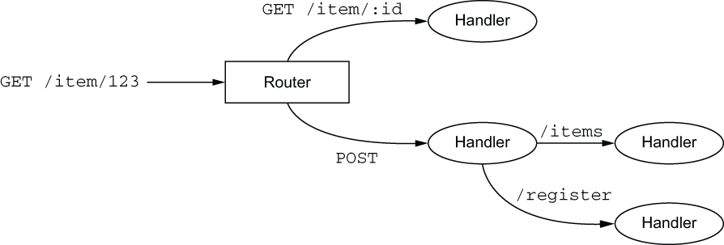
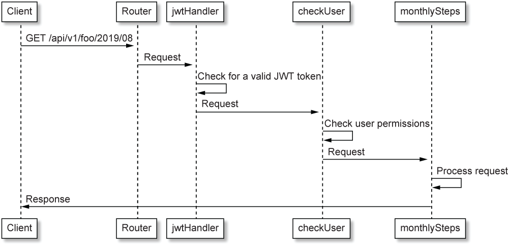

# Vert.x WebStack

## Vertix modules

- `vertx-web`, to provide advanced HTTP request-processing functionality
- `vertx-web-client`, to issue HTTP requests to the user profile and activity services
- `vertx-auth-jwt`, to generate and process JSON web tokens and perform access control

### Vertix web routing
The `vertx-web` module provides a router that can act as a Vert.x HTTP server request handler, and that manages the dispatch of HTTP requests to suitable handlers based on request paths



```java

//Define routes
Router router = Router.router(vertx);

//A router is a HTTP request handler
vertx.createHttpServer()
     .requestHandler(router)
     .listen(8080);   

BodyHandler bodyHandler = BodyHandler.create();               ❶
router.post().handler(bodyHandler);                           ❷
router.put().handler(bodyHandler);

String prefix = "/api/v1";

router.post(prefix + "/register").handler(this::register);    ❸
router.post(prefix + "/token").handler(this::token);
router.get(prefix + "/:username/:year/:month")                ❹
  .handler(jwtHandler)                                        ❺
  .handler(this::checkUser)
  .handler(this::monthlySteps);
```

❶ BodyHandler is a predefined handler that extracts HTTP request body payloads.

❷ Here bodyHandler is called for all HTTP POST and PUT requests.

❸ The register method handles /api/v1/register POST requests.

❹ We can extract path parameters by prefixing elements with ":".

❺ Handlers can be chained.



### Making HTTP requests

Creating a web client instance is as simple as this:

`WebClient webClient = WebClient.create(vertx);`

A WebClient instance is typically stored in a private field of a verticle class, as it can be used to perform multiple concurrent HTTP requests. The whole application uses the RxJava 2 bindings, so we can take advantage of them to compose asynchronous operations.

```java
private void register(RoutingContext ctx) {
  webClient
    .post(3000, "localhost", "/register")                       ❶
    .putHeader("Content-Type", "application/json")              ❷
    .rxSendJson(ctx.getBodyAsJson())                            ❸
    .subscribe(
      response -> sendStatusCode(ctx, response.statusCode()),   ❹
      err -> sendBadGateway(ctx, err));
}

private void sendStatusCode(RoutingContext ctx, int code) {
  ctx.response().setStatusCode(code).end();
}

private void sendBadGateway(RoutingContext ctx, Throwable err) {
  logger.error("Woops", err);
  ctx.fail(502);
}
```

❸ This converts the request from a Vert.x Buffer to a JsonObject.

❹ Subscription in RxJava triggers the request.